# Standing Record Faction Authority Map

## 1. Executive Authority Split

This document establishes the canonical boundary between static authored metadata in `standing_record_factions.json` and external mutable game systems, ensuring zero duplication of faction mechanics.

```mermaid
graph TD
    subgraph Static Authored Identity [standing_record_factions.json]
        ID[Faction ID: faction_the_*]
        Name[Display Name]
        Align[Initial Alignment Posture]
        Region[Home Region Anchor]
        Active[Default is_active Flag]
        TrustDef[Initial Trust Baseline: 0]
        WantsOffers[Declared Wants & Offers]
        Quote[Signature Quote]
        Rule[Access Rule Description]
        Badge[Badge Asset ID / Fallback]
    end

    subgraph Mutable Campaign Relationship State [Runtime & Save Stores]
        CurTrust[Live Trust / Reputation Score]
        CurAccess[Live Clearance / Blocked Status]
        DynamicRel[Hostile / Allied State Transitions]
        Quests[Completed Contracts & Tasks]
        Debt[Active Debt & Trade Balances]
    end

    subgraph External Domain Authorities
        Territory[Plan 44 / Wasteland Map System]
        Patrols[Plan 45 / Patrol Encounter System]
        Settlements[Plan 43 / Settlement Gazetteer]
        Dialogue[Plan 92 / Faction Dialogue Corpus]
        Endings[Plan 89 / Epilogue Matrix System]
        Icons[FactionIconCatalog / Emblems]
    end

    ID -.-> CurTrust
    ID -.-> Territory
    ID -.-> Settlements
    ID -.-> Dialogue
    ID -.-> Icons
```

---

## 2. Domain Responsibility Matrix

| Subsystem Domain | Canonical Authority File | Data Ownership Boundary | Plan 98 Boundary Rule |
|---|---|---|---|
| **Authored Profile** | `Assets/StreamingAssets/Data/standing_record_factions.json` | Dossier fields (`id`, `display_name`, `home_region`, `wants`, `offers`, `access_rule`) | Sole author of Standing Record profiles; does NOT track live standing. |
| **Mutable Trust** | `StandingRecordSaveStore` / `SaveStoreHub` | Persisted dictionary of `{ factionId -> int currentTrust }` | Campaign state owns current reputation; JSON defaults never overwrite saved values. |
| **Territory Control** | `Assets/StreamingAssets/Data/wasteland_map_v1.json` / Plan 44 | Map nodes, regional partitions, control flags | Factions reference `home_region`; territory ownership is owned by map systems. |
| **Patrols** | Plan 45 / `patrol_encounters.json` | Armed encounter routes, spawn tables | Factions provide identity and lore; no combat patrol logic is embedded in Plan 98. |
| **Settlement Allegiance** | `Assets/StreamingAssets/Data/narrative/wasteland_settlement_gazetteer.json` | Governing faction per settlement | Fort Karkov and Silo Commune map to canonical IDs without duplicate authorities. |
| **Dialogue & Banter** | `Assets/StreamingAssets/Data/faction_war_dialogue.json` | Overheard radio and site conversation graphs | Faction voice and quotes guide writers; no new dialogue runner is created. |
| **Epilogues & Endings** | `Assets/StreamingAssets/Data/endings.json` / Plan 89 | Campaign outcome branch conditions | Endings evaluate mutable trust; Plan 98 creates zero new ending branches. |
| **Emblems & Visuals** | `Assets/Ashfall.Core/UI/FactionIconCatalog.cs` | Icon asset paths and resolution fallbacks | Badges resolve via catalog dictionary; legal empty string triggers safe fallback. |
