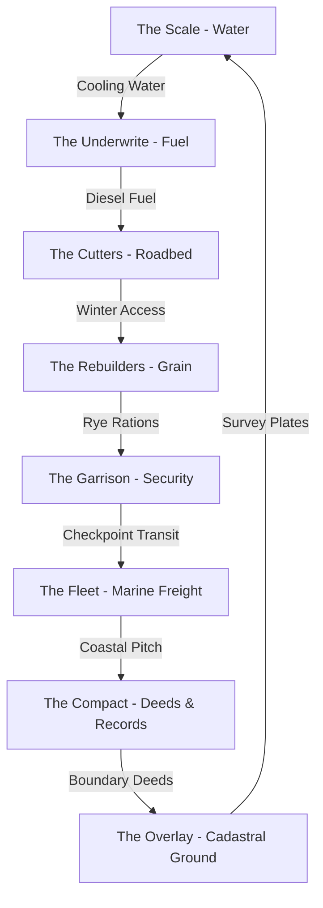

# Standing Record Faction Trade & Economic Matrix

## 1. Trade Profiles Overview

Each of the 8 factions possesses an authored economic niche. No two factions share an identical demand or supply profile.

| Faction | Demand (`wants`) | Supply (`offers`) | Economic Role |
|---|---|---|---|
| **The Overlay** | `brass_fittings`, `sr_stencil_pot`, `lamp_oil` | `cadastral_keys`, `travel_correction_on_named_sites` | Cartographic reconciliation, site wayfinding |
| **The Scale** | `brass_valve_bodies`, `filter_charcoal`, `pipe_sealant` | `potable_ration_quota`, `sluice_transit_clearance`, `flow_rate_telemetry` | Volumetric water metering, pressure infrastructure |
| **The Compact** | `parchment_rolls`, `iron_gall_ink`, `surveyor_transit_glass` | `cadastral_boundary_deeds`, `arbitration_records`, `survey_marker_waypoints` | Legal deed documentation, boundary arbitration |
| **The Underwrite** | `hardened_plate_carriers`, `heavy_machine_oil`, `sealed_logistics_manifests` | `convoy_underwriting`, `armed_escort_vouchers`, `depot_fuel_draws` | Risk indemnification, diesel allocation, security |
| **The Cutters** | `hardened_ice_spikes`, `black_coal_briquettes`, `steel_winch_cable` | `cleared_corridor_passage`, `heavy_haulage_sledges`, `span_waystation_shelter` | Heavy roadbed clearing, winter haulage, bridge access |
| **The Fleet** | `tarred_hemp_rigging`, `marine_pitch_caulk`, `copper_hull_nails` | `barge_ferry_berth`, `coastal_salvage_tolls`, `tide_table_nav_charts` | Waterway barge transit, tidal salvage rights |
| **The Rebuilders** | `viable_heirloom_seeds`, `refractory_kiln_bricks`, `sterilized_field_dressings` | `staple_grain_bushels`, `soil_rotation_almanac`, `communal_silo_storage` | Caloric production, soil agronomy, grain storage |
| **The Garrison** | `smokeless_powder_kegs`, `machined_rifle_extractors`, `preserved_medical_plasma` | `checkpoint_transit_chits`, `sentry_perimeter_watch`, `tactical_hazard_briefings` | Fortified checkpoint transit, armed overwatch |

---

## 2. Resource Circulation Web

---

## 3. Commodity Token Hygiene

All commodity tokens in `wants` and `offers` conform strictly to `CatalogIntegrityValidator.cs` guidelines:
- Avoided all false-positive string collisions with active `IdPrefixes` (e.g. `crop_` prefix in `crop_rotation_almanac` safely shifted to `soil_rotation_almanac`).
- Preserved `The Overlay` baseline tokens verbatim (`brass_fittings`, `sr_stencil_pot`, `lamp_oil`, `cadastral_keys`, `travel_correction_on_named_sites`).
- Utilized descriptive compound snake_case terms reflecting physical wasteland goods and administrative services.
