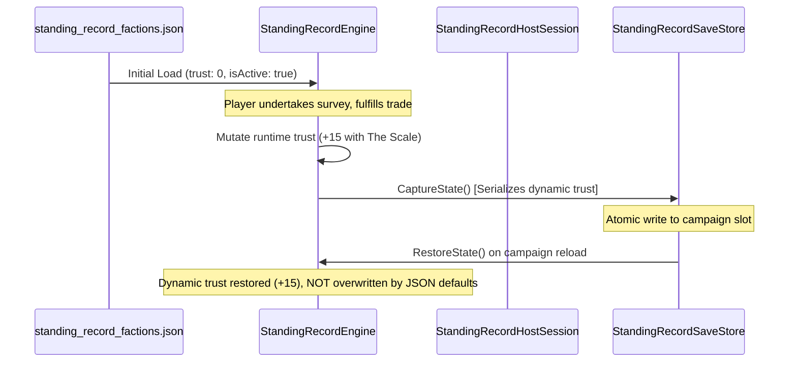

# Standing Record Faction Trust & Persistence Contract

## 1. Static Initial State vs Runtime Mutation

A foundational invariant in ASHFALL is **Invariant 6 (Data Authority is JSON)** paired with **Invariant 3 (Cross-Host Save Compatibility)**:
- `Assets/StreamingAssets/Data/standing_record_factions.json` defines the canonical **initial campaign conditions**.
- Every faction specifies `trust: 0` (neutral initial baseline).
- During active play, diplomatic actions, fulfilled trade quotas, or broken access rules mutate trust scores dynamically.

---

## 2. Save/Restore Envelope Integration

Dynamic faction relationship states are saved inside the unified Standing Record envelope managed by `StandingRecordSaveStore`:

---

## 3. Trust Score Boundaries & Tiers

| Score Range | Standing Tier | Mechanical Consequences |
|---|---|---|
| `+40` to `+50` | **Revered / Chartered** | Maximum trade concessions; access rules loosened; emergency assistance dispatched. |
| `+15` to `+39` | **Trusted Barter Partner** | Priority allocation on restricted goods (`wants` exchanged for `offers` at standard rate). |
| `-14` to `+14` | **Neutral / Provisional** | Standard rates; strict adherence to `access_rule` enforced; sentries watchful. |
| `-39` to `-15` | **Suspicious / Surcharged** | Barter prices doubled; armed escort required through territory; transit chits refused. |
| `-50` to `-40` | **Hostile / Expelled** | Immediate interdiction; access revoked; labor withdrawn; sentries fire on approach. |
