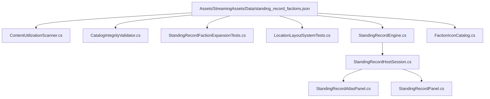

# Standing Record Faction Wiring & Architecture Tracer

## 1. System Dependency Graph



---

## 2. Downstream Presentation & Host Routing

1. **Host Session:**
   `StandingRecordHostSession.cs` coordinates data directory resolution and instantiates `StandingRecordEngine`.
2. **UI Atlas Panels:**
   `StandingRecordAtlasPanel.cs` and `StandingRecordPanel.cs` render ground layout boundaries, room exploration stencils, and territorial markers.
3. **Emblem Resolution:**
   `FactionIconCatalog.Resolve(factionId)` queries the internal dictionary or returns `FallbackIconPath` ("assets/ui/Icons/faction_icon_unknown.png") when no explicit PNG asset is specified.
4. **Data Verification Pipeline:**
   - Pre-commit & CI: `CatalogIntegrityValidator.Validate` cross-references all IDs against `IdPrefixes`.
   - Godot CLI: `--data-integrity-selftest` validates all 216 catalogs without errors.
   - Core CLI: `dotnet test Ashfall.Core.Tests` runs the test suite.


---

# 2026-09-24 integration expansion — Standing Record Engine

> **Document status:** evidence-based integration proposal, generated after the dated material above. The older plan or audit is retained as historical evidence, not silently revalidated. This section is reproducible through `gen_requested_fifteen_authority_plans.py` followed by the separate editorial polishing script. Narrative lines below are candidate specifications outside runtime JSON. They do not become ASHFALL canon until a current trigger, consumer, and continuity review accept them.

## 1. Objective and verified premise

**Objective:** one canonical standing-record instance receives a real visit/mutation and drives one atlas projection and one durable envelope.

**Current evidence:** StandingRecordHostSession owns a unified StandingRecordEngine and atlas binding, while ExpansionHostSession separately constructs layout, memory, and encounter children and saves them in ExpansionHubSave. The existing tracer focuses faction wiring; an architecture closeout must settle which instance receives visit and mutation facts.

**Owner boundary:** StandingRecordEngine should be the unified owner only after migration and caller audit; faction standing, quests, and expeditions remain external fact producers. **Core source:** `Assets/Ashfall.Core/StandingRecord/StandingRecordEngine.cs`. **Current or candidate host:** `StandingRecordHostSession / StandingRecordAtlasPanel; compare ExpansionHostSession`. **Persistence decision:** Compare both envelopes and choose a documented migration/precedence rule before a consolidation change. **Authored data:** `standing_record_memory.json`. This follows the master expansion document's C6 and C13 cluster and its four-tier data → Core → host → verification structure. Live source outranks the master when a dated example is stale.

**Non-goals and stop rule:** Do not wire the atlas to one instance while the campaign mutates or saves another. This documentation does not register a new save section, modify a host, or certify player reachability. A foreman must claim exact implementation paths under `WORKTREE_OWNERSHIP.md`; a collision or missing authority returns a premise finding rather than an invented parallel subsystem.

## 2. Integration architecture and state flow

```text
standing_record_memory.json / canonical owner facts
    -> StandingRecordEngine
    -> StandingRecordHostSession / StandingRecordAtlasPanel; compare ExpansionHostSession
    -> StandingRecordSave unified state; ExpansionHubSave has sibling layout/memory/encounter state
    -> existing panel, journal, briefing, or campaign read model
```

The data or canonical input owner supplies IDs and quantities. The Core call validates or computes the domain result. A host adapter, when needed, chooses the command and applies its authorized cross-owner consequences once. Mutable state is captured by its chosen existing owner; a pure evaluator has no private save or day owner. The Godot view reads the result and emits a player intent. It never owns a shadow resource, hidden roll, or second ledger. An invalid or refused command changes no unrelated authority. A successful command is observed in a current panel or journal route and survives reload where the result is persistent.

## 3. Current authority and API checklist

| Question | Source checkpoint | Required finding before promotion |
|---|---|---|
| Which Core type actually runs? | `Assets/Ashfall.Core/StandingRecord/StandingRecordEngine.cs` | Resolve exact constructor, method signatures, input ports, output DTOs, and indirect callers. |
| Which method can the host call? | `Load, UnlockExpansion, Tick, ApplySiteMutation, GetActiveRecast, CaptureState, RestoreState` | Use current API; introduce a thin adapter only if source cannot express the bounded outcome. |
| Who owns cross-system state? | `StandingRecordEngine should be the unified owner only after migration and caller audit; faction standing, quests, and expeditions remain external fact producers` | One writer per resource, result, and persistent record. |
| What survives save/load? | `StandingRecordSave unified state; ExpansionHubSave has sibling layout/memory/encounter state` | Capture/restore and old-save default or explicit stateless verdict. |
| What is authored? | `standing_record_memory.json` | Verify loader, IDs, references, range validation, and an actual consumer. |
| What does the player see? | `StandingRecordHostSession / StandingRecordAtlasPanel; compare ExpansionHostSession` | Trace a command or read route through the current Godot lifecycle. |
| Which expansion ideas apply? | `docs/newest-ashfall-master-expansion-authority-v2-0-complete-compiled-edition-volumes-1-57.md` | Use the C6 and C13 cluster's prose register, continuity, and anti-duplication rules. |

## Editorial source review and first-package handoff

### The atlas and expedition hub must refer to the same record

`StandingRecordHostSession` creates `StandingRecordEngine`, loads its layout/memory/encounter children, and captures a unified `StandingRecordSave`. Its atlas panel binds directly to that host. `ExpansionHostSession` separately constructs and saves the same three child-system types in `ExpansionHubSave`. The faction wiring tracer should become an authority diagram with both actual branches and a migration decision gate. A faction standing change is an external fact that may unlock or annotate a record; it cannot be copied into a second faction-standing number. A site mutation should enter the chosen record engine once and then refresh the atlas. Until one writer is selected, expanding narrative strata increases the chance of two contradictory histories.

The first package is an instance map: constructors, Main fields, save sections, restore order, panel binding, expedition/quest mutation callers, and legacy-save precedence. Only then should it choose which host survives as the production record path. For conflict resolution, compare stable site IDs, mutation flags, visit counts, and resolved encounter IDs; never choose whichever snapshot has the most text. The older envelope may require a one-time import, but import must be idempotent and recorded. A current site/faction link is enough to prove the path before more atlas lore is added.

**Acceptance:** one visit/mutation produces one atlas update and one canonical saved state; old saves migrate once without lost or duplicated history.

## 4. Dependency-ordered implementation package

**P0 — premise and ownership.** Refresh exact source references, save registration, data loader, tests, and player route. Compare the historical text above with the live tree. Write an explicit authority map before touching `src/Main*`, the save registry, or a catalog. Decide whether the direct-name orphan is a real missing behavior or merely an indirectly hosted type. Acceptance: file:line evidence for the first bounded outcome and an exact path claim.

**P1 — one contract.** Define the input IDs, campaign day or tick, canonical quantities, result/refusal code, and command idempotency. If the type is pure, state the caller that owns application. If mutable, state the DTO and one save owner. Acceptance: the owner can reject an invalid ID without spending, writing, or publishing a success fact.

**P2 — content and catalog reach.** Inspect the existing JSON row IDs and reference fields. Add only a small cohort when current rows cannot express the first outcome. Link any new prose to a real event trigger and reader. Do not interpret a name-matched catalog or a story line as a live consumer. Acceptance: one current row is loaded, eligible, invoked, and observable.

**P3 — host and event path.** Sample current source facts, invoke Core once, apply only owner-approved effects, then mark the correct section dirty. Subscribe and unsubscribe without leaking duplicate callbacks. A panel may request the action and refresh from the host, but cannot make the gameplay decision. Acceptance: one player action reaches one Core operation and a refusal stays a no-op.

**P4 — save, day, and replay.** Restore before binding UI. For mutable systems, ensure an old save defaults safely and a mid-effect restore neither drops nor repeats an item, contact, treatment, reservation, or award. For a pure evaluator, persist only the canonical caller's accepted result. Sort IDs before iteration and use the established seeded RNG or stable hash contract. Acceptance: fresh and restored campaigns agree after the same input sequence.

**P5 — observable acceptance and polish.** Surface state, eligibility, cost, risk, and refusal through the existing panel or briefing route. Preserve keyboard/controller back behavior, focus, readable labels, refresh, and disposal. Use a few focused Core/host assertions under `TEST_POLICY.md` when implementation is authorized; headless Godot is appropriate only if the runtime route changes. The documentation pass makes no test or production claim. Acceptance: a person can explain what happened from the UI and save state without reading debug logs.

## 5. C# integration framework — illustrative contract

```csharp
// Planning sketch. Bind to the existing owner and exact public API above.
// Do not add these types simply because they appear in a document.
public readonly record struct OwnerCommand(
    string SourceId, string SubjectId, int CampaignDay, string RequestId);
public readonly record struct OwnerReadModel(
    string SourceId, bool Eligible, string RefusalCode,
    string CurrentStatus, string CostText, string OutcomeText);
// Host command sequence:
// 1. Resolve SourceId and SubjectId from canonical owners.
// 2. Revalidate after any preview and before resource mutation.
// 3. Call the present Core method exactly once.
// 4. Apply authorized cross-owner deltas and persist through the chosen section.
// 5. Publish a typed success fact; on refusal publish no success fact.
// 6. Refresh a read-only panel model and preserve close/back focus.
```

This code is an interface sketch, not a drop-in implementation. The symbol inventory above is the source checkpoint. The first implementation commit should use the current concrete API and only introduce a DTO if multiple callers need a stable contract. In particular, pure evaluators need neither an `OwnerCommand` instance nor a new save section if the caller already has the necessary operation.

## 6. Content voice and acceptance rubric

The master expansion's physical, restrained prose rule applies to an annotated standing atlas. A proposed sentence must state what the speaker or document can know. An operational report may name measurements that the owner returns; a bedside or survivor line may describe lived experience without claiming a clinical result. A refusal cannot be narrated as a success. A catalog addition must have a loader, eligibility predicate, route, fallback, and localization strategy. The case register below uses varied scene and failure conditions as review prompts; it is not a release checklist and should be trimmed to the few cases that the first package can actually exercise.

## Live authored ID register

These IDs are read from current JSON. They are review targets, not evidence of player reachability.

| Current ID | Fields to inspect | Reachability question |
|---|---|---|
| `unnamed_row` | `siteId`, `stratumId`, `requiredFlag`, `text` | Which loader, owner predicate, host command, and read surface consume this row? |
| `unnamed_row` | `siteId`, `stratumId`, `requiredFlag`, `text` | Which loader, owner predicate, host command, and read surface consume this row? |
| `unnamed_row` | `siteId`, `stratumId`, `requiredFlag`, `text` | Which loader, owner predicate, host command, and read surface consume this row? |
| `unnamed_row` | `siteId`, `stratumId`, `requiredFlag`, `text` | Which loader, owner predicate, host command, and read surface consume this row? |
| `unnamed_row` | `siteId`, `stratumId`, `requiredFlag`, `text` | Which loader, owner predicate, host command, and read surface consume this row? |
| `unnamed_row` | `siteId`, `stratumId`, `requiredFlag`, `text` | Which loader, owner predicate, host command, and read surface consume this row? |
| `unnamed_row` | `siteId`, `stratumId`, `requiredFlag`, `text` | Which loader, owner predicate, host command, and read surface consume this row? |
| `unnamed_row` | `siteId`, `stratumId`, `requiredFlag`, `text` | Which loader, owner predicate, host command, and read surface consume this row? |
| `unnamed_row` | `siteId`, `stratumId`, `requiredFlag`, `text` | Which loader, owner predicate, host command, and read surface consume this row? |
| `unnamed_row` | `siteId`, `stratumId`, `requiredFlag`, `text` | Which loader, owner predicate, host command, and read surface consume this row? |
| `unnamed_row` | `siteId`, `stratumId`, `requiredFlag`, `text` | Which loader, owner predicate, host command, and read surface consume this row? |
| `unnamed_row` | `siteId`, `stratumId`, `requiredFlag`, `text` | Which loader, owner predicate, host command, and read surface consume this row? |
| `unnamed_row` | `siteId`, `stratumId`, `requiredFlag`, `text` | Which loader, owner predicate, host command, and read surface consume this row? |
| `unnamed_row` | `siteId`, `stratumId`, `requiredFlag`, `text` | Which loader, owner predicate, host command, and read surface consume this row? |
| `unnamed_row` | `siteId`, `stratumId`, `requiredFlag`, `text` | Which loader, owner predicate, host command, and read surface consume this row? |
| `unnamed_row` | `siteId`, `stratumId`, `requiredFlag`, `text` | Which loader, owner predicate, host command, and read surface consume this row? |
| `unnamed_row` | `siteId`, `stratumId`, `requiredFlag`, `text` | Which loader, owner predicate, host command, and read surface consume this row? |
| `unnamed_row` | `siteId`, `stratumId`, `requiredFlag`, `text` | Which loader, owner predicate, host command, and read surface consume this row? |
| `unnamed_row` | `siteId`, `stratumId`, `requiredFlag`, `text` | Which loader, owner predicate, host command, and read surface consume this row? |
| `unnamed_row` | `siteId`, `stratumId`, `requiredFlag`, `text` | Which loader, owner predicate, host command, and read surface consume this row? |
| `unnamed_row` | `siteId`, `stratumId`, `requiredFlag`, `text` | Which loader, owner predicate, host command, and read surface consume this row? |
| `unnamed_row` | `siteId`, `stratumId`, `requiredFlag`, `text` | Which loader, owner predicate, host command, and read surface consume this row? |
| `unnamed_row` | `siteId`, `stratumId`, `requiredFlag`, `text` | Which loader, owner predicate, host command, and read surface consume this row? |
| `unnamed_row` | `siteId`, `stratumId`, `requiredFlag`, `text` | Which loader, owner predicate, host command, and read surface consume this row? |
| `unnamed_row` | `siteId`, `stratumId`, `requiredFlag`, `text` | Which loader, owner predicate, host command, and read surface consume this row? |
| `unnamed_row` | `siteId`, `stratumId`, `requiredFlag`, `text` | Which loader, owner predicate, host command, and read surface consume this row? |
| `unnamed_row` | `siteId`, `stratumId`, `requiredFlag`, `text` | Which loader, owner predicate, host command, and read surface consume this row? |
| `unnamed_row` | `siteId`, `stratumId`, `requiredFlag`, `text` | Which loader, owner predicate, host command, and read surface consume this row? |
| `unnamed_row` | `siteId`, `stratumId`, `requiredFlag`, `text` | Which loader, owner predicate, host command, and read surface consume this row? |
| `unnamed_row` | `siteId`, `stratumId`, `requiredFlag`, `text` | Which loader, owner predicate, host command, and read surface consume this row? |
| `unnamed_row` | `siteId`, `stratumId`, `requiredFlag`, `text` | Which loader, owner predicate, host command, and read surface consume this row? |
| `unnamed_row` | `siteId`, `stratumId`, `requiredFlag`, `text` | Which loader, owner predicate, host command, and read surface consume this row? |
| `unnamed_row` | `siteId`, `stratumId`, `requiredFlag`, `text` | Which loader, owner predicate, host command, and read surface consume this row? |
| `unnamed_row` | `siteId`, `stratumId`, `requiredFlag`, `text` | Which loader, owner predicate, host command, and read surface consume this row? |
| `unnamed_row` | `siteId`, `stratumId`, `requiredFlag`, `text` | Which loader, owner predicate, host command, and read surface consume this row? |
| `unnamed_row` | `siteId`, `stratumId`, `requiredFlag`, `text` | Which loader, owner predicate, host command, and read surface consume this row? |
| `unnamed_row` | `siteId`, `stratumId`, `requiredFlag`, `text` | Which loader, owner predicate, host command, and read surface consume this row? |
| `unnamed_row` | `siteId`, `stratumId`, `requiredFlag`, `text` | Which loader, owner predicate, host command, and read surface consume this row? |
| `unnamed_row` | `siteId`, `stratumId`, `requiredFlag`, `text` | Which loader, owner predicate, host command, and read surface consume this row? |
| `unnamed_row` | `siteId`, `stratumId`, `requiredFlag`, `text` | Which loader, owner predicate, host command, and read surface consume this row? |
| `unnamed_row` | `siteId`, `stratumId`, `requiredFlag`, `text` | Which loader, owner predicate, host command, and read surface consume this row? |
| `unnamed_row` | `siteId`, `stratumId`, `requiredFlag`, `text` | Which loader, owner predicate, host command, and read surface consume this row? |
| `unnamed_row` | `siteId`, `stratumId`, `requiredFlag`, `text` | Which loader, owner predicate, host command, and read surface consume this row? |
| `unnamed_row` | `siteId`, `stratumId`, `requiredFlag`, `text` | Which loader, owner predicate, host command, and read surface consume this row? |
| `unnamed_row` | `siteId`, `stratumId`, `requiredFlag`, `text` | Which loader, owner predicate, host command, and read surface consume this row? |
| `unnamed_row` | `siteId`, `stratumId`, `requiredFlag`, `text` | Which loader, owner predicate, host command, and read surface consume this row? |
| `unnamed_row` | `siteId`, `stratumId`, `requiredFlag`, `text` | Which loader, owner predicate, host command, and read surface consume this row? |
| `unnamed_row` | `siteId`, `stratumId`, `requiredFlag`, `text` | Which loader, owner predicate, host command, and read surface consume this row? |
| `unnamed_row` | `siteId`, `stratumId`, `requiredFlag`, `text` | Which loader, owner predicate, host command, and read surface consume this row? |
| `unnamed_row` | `siteId`, `stratumId`, `requiredFlag`, `text` | Which loader, owner predicate, host command, and read surface consume this row? |
| `unnamed_row` | `siteId`, `stratumId`, `requiredFlag`, `text` | Which loader, owner predicate, host command, and read surface consume this row? |
| `unnamed_row` | `siteId`, `stratumId`, `requiredFlag`, `text` | Which loader, owner predicate, host command, and read surface consume this row? |

### Review case 001: expansion unlock under first valid use

**Scene premise.** The player's route reaches **expansion unlock** while the canonical owner has the required record and no earlier accepted command. The implementation candidate starts with `unnamed_row`. The live source checkpoint is `Assets/Ashfall.Core/StandingRecord/StandingRecordEngine.cs`; the proposed reader is `StandingRecordHostSession / StandingRecordAtlasPanel; compare ExpansionHostSession`. The scene exists only if the current catalog or owner provides this trigger. No date, character, equipment, hazard, or reward is asserted merely because the heading names it. This makes the card a precise question for the promotion audit: what real fact causes this view or command to exist at this point in the campaign?

**Possible prose register.** “The annotated standing atlas is left where the person making the next decision can see it.” is a candidate observation anchored by an annotated standing atlas. Its final form must identify an actual speaker or document type, avoid knowledge the source cannot possess, and use the result's real status language. The line is deferred if the item, person, or record is not present. A journal note may record the player's knowledge after a fact is published; a panel can describe current eligibility; neither can invent an upstream event. The content editor should compare nearby JSON rows and avoid a second paragraph that only repeats this one in different words.

**Command and owner trace.** The relevant Core call comes from `Load, UnlockExpansion, Tick, ApplySiteMutation, GetActiveRecast, CaptureState, RestoreState` after its actual input owners have been sampled. StandingRecordEngine should be the unified owner only after migration and caller audit; faction standing, quests, and expeditions remain external fact producers. For first valid use, the mandatory boundary is to prove the default state, eligibility, and one visible outcome. Before confirmation, show the canonical cost and status from the same snapshot that will be rechecked at commit. If the named system is a pure evaluator, the caller applies any accepted result and the evaluator keeps no independent state. If it is mutable, the host captures its state through the selected owner. The decision must not create a parallel inventory, medical record, route reservation, award list, threat contact, or merchant stock entry.

**Save and replay reading.** Persistence decision: Compare both envelopes and choose a documented migration/precedence rule before a consolidation change. The audit must show the before-state, the accepted or refused result, the after-state, and the restore-state. A duplicate event must not spend stock twice. A day transition must not advance twice. Stable ID order and a campaign seed are required where selection or risk is random; where the function is deterministic math, no RNG is added. The panel should obtain the same status after reopening and should release subscriptions when disposed. The author should not refer to a live result until the save and host trace confirms it.

**Acceptance decision.** Mark this card accepted only with source file:line references, a live trigger, the exact method call, a reachable authored ID or owner record, an observable current surface, and a focused assertion matched to prove the default state, eligibility, and one visible outcome. Otherwise mark it deferred or inapplicable. A high-level compilation result does not prove a player route, a catalog file does not prove a loader, and a historical audit count does not prove that the class is still host-unreachable. The first implementation package should choose only the cases necessary to establish one canonical standing-record instance receives a real visit/mutation and drives one atlas projection and one durable envelope.

### Review case 002: first arrival under first valid use

**Scene premise.** The player's route reaches **first arrival** while the canonical owner has the required record and no earlier accepted command. The implementation candidate starts with `unnamed_row`. The live source checkpoint is `Assets/Ashfall.Core/StandingRecord/StandingRecordEngine.cs`; the proposed reader is `StandingRecordHostSession / StandingRecordAtlasPanel; compare ExpansionHostSession`. The scene exists only if the current catalog or owner provides this trigger. No date, character, equipment, hazard, or reward is asserted merely because the heading names it. This makes the card a precise question for the promotion audit: what real fact causes this view or command to exist at this point in the campaign?

**Possible prose register.** “A note beside the an annotated standing atlas records the uncertainty before anyone writes an outcome.” is a candidate observation anchored by an annotated standing atlas. Its final form must identify an actual speaker or document type, avoid knowledge the source cannot possess, and use the result's real status language. The line is deferred if the item, person, or record is not present. A journal note may record the player's knowledge after a fact is published; a panel can describe current eligibility; neither can invent an upstream event. The content editor should compare nearby JSON rows and avoid a second paragraph that only repeats this one in different words.

**Command and owner trace.** The relevant Core call comes from `Load, UnlockExpansion, Tick, ApplySiteMutation, GetActiveRecast, CaptureState, RestoreState` after its actual input owners have been sampled. StandingRecordEngine should be the unified owner only after migration and caller audit; faction standing, quests, and expeditions remain external fact producers. For first valid use, the mandatory boundary is to prove the default state, eligibility, and one visible outcome. After a refusal, retain the prior state and give a concrete reason in the player's current surface. If the named system is a pure evaluator, the caller applies any accepted result and the evaluator keeps no independent state. If it is mutable, the host captures its state through the selected owner. The decision must not create a parallel inventory, medical record, route reservation, award list, threat contact, or merchant stock entry.

**Save and replay reading.** Persistence decision: Compare both envelopes and choose a documented migration/precedence rule before a consolidation change. The audit must show the before-state, the accepted or refused result, the after-state, and the restore-state. A duplicate event must not spend stock twice. A day transition must not advance twice. Stable ID order and a campaign seed are required where selection or risk is random; where the function is deterministic math, no RNG is added. The panel should obtain the same status after reopening and should release subscriptions when disposed. The author should not refer to a live result until the save and host trace confirms it.

**Acceptance decision.** Mark this card accepted only with source file:line references, a live trigger, the exact method call, a reachable authored ID or owner record, an observable current surface, and a focused assertion matched to prove the default state, eligibility, and one visible outcome. Otherwise mark it deferred or inapplicable. A high-level compilation result does not prove a player route, a catalog file does not prove a loader, and a historical audit count does not prove that the class is still host-unreachable. The first implementation package should choose only the cases necessary to establish one canonical standing-record instance receives a real visit/mutation and drives one atlas projection and one durable envelope.

### Review case 003: room inspection under first valid use

**Scene premise.** The player's route reaches **room inspection** while the canonical owner has the required record and no earlier accepted command. The implementation candidate starts with `unnamed_row`. The live source checkpoint is `Assets/Ashfall.Core/StandingRecord/StandingRecordEngine.cs`; the proposed reader is `StandingRecordHostSession / StandingRecordAtlasPanel; compare ExpansionHostSession`. The scene exists only if the current catalog or owner provides this trigger. No date, character, equipment, hazard, or reward is asserted merely because the heading names it. This makes the card a precise question for the promotion audit: what real fact causes this view or command to exist at this point in the campaign?

**Possible prose register.** “The annotated standing atlas carries a date and a name; neither is proof that the work is finished.” is a candidate observation anchored by an annotated standing atlas. Its final form must identify an actual speaker or document type, avoid knowledge the source cannot possess, and use the result's real status language. The line is deferred if the item, person, or record is not present. A journal note may record the player's knowledge after a fact is published; a panel can describe current eligibility; neither can invent an upstream event. The content editor should compare nearby JSON rows and avoid a second paragraph that only repeats this one in different words.

**Command and owner trace.** The relevant Core call comes from `Load, UnlockExpansion, Tick, ApplySiteMutation, GetActiveRecast, CaptureState, RestoreState` after its actual input owners have been sampled. StandingRecordEngine should be the unified owner only after migration and caller audit; faction standing, quests, and expeditions remain external fact producers. For first valid use, the mandatory boundary is to prove the default state, eligibility, and one visible outcome. After success, the relevant owner may emit one fact; presentation can paraphrase it but cannot create another reward. If the named system is a pure evaluator, the caller applies any accepted result and the evaluator keeps no independent state. If it is mutable, the host captures its state through the selected owner. The decision must not create a parallel inventory, medical record, route reservation, award list, threat contact, or merchant stock entry.

**Save and replay reading.** Persistence decision: Compare both envelopes and choose a documented migration/precedence rule before a consolidation change. The audit must show the before-state, the accepted or refused result, the after-state, and the restore-state. A duplicate event must not spend stock twice. A day transition must not advance twice. Stable ID order and a campaign seed are required where selection or risk is random; where the function is deterministic math, no RNG is added. The panel should obtain the same status after reopening and should release subscriptions when disposed. The author should not refer to a live result until the save and host trace confirms it.

**Acceptance decision.** Mark this card accepted only with source file:line references, a live trigger, the exact method call, a reachable authored ID or owner record, an observable current surface, and a focused assertion matched to prove the default state, eligibility, and one visible outcome. Otherwise mark it deferred or inapplicable. A high-level compilation result does not prove a player route, a catalog file does not prove a loader, and a historical audit count does not prove that the class is still host-unreachable. The first implementation package should choose only the cases necessary to establish one canonical standing-record instance receives a real visit/mutation and drives one atlas projection and one durable envelope.

### Review case 004: memory layer under first valid use

**Scene premise.** The player's route reaches **memory layer** while the canonical owner has the required record and no earlier accepted command. The implementation candidate starts with `unnamed_row`. The live source checkpoint is `Assets/Ashfall.Core/StandingRecord/StandingRecordEngine.cs`; the proposed reader is `StandingRecordHostSession / StandingRecordAtlasPanel; compare ExpansionHostSession`. The scene exists only if the current catalog or owner provides this trigger. No date, character, equipment, hazard, or reward is asserted merely because the heading names it. This makes the card a precise question for the promotion audit: what real fact causes this view or command to exist at this point in the campaign?

**Possible prose register.** “Someone checks the an annotated standing atlas against the ledger, then leaves the blank field blank.” is a candidate observation anchored by an annotated standing atlas. Its final form must identify an actual speaker or document type, avoid knowledge the source cannot possess, and use the result's real status language. The line is deferred if the item, person, or record is not present. A journal note may record the player's knowledge after a fact is published; a panel can describe current eligibility; neither can invent an upstream event. The content editor should compare nearby JSON rows and avoid a second paragraph that only repeats this one in different words.

**Command and owner trace.** The relevant Core call comes from `Load, UnlockExpansion, Tick, ApplySiteMutation, GetActiveRecast, CaptureState, RestoreState` after its actual input owners have been sampled. StandingRecordEngine should be the unified owner only after migration and caller audit; faction standing, quests, and expeditions remain external fact producers. For first valid use, the mandatory boundary is to prove the default state, eligibility, and one visible outcome. After restore, rebuild the view from saved owner state without calling the gameplay command again. If the named system is a pure evaluator, the caller applies any accepted result and the evaluator keeps no independent state. If it is mutable, the host captures its state through the selected owner. The decision must not create a parallel inventory, medical record, route reservation, award list, threat contact, or merchant stock entry.

**Save and replay reading.** Persistence decision: Compare both envelopes and choose a documented migration/precedence rule before a consolidation change. The audit must show the before-state, the accepted or refused result, the after-state, and the restore-state. A duplicate event must not spend stock twice. A day transition must not advance twice. Stable ID order and a campaign seed are required where selection or risk is random; where the function is deterministic math, no RNG is added. The panel should obtain the same status after reopening and should release subscriptions when disposed. The author should not refer to a live result until the save and host trace confirms it.

**Acceptance decision.** Mark this card accepted only with source file:line references, a live trigger, the exact method call, a reachable authored ID or owner record, an observable current surface, and a focused assertion matched to prove the default state, eligibility, and one visible outcome. Otherwise mark it deferred or inapplicable. A high-level compilation result does not prove a player route, a catalog file does not prove a loader, and a historical audit count does not prove that the class is still host-unreachable. The first implementation package should choose only the cases necessary to establish one canonical standing-record instance receives a real visit/mutation and drives one atlas projection and one durable envelope.

### Review case 005: encounter start under first valid use

**Scene premise.** The player's route reaches **encounter start** while the canonical owner has the required record and no earlier accepted command. The implementation candidate starts with `unnamed_row`. The live source checkpoint is `Assets/Ashfall.Core/StandingRecord/StandingRecordEngine.cs`; the proposed reader is `StandingRecordHostSession / StandingRecordAtlasPanel; compare ExpansionHostSession`. The scene exists only if the current catalog or owner provides this trigger. No date, character, equipment, hazard, or reward is asserted merely because the heading names it. This makes the card a precise question for the promotion audit: what real fact causes this view or command to exist at this point in the campaign?

**Possible prose register.** “A second hand reaches for the an annotated standing atlas, waits, and asks who signed the first entry.” is a candidate observation anchored by an annotated standing atlas. Its final form must identify an actual speaker or document type, avoid knowledge the source cannot possess, and use the result's real status language. The line is deferred if the item, person, or record is not present. A journal note may record the player's knowledge after a fact is published; a panel can describe current eligibility; neither can invent an upstream event. The content editor should compare nearby JSON rows and avoid a second paragraph that only repeats this one in different words.

**Command and owner trace.** The relevant Core call comes from `Load, UnlockExpansion, Tick, ApplySiteMutation, GetActiveRecast, CaptureState, RestoreState` after its actual input owners have been sampled. StandingRecordEngine should be the unified owner only after migration and caller audit; faction standing, quests, and expeditions remain external fact producers. For first valid use, the mandatory boundary is to prove the default state, eligibility, and one visible outcome. Before confirmation, show the canonical cost and status from the same snapshot that will be rechecked at commit. If the named system is a pure evaluator, the caller applies any accepted result and the evaluator keeps no independent state. If it is mutable, the host captures its state through the selected owner. The decision must not create a parallel inventory, medical record, route reservation, award list, threat contact, or merchant stock entry.

**Save and replay reading.** Persistence decision: Compare both envelopes and choose a documented migration/precedence rule before a consolidation change. The audit must show the before-state, the accepted or refused result, the after-state, and the restore-state. A duplicate event must not spend stock twice. A day transition must not advance twice. Stable ID order and a campaign seed are required where selection or risk is random; where the function is deterministic math, no RNG is added. The panel should obtain the same status after reopening and should release subscriptions when disposed. The author should not refer to a live result until the save and host trace confirms it.

**Acceptance decision.** Mark this card accepted only with source file:line references, a live trigger, the exact method call, a reachable authored ID or owner record, an observable current surface, and a focused assertion matched to prove the default state, eligibility, and one visible outcome. Otherwise mark it deferred or inapplicable. A high-level compilation result does not prove a player route, a catalog file does not prove a loader, and a historical audit count does not prove that the class is still host-unreachable. The first implementation package should choose only the cases necessary to establish one canonical standing-record instance receives a real visit/mutation and drives one atlas projection and one durable envelope.

### Review case 006: encounter resolution under first valid use

**Scene premise.** The player's route reaches **encounter resolution** while the canonical owner has the required record and no earlier accepted command. The implementation candidate starts with `unnamed_row`. The live source checkpoint is `Assets/Ashfall.Core/StandingRecord/StandingRecordEngine.cs`; the proposed reader is `StandingRecordHostSession / StandingRecordAtlasPanel; compare ExpansionHostSession`. The scene exists only if the current catalog or owner provides this trigger. No date, character, equipment, hazard, or reward is asserted merely because the heading names it. This makes the card a precise question for the promotion audit: what real fact causes this view or command to exist at this point in the campaign?

**Possible prose register.** “The annotated standing atlas is left where the person making the next decision can see it.” is a candidate observation anchored by an annotated standing atlas. Its final form must identify an actual speaker or document type, avoid knowledge the source cannot possess, and use the result's real status language. The line is deferred if the item, person, or record is not present. A journal note may record the player's knowledge after a fact is published; a panel can describe current eligibility; neither can invent an upstream event. The content editor should compare nearby JSON rows and avoid a second paragraph that only repeats this one in different words.

**Command and owner trace.** The relevant Core call comes from `Load, UnlockExpansion, Tick, ApplySiteMutation, GetActiveRecast, CaptureState, RestoreState` after its actual input owners have been sampled. StandingRecordEngine should be the unified owner only after migration and caller audit; faction standing, quests, and expeditions remain external fact producers. For first valid use, the mandatory boundary is to prove the default state, eligibility, and one visible outcome. After a refusal, retain the prior state and give a concrete reason in the player's current surface. If the named system is a pure evaluator, the caller applies any accepted result and the evaluator keeps no independent state. If it is mutable, the host captures its state through the selected owner. The decision must not create a parallel inventory, medical record, route reservation, award list, threat contact, or merchant stock entry.

**Save and replay reading.** Persistence decision: Compare both envelopes and choose a documented migration/precedence rule before a consolidation change. The audit must show the before-state, the accepted or refused result, the after-state, and the restore-state. A duplicate event must not spend stock twice. A day transition must not advance twice. Stable ID order and a campaign seed are required where selection or risk is random; where the function is deterministic math, no RNG is added. The panel should obtain the same status after reopening and should release subscriptions when disposed. The author should not refer to a live result until the save and host trace confirms it.

**Acceptance decision.** Mark this card accepted only with source file:line references, a live trigger, the exact method call, a reachable authored ID or owner record, an observable current surface, and a focused assertion matched to prove the default state, eligibility, and one visible outcome. Otherwise mark it deferred or inapplicable. A high-level compilation result does not prove a player route, a catalog file does not prove a loader, and a historical audit count does not prove that the class is still host-unreachable. The first implementation package should choose only the cases necessary to establish one canonical standing-record instance receives a real visit/mutation and drives one atlas projection and one durable envelope.

### Review case 007: site mutation under first valid use

**Scene premise.** The player's route reaches **site mutation** while the canonical owner has the required record and no earlier accepted command. The implementation candidate starts with `unnamed_row`. The live source checkpoint is `Assets/Ashfall.Core/StandingRecord/StandingRecordEngine.cs`; the proposed reader is `StandingRecordHostSession / StandingRecordAtlasPanel; compare ExpansionHostSession`. The scene exists only if the current catalog or owner provides this trigger. No date, character, equipment, hazard, or reward is asserted merely because the heading names it. This makes the card a precise question for the promotion audit: what real fact causes this view or command to exist at this point in the campaign?

**Possible prose register.** “A note beside the an annotated standing atlas records the uncertainty before anyone writes an outcome.” is a candidate observation anchored by an annotated standing atlas. Its final form must identify an actual speaker or document type, avoid knowledge the source cannot possess, and use the result's real status language. The line is deferred if the item, person, or record is not present. A journal note may record the player's knowledge after a fact is published; a panel can describe current eligibility; neither can invent an upstream event. The content editor should compare nearby JSON rows and avoid a second paragraph that only repeats this one in different words.

**Command and owner trace.** The relevant Core call comes from `Load, UnlockExpansion, Tick, ApplySiteMutation, GetActiveRecast, CaptureState, RestoreState` after its actual input owners have been sampled. StandingRecordEngine should be the unified owner only after migration and caller audit; faction standing, quests, and expeditions remain external fact producers. For first valid use, the mandatory boundary is to prove the default state, eligibility, and one visible outcome. After success, the relevant owner may emit one fact; presentation can paraphrase it but cannot create another reward. If the named system is a pure evaluator, the caller applies any accepted result and the evaluator keeps no independent state. If it is mutable, the host captures its state through the selected owner. The decision must not create a parallel inventory, medical record, route reservation, award list, threat contact, or merchant stock entry.

**Save and replay reading.** Persistence decision: Compare both envelopes and choose a documented migration/precedence rule before a consolidation change. The audit must show the before-state, the accepted or refused result, the after-state, and the restore-state. A duplicate event must not spend stock twice. A day transition must not advance twice. Stable ID order and a campaign seed are required where selection or risk is random; where the function is deterministic math, no RNG is added. The panel should obtain the same status after reopening and should release subscriptions when disposed. The author should not refer to a live result until the save and host trace confirms it.

**Acceptance decision.** Mark this card accepted only with source file:line references, a live trigger, the exact method call, a reachable authored ID or owner record, an observable current surface, and a focused assertion matched to prove the default state, eligibility, and one visible outcome. Otherwise mark it deferred or inapplicable. A high-level compilation result does not prove a player route, a catalog file does not prove a loader, and a historical audit count does not prove that the class is still host-unreachable. The first implementation package should choose only the cases necessary to establish one canonical standing-record instance receives a real visit/mutation and drives one atlas projection and one durable envelope.

### Review case 008: faction overlay under first valid use

**Scene premise.** The player's route reaches **faction overlay** while the canonical owner has the required record and no earlier accepted command. The implementation candidate starts with `unnamed_row`. The live source checkpoint is `Assets/Ashfall.Core/StandingRecord/StandingRecordEngine.cs`; the proposed reader is `StandingRecordHostSession / StandingRecordAtlasPanel; compare ExpansionHostSession`. The scene exists only if the current catalog or owner provides this trigger. No date, character, equipment, hazard, or reward is asserted merely because the heading names it. This makes the card a precise question for the promotion audit: what real fact causes this view or command to exist at this point in the campaign?

**Possible prose register.** “The annotated standing atlas carries a date and a name; neither is proof that the work is finished.” is a candidate observation anchored by an annotated standing atlas. Its final form must identify an actual speaker or document type, avoid knowledge the source cannot possess, and use the result's real status language. The line is deferred if the item, person, or record is not present. A journal note may record the player's knowledge after a fact is published; a panel can describe current eligibility; neither can invent an upstream event. The content editor should compare nearby JSON rows and avoid a second paragraph that only repeats this one in different words.

**Command and owner trace.** The relevant Core call comes from `Load, UnlockExpansion, Tick, ApplySiteMutation, GetActiveRecast, CaptureState, RestoreState` after its actual input owners have been sampled. StandingRecordEngine should be the unified owner only after migration and caller audit; faction standing, quests, and expeditions remain external fact producers. For first valid use, the mandatory boundary is to prove the default state, eligibility, and one visible outcome. After restore, rebuild the view from saved owner state without calling the gameplay command again. If the named system is a pure evaluator, the caller applies any accepted result and the evaluator keeps no independent state. If it is mutable, the host captures its state through the selected owner. The decision must not create a parallel inventory, medical record, route reservation, award list, threat contact, or merchant stock entry.

**Save and replay reading.** Persistence decision: Compare both envelopes and choose a documented migration/precedence rule before a consolidation change. The audit must show the before-state, the accepted or refused result, the after-state, and the restore-state. A duplicate event must not spend stock twice. A day transition must not advance twice. Stable ID order and a campaign seed are required where selection or risk is random; where the function is deterministic math, no RNG is added. The panel should obtain the same status after reopening and should release subscriptions when disposed. The author should not refer to a live result until the save and host trace confirms it.

**Acceptance decision.** Mark this card accepted only with source file:line references, a live trigger, the exact method call, a reachable authored ID or owner record, an observable current surface, and a focused assertion matched to prove the default state, eligibility, and one visible outcome. Otherwise mark it deferred or inapplicable. A high-level compilation result does not prove a player route, a catalog file does not prove a loader, and a historical audit count does not prove that the class is still host-unreachable. The first implementation package should choose only the cases necessary to establish one canonical standing-record instance receives a real visit/mutation and drives one atlas projection and one durable envelope.

### Review case 009: quest follow-up under first valid use

**Scene premise.** The player's route reaches **quest follow-up** while the canonical owner has the required record and no earlier accepted command. The implementation candidate starts with `unnamed_row`. The live source checkpoint is `Assets/Ashfall.Core/StandingRecord/StandingRecordEngine.cs`; the proposed reader is `StandingRecordHostSession / StandingRecordAtlasPanel; compare ExpansionHostSession`. The scene exists only if the current catalog or owner provides this trigger. No date, character, equipment, hazard, or reward is asserted merely because the heading names it. This makes the card a precise question for the promotion audit: what real fact causes this view or command to exist at this point in the campaign?

**Possible prose register.** “Someone checks the an annotated standing atlas against the ledger, then leaves the blank field blank.” is a candidate observation anchored by an annotated standing atlas. Its final form must identify an actual speaker or document type, avoid knowledge the source cannot possess, and use the result's real status language. The line is deferred if the item, person, or record is not present. A journal note may record the player's knowledge after a fact is published; a panel can describe current eligibility; neither can invent an upstream event. The content editor should compare nearby JSON rows and avoid a second paragraph that only repeats this one in different words.

**Command and owner trace.** The relevant Core call comes from `Load, UnlockExpansion, Tick, ApplySiteMutation, GetActiveRecast, CaptureState, RestoreState` after its actual input owners have been sampled. StandingRecordEngine should be the unified owner only after migration and caller audit; faction standing, quests, and expeditions remain external fact producers. For first valid use, the mandatory boundary is to prove the default state, eligibility, and one visible outcome. Before confirmation, show the canonical cost and status from the same snapshot that will be rechecked at commit. If the named system is a pure evaluator, the caller applies any accepted result and the evaluator keeps no independent state. If it is mutable, the host captures its state through the selected owner. The decision must not create a parallel inventory, medical record, route reservation, award list, threat contact, or merchant stock entry.

**Save and replay reading.** Persistence decision: Compare both envelopes and choose a documented migration/precedence rule before a consolidation change. The audit must show the before-state, the accepted or refused result, the after-state, and the restore-state. A duplicate event must not spend stock twice. A day transition must not advance twice. Stable ID order and a campaign seed are required where selection or risk is random; where the function is deterministic math, no RNG is added. The panel should obtain the same status after reopening and should release subscriptions when disposed. The author should not refer to a live result until the save and host trace confirms it.

**Acceptance decision.** Mark this card accepted only with source file:line references, a live trigger, the exact method call, a reachable authored ID or owner record, an observable current surface, and a focused assertion matched to prove the default state, eligibility, and one visible outcome. Otherwise mark it deferred or inapplicable. A high-level compilation result does not prove a player route, a catalog file does not prove a loader, and a historical audit count does not prove that the class is still host-unreachable. The first implementation package should choose only the cases necessary to establish one canonical standing-record instance receives a real visit/mutation and drives one atlas projection and one durable envelope.

### Review case 010: plate scrape under first valid use

**Scene premise.** The player's route reaches **plate scrape** while the canonical owner has the required record and no earlier accepted command. The implementation candidate starts with `unnamed_row`. The live source checkpoint is `Assets/Ashfall.Core/StandingRecord/StandingRecordEngine.cs`; the proposed reader is `StandingRecordHostSession / StandingRecordAtlasPanel; compare ExpansionHostSession`. The scene exists only if the current catalog or owner provides this trigger. No date, character, equipment, hazard, or reward is asserted merely because the heading names it. This makes the card a precise question for the promotion audit: what real fact causes this view or command to exist at this point in the campaign?

**Possible prose register.** “A second hand reaches for the an annotated standing atlas, waits, and asks who signed the first entry.” is a candidate observation anchored by an annotated standing atlas. Its final form must identify an actual speaker or document type, avoid knowledge the source cannot possess, and use the result's real status language. The line is deferred if the item, person, or record is not present. A journal note may record the player's knowledge after a fact is published; a panel can describe current eligibility; neither can invent an upstream event. The content editor should compare nearby JSON rows and avoid a second paragraph that only repeats this one in different words.

**Command and owner trace.** The relevant Core call comes from `Load, UnlockExpansion, Tick, ApplySiteMutation, GetActiveRecast, CaptureState, RestoreState` after its actual input owners have been sampled. StandingRecordEngine should be the unified owner only after migration and caller audit; faction standing, quests, and expeditions remain external fact producers. For first valid use, the mandatory boundary is to prove the default state, eligibility, and one visible outcome. After a refusal, retain the prior state and give a concrete reason in the player's current surface. If the named system is a pure evaluator, the caller applies any accepted result and the evaluator keeps no independent state. If it is mutable, the host captures its state through the selected owner. The decision must not create a parallel inventory, medical record, route reservation, award list, threat contact, or merchant stock entry.

**Save and replay reading.** Persistence decision: Compare both envelopes and choose a documented migration/precedence rule before a consolidation change. The audit must show the before-state, the accepted or refused result, the after-state, and the restore-state. A duplicate event must not spend stock twice. A day transition must not advance twice. Stable ID order and a campaign seed are required where selection or risk is random; where the function is deterministic math, no RNG is added. The panel should obtain the same status after reopening and should release subscriptions when disposed. The author should not refer to a live result until the save and host trace confirms it.

**Acceptance decision.** Mark this card accepted only with source file:line references, a live trigger, the exact method call, a reachable authored ID or owner record, an observable current surface, and a focused assertion matched to prove the default state, eligibility, and one visible outcome. Otherwise mark it deferred or inapplicable. A high-level compilation result does not prove a player route, a catalog file does not prove a loader, and a historical audit count does not prove that the class is still host-unreachable. The first implementation package should choose only the cases necessary to establish one canonical standing-record instance receives a real visit/mutation and drives one atlas projection and one durable envelope.

### Review case 011: overlay return under first valid use

**Scene premise.** The player's route reaches **overlay return** while the canonical owner has the required record and no earlier accepted command. The implementation candidate starts with `unnamed_row`. The live source checkpoint is `Assets/Ashfall.Core/StandingRecord/StandingRecordEngine.cs`; the proposed reader is `StandingRecordHostSession / StandingRecordAtlasPanel; compare ExpansionHostSession`. The scene exists only if the current catalog or owner provides this trigger. No date, character, equipment, hazard, or reward is asserted merely because the heading names it. This makes the card a precise question for the promotion audit: what real fact causes this view or command to exist at this point in the campaign?

**Possible prose register.** “The annotated standing atlas is left where the person making the next decision can see it.” is a candidate observation anchored by an annotated standing atlas. Its final form must identify an actual speaker or document type, avoid knowledge the source cannot possess, and use the result's real status language. The line is deferred if the item, person, or record is not present. A journal note may record the player's knowledge after a fact is published; a panel can describe current eligibility; neither can invent an upstream event. The content editor should compare nearby JSON rows and avoid a second paragraph that only repeats this one in different words.

**Command and owner trace.** The relevant Core call comes from `Load, UnlockExpansion, Tick, ApplySiteMutation, GetActiveRecast, CaptureState, RestoreState` after its actual input owners have been sampled. StandingRecordEngine should be the unified owner only after migration and caller audit; faction standing, quests, and expeditions remain external fact producers. For first valid use, the mandatory boundary is to prove the default state, eligibility, and one visible outcome. After success, the relevant owner may emit one fact; presentation can paraphrase it but cannot create another reward. If the named system is a pure evaluator, the caller applies any accepted result and the evaluator keeps no independent state. If it is mutable, the host captures its state through the selected owner. The decision must not create a parallel inventory, medical record, route reservation, award list, threat contact, or merchant stock entry.

**Save and replay reading.** Persistence decision: Compare both envelopes and choose a documented migration/precedence rule before a consolidation change. The audit must show the before-state, the accepted or refused result, the after-state, and the restore-state. A duplicate event must not spend stock twice. A day transition must not advance twice. Stable ID order and a campaign seed are required where selection or risk is random; where the function is deterministic math, no RNG is added. The panel should obtain the same status after reopening and should release subscriptions when disposed. The author should not refer to a live result until the save and host trace confirms it.

**Acceptance decision.** Mark this card accepted only with source file:line references, a live trigger, the exact method call, a reachable authored ID or owner record, an observable current surface, and a focused assertion matched to prove the default state, eligibility, and one visible outcome. Otherwise mark it deferred or inapplicable. A high-level compilation result does not prove a player route, a catalog file does not prove a loader, and a historical audit count does not prove that the class is still host-unreachable. The first implementation package should choose only the cases necessary to establish one canonical standing-record instance receives a real visit/mutation and drives one atlas projection and one durable envelope.

### Review case 012: revisit recast under first valid use

**Scene premise.** The player's route reaches **revisit recast** while the canonical owner has the required record and no earlier accepted command. The implementation candidate starts with `unnamed_row`. The live source checkpoint is `Assets/Ashfall.Core/StandingRecord/StandingRecordEngine.cs`; the proposed reader is `StandingRecordHostSession / StandingRecordAtlasPanel; compare ExpansionHostSession`. The scene exists only if the current catalog or owner provides this trigger. No date, character, equipment, hazard, or reward is asserted merely because the heading names it. This makes the card a precise question for the promotion audit: what real fact causes this view or command to exist at this point in the campaign?

**Possible prose register.** “A note beside the an annotated standing atlas records the uncertainty before anyone writes an outcome.” is a candidate observation anchored by an annotated standing atlas. Its final form must identify an actual speaker or document type, avoid knowledge the source cannot possess, and use the result's real status language. The line is deferred if the item, person, or record is not present. A journal note may record the player's knowledge after a fact is published; a panel can describe current eligibility; neither can invent an upstream event. The content editor should compare nearby JSON rows and avoid a second paragraph that only repeats this one in different words.

**Command and owner trace.** The relevant Core call comes from `Load, UnlockExpansion, Tick, ApplySiteMutation, GetActiveRecast, CaptureState, RestoreState` after its actual input owners have been sampled. StandingRecordEngine should be the unified owner only after migration and caller audit; faction standing, quests, and expeditions remain external fact producers. For first valid use, the mandatory boundary is to prove the default state, eligibility, and one visible outcome. After restore, rebuild the view from saved owner state without calling the gameplay command again. If the named system is a pure evaluator, the caller applies any accepted result and the evaluator keeps no independent state. If it is mutable, the host captures its state through the selected owner. The decision must not create a parallel inventory, medical record, route reservation, award list, threat contact, or merchant stock entry.

**Save and replay reading.** Persistence decision: Compare both envelopes and choose a documented migration/precedence rule before a consolidation change. The audit must show the before-state, the accepted or refused result, the after-state, and the restore-state. A duplicate event must not spend stock twice. A day transition must not advance twice. Stable ID order and a campaign seed are required where selection or risk is random; where the function is deterministic math, no RNG is added. The panel should obtain the same status after reopening and should release subscriptions when disposed. The author should not refer to a live result until the save and host trace confirms it.

**Acceptance decision.** Mark this card accepted only with source file:line references, a live trigger, the exact method call, a reachable authored ID or owner record, an observable current surface, and a focused assertion matched to prove the default state, eligibility, and one visible outcome. Otherwise mark it deferred or inapplicable. A high-level compilation result does not prove a player route, a catalog file does not prove a loader, and a historical audit count does not prove that the class is still host-unreachable. The first implementation package should choose only the cases necessary to establish one canonical standing-record instance receives a real visit/mutation and drives one atlas projection and one durable envelope.

### Review case 013: day advancement under first valid use

**Scene premise.** The player's route reaches **day advancement** while the canonical owner has the required record and no earlier accepted command. The implementation candidate starts with `unnamed_row`. The live source checkpoint is `Assets/Ashfall.Core/StandingRecord/StandingRecordEngine.cs`; the proposed reader is `StandingRecordHostSession / StandingRecordAtlasPanel; compare ExpansionHostSession`. The scene exists only if the current catalog or owner provides this trigger. No date, character, equipment, hazard, or reward is asserted merely because the heading names it. This makes the card a precise question for the promotion audit: what real fact causes this view or command to exist at this point in the campaign?

**Possible prose register.** “The annotated standing atlas carries a date and a name; neither is proof that the work is finished.” is a candidate observation anchored by an annotated standing atlas. Its final form must identify an actual speaker or document type, avoid knowledge the source cannot possess, and use the result's real status language. The line is deferred if the item, person, or record is not present. A journal note may record the player's knowledge after a fact is published; a panel can describe current eligibility; neither can invent an upstream event. The content editor should compare nearby JSON rows and avoid a second paragraph that only repeats this one in different words.

**Command and owner trace.** The relevant Core call comes from `Load, UnlockExpansion, Tick, ApplySiteMutation, GetActiveRecast, CaptureState, RestoreState` after its actual input owners have been sampled. StandingRecordEngine should be the unified owner only after migration and caller audit; faction standing, quests, and expeditions remain external fact producers. For first valid use, the mandatory boundary is to prove the default state, eligibility, and one visible outcome. Before confirmation, show the canonical cost and status from the same snapshot that will be rechecked at commit. If the named system is a pure evaluator, the caller applies any accepted result and the evaluator keeps no independent state. If it is mutable, the host captures its state through the selected owner. The decision must not create a parallel inventory, medical record, route reservation, award list, threat contact, or merchant stock entry.

**Save and replay reading.** Persistence decision: Compare both envelopes and choose a documented migration/precedence rule before a consolidation change. The audit must show the before-state, the accepted or refused result, the after-state, and the restore-state. A duplicate event must not spend stock twice. A day transition must not advance twice. Stable ID order and a campaign seed are required where selection or risk is random; where the function is deterministic math, no RNG is added. The panel should obtain the same status after reopening and should release subscriptions when disposed. The author should not refer to a live result until the save and host trace confirms it.

**Acceptance decision.** Mark this card accepted only with source file:line references, a live trigger, the exact method call, a reachable authored ID or owner record, an observable current surface, and a focused assertion matched to prove the default state, eligibility, and one visible outcome. Otherwise mark it deferred or inapplicable. A high-level compilation result does not prove a player route, a catalog file does not prove a loader, and a historical audit count does not prove that the class is still host-unreachable. The first implementation package should choose only the cases necessary to establish one canonical standing-record instance receives a real visit/mutation and drives one atlas projection and one durable envelope.

### Review case 014: atlas reopen under first valid use

**Scene premise.** The player's route reaches **atlas reopen** while the canonical owner has the required record and no earlier accepted command. The implementation candidate starts with `unnamed_row`. The live source checkpoint is `Assets/Ashfall.Core/StandingRecord/StandingRecordEngine.cs`; the proposed reader is `StandingRecordHostSession / StandingRecordAtlasPanel; compare ExpansionHostSession`. The scene exists only if the current catalog or owner provides this trigger. No date, character, equipment, hazard, or reward is asserted merely because the heading names it. This makes the card a precise question for the promotion audit: what real fact causes this view or command to exist at this point in the campaign?

**Possible prose register.** “Someone checks the an annotated standing atlas against the ledger, then leaves the blank field blank.” is a candidate observation anchored by an annotated standing atlas. Its final form must identify an actual speaker or document type, avoid knowledge the source cannot possess, and use the result's real status language. The line is deferred if the item, person, or record is not present. A journal note may record the player's knowledge after a fact is published; a panel can describe current eligibility; neither can invent an upstream event. The content editor should compare nearby JSON rows and avoid a second paragraph that only repeats this one in different words.

**Command and owner trace.** The relevant Core call comes from `Load, UnlockExpansion, Tick, ApplySiteMutation, GetActiveRecast, CaptureState, RestoreState` after its actual input owners have been sampled. StandingRecordEngine should be the unified owner only after migration and caller audit; faction standing, quests, and expeditions remain external fact producers. For first valid use, the mandatory boundary is to prove the default state, eligibility, and one visible outcome. After a refusal, retain the prior state and give a concrete reason in the player's current surface. If the named system is a pure evaluator, the caller applies any accepted result and the evaluator keeps no independent state. If it is mutable, the host captures its state through the selected owner. The decision must not create a parallel inventory, medical record, route reservation, award list, threat contact, or merchant stock entry.

**Save and replay reading.** Persistence decision: Compare both envelopes and choose a documented migration/precedence rule before a consolidation change. The audit must show the before-state, the accepted or refused result, the after-state, and the restore-state. A duplicate event must not spend stock twice. A day transition must not advance twice. Stable ID order and a campaign seed are required where selection or risk is random; where the function is deterministic math, no RNG is added. The panel should obtain the same status after reopening and should release subscriptions when disposed. The author should not refer to a live result until the save and host trace confirms it.

**Acceptance decision.** Mark this card accepted only with source file:line references, a live trigger, the exact method call, a reachable authored ID or owner record, an observable current surface, and a focused assertion matched to prove the default state, eligibility, and one visible outcome. Otherwise mark it deferred or inapplicable. A high-level compilation result does not prove a player route, a catalog file does not prove a loader, and a historical audit count does not prove that the class is still host-unreachable. The first implementation package should choose only the cases necessary to establish one canonical standing-record instance receives a real visit/mutation and drives one atlas projection and one durable envelope.

### Review case 015: two envelopes under first valid use

**Scene premise.** The player's route reaches **two envelopes** while the canonical owner has the required record and no earlier accepted command. The implementation candidate starts with `unnamed_row`. The live source checkpoint is `Assets/Ashfall.Core/StandingRecord/StandingRecordEngine.cs`; the proposed reader is `StandingRecordHostSession / StandingRecordAtlasPanel; compare ExpansionHostSession`. The scene exists only if the current catalog or owner provides this trigger. No date, character, equipment, hazard, or reward is asserted merely because the heading names it. This makes the card a precise question for the promotion audit: what real fact causes this view or command to exist at this point in the campaign?

**Possible prose register.** “A second hand reaches for the an annotated standing atlas, waits, and asks who signed the first entry.” is a candidate observation anchored by an annotated standing atlas. Its final form must identify an actual speaker or document type, avoid knowledge the source cannot possess, and use the result's real status language. The line is deferred if the item, person, or record is not present. A journal note may record the player's knowledge after a fact is published; a panel can describe current eligibility; neither can invent an upstream event. The content editor should compare nearby JSON rows and avoid a second paragraph that only repeats this one in different words.

**Command and owner trace.** The relevant Core call comes from `Load, UnlockExpansion, Tick, ApplySiteMutation, GetActiveRecast, CaptureState, RestoreState` after its actual input owners have been sampled. StandingRecordEngine should be the unified owner only after migration and caller audit; faction standing, quests, and expeditions remain external fact producers. For first valid use, the mandatory boundary is to prove the default state, eligibility, and one visible outcome. After success, the relevant owner may emit one fact; presentation can paraphrase it but cannot create another reward. If the named system is a pure evaluator, the caller applies any accepted result and the evaluator keeps no independent state. If it is mutable, the host captures its state through the selected owner. The decision must not create a parallel inventory, medical record, route reservation, award list, threat contact, or merchant stock entry.

**Save and replay reading.** Persistence decision: Compare both envelopes and choose a documented migration/precedence rule before a consolidation change. The audit must show the before-state, the accepted or refused result, the after-state, and the restore-state. A duplicate event must not spend stock twice. A day transition must not advance twice. Stable ID order and a campaign seed are required where selection or risk is random; where the function is deterministic math, no RNG is added. The panel should obtain the same status after reopening and should release subscriptions when disposed. The author should not refer to a live result until the save and host trace confirms it.

**Acceptance decision.** Mark this card accepted only with source file:line references, a live trigger, the exact method call, a reachable authored ID or owner record, an observable current surface, and a focused assertion matched to prove the default state, eligibility, and one visible outcome. Otherwise mark it deferred or inapplicable. A high-level compilation result does not prove a player route, a catalog file does not prove a loader, and a historical audit count does not prove that the class is still host-unreachable. The first implementation package should choose only the cases necessary to establish one canonical standing-record instance receives a real visit/mutation and drives one atlas projection and one durable envelope.

### Review case 016: legacy migration under first valid use

**Scene premise.** The player's route reaches **legacy migration** while the canonical owner has the required record and no earlier accepted command. The implementation candidate starts with `unnamed_row`. The live source checkpoint is `Assets/Ashfall.Core/StandingRecord/StandingRecordEngine.cs`; the proposed reader is `StandingRecordHostSession / StandingRecordAtlasPanel; compare ExpansionHostSession`. The scene exists only if the current catalog or owner provides this trigger. No date, character, equipment, hazard, or reward is asserted merely because the heading names it. This makes the card a precise question for the promotion audit: what real fact causes this view or command to exist at this point in the campaign?

**Possible prose register.** “The annotated standing atlas is left where the person making the next decision can see it.” is a candidate observation anchored by an annotated standing atlas. Its final form must identify an actual speaker or document type, avoid knowledge the source cannot possess, and use the result's real status language. The line is deferred if the item, person, or record is not present. A journal note may record the player's knowledge after a fact is published; a panel can describe current eligibility; neither can invent an upstream event. The content editor should compare nearby JSON rows and avoid a second paragraph that only repeats this one in different words.

**Command and owner trace.** The relevant Core call comes from `Load, UnlockExpansion, Tick, ApplySiteMutation, GetActiveRecast, CaptureState, RestoreState` after its actual input owners have been sampled. StandingRecordEngine should be the unified owner only after migration and caller audit; faction standing, quests, and expeditions remain external fact producers. For first valid use, the mandatory boundary is to prove the default state, eligibility, and one visible outcome. After restore, rebuild the view from saved owner state without calling the gameplay command again. If the named system is a pure evaluator, the caller applies any accepted result and the evaluator keeps no independent state. If it is mutable, the host captures its state through the selected owner. The decision must not create a parallel inventory, medical record, route reservation, award list, threat contact, or merchant stock entry.

**Save and replay reading.** Persistence decision: Compare both envelopes and choose a documented migration/precedence rule before a consolidation change. The audit must show the before-state, the accepted or refused result, the after-state, and the restore-state. A duplicate event must not spend stock twice. A day transition must not advance twice. Stable ID order and a campaign seed are required where selection or risk is random; where the function is deterministic math, no RNG is added. The panel should obtain the same status after reopening and should release subscriptions when disposed. The author should not refer to a live result until the save and host trace confirms it.

**Acceptance decision.** Mark this card accepted only with source file:line references, a live trigger, the exact method call, a reachable authored ID or owner record, an observable current surface, and a focused assertion matched to prove the default state, eligibility, and one visible outcome. Otherwise mark it deferred or inapplicable. A high-level compilation result does not prove a player route, a catalog file does not prove a loader, and a historical audit count does not prove that the class is still host-unreachable. The first implementation package should choose only the cases necessary to establish one canonical standing-record instance receives a real visit/mutation and drives one atlas projection and one durable envelope.

### Review case 017: expansion unlock under legacy restore

**Scene premise.** The player's route reaches **expansion unlock** while the campaign was saved before the proposed adapter existed. The implementation candidate starts with `unnamed_row`. The live source checkpoint is `Assets/Ashfall.Core/StandingRecord/StandingRecordEngine.cs`; the proposed reader is `StandingRecordHostSession / StandingRecordAtlasPanel; compare ExpansionHostSession`. The scene exists only if the current catalog or owner provides this trigger. No date, character, equipment, hazard, or reward is asserted merely because the heading names it. This makes the card a precise question for the promotion audit: what real fact causes this view or command to exist at this point in the campaign?

**Possible prose register.** “A note beside the an annotated standing atlas records the uncertainty before anyone writes an outcome.” is a candidate observation anchored by an annotated standing atlas. Its final form must identify an actual speaker or document type, avoid knowledge the source cannot possess, and use the result's real status language. The line is deferred if the item, person, or record is not present. A journal note may record the player's knowledge after a fact is published; a panel can describe current eligibility; neither can invent an upstream event. The content editor should compare nearby JSON rows and avoid a second paragraph that only repeats this one in different words.

**Command and owner trace.** The relevant Core call comes from `Load, UnlockExpansion, Tick, ApplySiteMutation, GetActiveRecast, CaptureState, RestoreState` after its actual input owners have been sampled. StandingRecordEngine should be the unified owner only after migration and caller audit; faction standing, quests, and expeditions remain external fact producers. For legacy restore, the mandatory boundary is to default additive state safely and never replay an old effect. Before confirmation, show the canonical cost and status from the same snapshot that will be rechecked at commit. If the named system is a pure evaluator, the caller applies any accepted result and the evaluator keeps no independent state. If it is mutable, the host captures its state through the selected owner. The decision must not create a parallel inventory, medical record, route reservation, award list, threat contact, or merchant stock entry.

**Save and replay reading.** Persistence decision: Compare both envelopes and choose a documented migration/precedence rule before a consolidation change. The audit must show the before-state, the accepted or refused result, the after-state, and the restore-state. A duplicate event must not spend stock twice. A day transition must not advance twice. Stable ID order and a campaign seed are required where selection or risk is random; where the function is deterministic math, no RNG is added. The panel should obtain the same status after reopening and should release subscriptions when disposed. The author should not refer to a live result until the save and host trace confirms it.

**Acceptance decision.** Mark this card accepted only with source file:line references, a live trigger, the exact method call, a reachable authored ID or owner record, an observable current surface, and a focused assertion matched to default additive state safely and never replay an old effect. Otherwise mark it deferred or inapplicable. A high-level compilation result does not prove a player route, a catalog file does not prove a loader, and a historical audit count does not prove that the class is still host-unreachable. The first implementation package should choose only the cases necessary to establish one canonical standing-record instance receives a real visit/mutation and drives one atlas projection and one durable envelope.

### Review case 018: first arrival under legacy restore

**Scene premise.** The player's route reaches **first arrival** while the campaign was saved before the proposed adapter existed. The implementation candidate starts with `unnamed_row`. The live source checkpoint is `Assets/Ashfall.Core/StandingRecord/StandingRecordEngine.cs`; the proposed reader is `StandingRecordHostSession / StandingRecordAtlasPanel; compare ExpansionHostSession`. The scene exists only if the current catalog or owner provides this trigger. No date, character, equipment, hazard, or reward is asserted merely because the heading names it. This makes the card a precise question for the promotion audit: what real fact causes this view or command to exist at this point in the campaign?

**Possible prose register.** “The annotated standing atlas carries a date and a name; neither is proof that the work is finished.” is a candidate observation anchored by an annotated standing atlas. Its final form must identify an actual speaker or document type, avoid knowledge the source cannot possess, and use the result's real status language. The line is deferred if the item, person, or record is not present. A journal note may record the player's knowledge after a fact is published; a panel can describe current eligibility; neither can invent an upstream event. The content editor should compare nearby JSON rows and avoid a second paragraph that only repeats this one in different words.

**Command and owner trace.** The relevant Core call comes from `Load, UnlockExpansion, Tick, ApplySiteMutation, GetActiveRecast, CaptureState, RestoreState` after its actual input owners have been sampled. StandingRecordEngine should be the unified owner only after migration and caller audit; faction standing, quests, and expeditions remain external fact producers. For legacy restore, the mandatory boundary is to default additive state safely and never replay an old effect. After a refusal, retain the prior state and give a concrete reason in the player's current surface. If the named system is a pure evaluator, the caller applies any accepted result and the evaluator keeps no independent state. If it is mutable, the host captures its state through the selected owner. The decision must not create a parallel inventory, medical record, route reservation, award list, threat contact, or merchant stock entry.

**Save and replay reading.** Persistence decision: Compare both envelopes and choose a documented migration/precedence rule before a consolidation change. The audit must show the before-state, the accepted or refused result, the after-state, and the restore-state. A duplicate event must not spend stock twice. A day transition must not advance twice. Stable ID order and a campaign seed are required where selection or risk is random; where the function is deterministic math, no RNG is added. The panel should obtain the same status after reopening and should release subscriptions when disposed. The author should not refer to a live result until the save and host trace confirms it.

**Acceptance decision.** Mark this card accepted only with source file:line references, a live trigger, the exact method call, a reachable authored ID or owner record, an observable current surface, and a focused assertion matched to default additive state safely and never replay an old effect. Otherwise mark it deferred or inapplicable. A high-level compilation result does not prove a player route, a catalog file does not prove a loader, and a historical audit count does not prove that the class is still host-unreachable. The first implementation package should choose only the cases necessary to establish one canonical standing-record instance receives a real visit/mutation and drives one atlas projection and one durable envelope.

### Review case 019: room inspection under legacy restore

**Scene premise.** The player's route reaches **room inspection** while the campaign was saved before the proposed adapter existed. The implementation candidate starts with `unnamed_row`. The live source checkpoint is `Assets/Ashfall.Core/StandingRecord/StandingRecordEngine.cs`; the proposed reader is `StandingRecordHostSession / StandingRecordAtlasPanel; compare ExpansionHostSession`. The scene exists only if the current catalog or owner provides this trigger. No date, character, equipment, hazard, or reward is asserted merely because the heading names it. This makes the card a precise question for the promotion audit: what real fact causes this view or command to exist at this point in the campaign?

**Possible prose register.** “Someone checks the an annotated standing atlas against the ledger, then leaves the blank field blank.” is a candidate observation anchored by an annotated standing atlas. Its final form must identify an actual speaker or document type, avoid knowledge the source cannot possess, and use the result's real status language. The line is deferred if the item, person, or record is not present. A journal note may record the player's knowledge after a fact is published; a panel can describe current eligibility; neither can invent an upstream event. The content editor should compare nearby JSON rows and avoid a second paragraph that only repeats this one in different words.

**Command and owner trace.** The relevant Core call comes from `Load, UnlockExpansion, Tick, ApplySiteMutation, GetActiveRecast, CaptureState, RestoreState` after its actual input owners have been sampled. StandingRecordEngine should be the unified owner only after migration and caller audit; faction standing, quests, and expeditions remain external fact producers. For legacy restore, the mandatory boundary is to default additive state safely and never replay an old effect. After success, the relevant owner may emit one fact; presentation can paraphrase it but cannot create another reward. If the named system is a pure evaluator, the caller applies any accepted result and the evaluator keeps no independent state. If it is mutable, the host captures its state through the selected owner. The decision must not create a parallel inventory, medical record, route reservation, award list, threat contact, or merchant stock entry.

**Save and replay reading.** Persistence decision: Compare both envelopes and choose a documented migration/precedence rule before a consolidation change. The audit must show the before-state, the accepted or refused result, the after-state, and the restore-state. A duplicate event must not spend stock twice. A day transition must not advance twice. Stable ID order and a campaign seed are required where selection or risk is random; where the function is deterministic math, no RNG is added. The panel should obtain the same status after reopening and should release subscriptions when disposed. The author should not refer to a live result until the save and host trace confirms it.

**Acceptance decision.** Mark this card accepted only with source file:line references, a live trigger, the exact method call, a reachable authored ID or owner record, an observable current surface, and a focused assertion matched to default additive state safely and never replay an old effect. Otherwise mark it deferred or inapplicable. A high-level compilation result does not prove a player route, a catalog file does not prove a loader, and a historical audit count does not prove that the class is still host-unreachable. The first implementation package should choose only the cases necessary to establish one canonical standing-record instance receives a real visit/mutation and drives one atlas projection and one durable envelope.

### Review case 020: memory layer under legacy restore

**Scene premise.** The player's route reaches **memory layer** while the campaign was saved before the proposed adapter existed. The implementation candidate starts with `unnamed_row`. The live source checkpoint is `Assets/Ashfall.Core/StandingRecord/StandingRecordEngine.cs`; the proposed reader is `StandingRecordHostSession / StandingRecordAtlasPanel; compare ExpansionHostSession`. The scene exists only if the current catalog or owner provides this trigger. No date, character, equipment, hazard, or reward is asserted merely because the heading names it. This makes the card a precise question for the promotion audit: what real fact causes this view or command to exist at this point in the campaign?

**Possible prose register.** “A second hand reaches for the an annotated standing atlas, waits, and asks who signed the first entry.” is a candidate observation anchored by an annotated standing atlas. Its final form must identify an actual speaker or document type, avoid knowledge the source cannot possess, and use the result's real status language. The line is deferred if the item, person, or record is not present. A journal note may record the player's knowledge after a fact is published; a panel can describe current eligibility; neither can invent an upstream event. The content editor should compare nearby JSON rows and avoid a second paragraph that only repeats this one in different words.

**Command and owner trace.** The relevant Core call comes from `Load, UnlockExpansion, Tick, ApplySiteMutation, GetActiveRecast, CaptureState, RestoreState` after its actual input owners have been sampled. StandingRecordEngine should be the unified owner only after migration and caller audit; faction standing, quests, and expeditions remain external fact producers. For legacy restore, the mandatory boundary is to default additive state safely and never replay an old effect. After restore, rebuild the view from saved owner state without calling the gameplay command again. If the named system is a pure evaluator, the caller applies any accepted result and the evaluator keeps no independent state. If it is mutable, the host captures its state through the selected owner. The decision must not create a parallel inventory, medical record, route reservation, award list, threat contact, or merchant stock entry.

**Save and replay reading.** Persistence decision: Compare both envelopes and choose a documented migration/precedence rule before a consolidation change. The audit must show the before-state, the accepted or refused result, the after-state, and the restore-state. A duplicate event must not spend stock twice. A day transition must not advance twice. Stable ID order and a campaign seed are required where selection or risk is random; where the function is deterministic math, no RNG is added. The panel should obtain the same status after reopening and should release subscriptions when disposed. The author should not refer to a live result until the save and host trace confirms it.

**Acceptance decision.** Mark this card accepted only with source file:line references, a live trigger, the exact method call, a reachable authored ID or owner record, an observable current surface, and a focused assertion matched to default additive state safely and never replay an old effect. Otherwise mark it deferred or inapplicable. A high-level compilation result does not prove a player route, a catalog file does not prove a loader, and a historical audit count does not prove that the class is still host-unreachable. The first implementation package should choose only the cases necessary to establish one canonical standing-record instance receives a real visit/mutation and drives one atlas projection and one durable envelope.

### Review case 021: encounter start under legacy restore

**Scene premise.** The player's route reaches **encounter start** while the campaign was saved before the proposed adapter existed. The implementation candidate starts with `unnamed_row`. The live source checkpoint is `Assets/Ashfall.Core/StandingRecord/StandingRecordEngine.cs`; the proposed reader is `StandingRecordHostSession / StandingRecordAtlasPanel; compare ExpansionHostSession`. The scene exists only if the current catalog or owner provides this trigger. No date, character, equipment, hazard, or reward is asserted merely because the heading names it. This makes the card a precise question for the promotion audit: what real fact causes this view or command to exist at this point in the campaign?

**Possible prose register.** “The annotated standing atlas is left where the person making the next decision can see it.” is a candidate observation anchored by an annotated standing atlas. Its final form must identify an actual speaker or document type, avoid knowledge the source cannot possess, and use the result's real status language. The line is deferred if the item, person, or record is not present. A journal note may record the player's knowledge after a fact is published; a panel can describe current eligibility; neither can invent an upstream event. The content editor should compare nearby JSON rows and avoid a second paragraph that only repeats this one in different words.

**Command and owner trace.** The relevant Core call comes from `Load, UnlockExpansion, Tick, ApplySiteMutation, GetActiveRecast, CaptureState, RestoreState` after its actual input owners have been sampled. StandingRecordEngine should be the unified owner only after migration and caller audit; faction standing, quests, and expeditions remain external fact producers. For legacy restore, the mandatory boundary is to default additive state safely and never replay an old effect. Before confirmation, show the canonical cost and status from the same snapshot that will be rechecked at commit. If the named system is a pure evaluator, the caller applies any accepted result and the evaluator keeps no independent state. If it is mutable, the host captures its state through the selected owner. The decision must not create a parallel inventory, medical record, route reservation, award list, threat contact, or merchant stock entry.

**Save and replay reading.** Persistence decision: Compare both envelopes and choose a documented migration/precedence rule before a consolidation change. The audit must show the before-state, the accepted or refused result, the after-state, and the restore-state. A duplicate event must not spend stock twice. A day transition must not advance twice. Stable ID order and a campaign seed are required where selection or risk is random; where the function is deterministic math, no RNG is added. The panel should obtain the same status after reopening and should release subscriptions when disposed. The author should not refer to a live result until the save and host trace confirms it.

**Acceptance decision.** Mark this card accepted only with source file:line references, a live trigger, the exact method call, a reachable authored ID or owner record, an observable current surface, and a focused assertion matched to default additive state safely and never replay an old effect. Otherwise mark it deferred or inapplicable. A high-level compilation result does not prove a player route, a catalog file does not prove a loader, and a historical audit count does not prove that the class is still host-unreachable. The first implementation package should choose only the cases necessary to establish one canonical standing-record instance receives a real visit/mutation and drives one atlas projection and one durable envelope.

### Review case 022: encounter resolution under legacy restore

**Scene premise.** The player's route reaches **encounter resolution** while the campaign was saved before the proposed adapter existed. The implementation candidate starts with `unnamed_row`. The live source checkpoint is `Assets/Ashfall.Core/StandingRecord/StandingRecordEngine.cs`; the proposed reader is `StandingRecordHostSession / StandingRecordAtlasPanel; compare ExpansionHostSession`. The scene exists only if the current catalog or owner provides this trigger. No date, character, equipment, hazard, or reward is asserted merely because the heading names it. This makes the card a precise question for the promotion audit: what real fact causes this view or command to exist at this point in the campaign?

**Possible prose register.** “A note beside the an annotated standing atlas records the uncertainty before anyone writes an outcome.” is a candidate observation anchored by an annotated standing atlas. Its final form must identify an actual speaker or document type, avoid knowledge the source cannot possess, and use the result's real status language. The line is deferred if the item, person, or record is not present. A journal note may record the player's knowledge after a fact is published; a panel can describe current eligibility; neither can invent an upstream event. The content editor should compare nearby JSON rows and avoid a second paragraph that only repeats this one in different words.

**Command and owner trace.** The relevant Core call comes from `Load, UnlockExpansion, Tick, ApplySiteMutation, GetActiveRecast, CaptureState, RestoreState` after its actual input owners have been sampled. StandingRecordEngine should be the unified owner only after migration and caller audit; faction standing, quests, and expeditions remain external fact producers. For legacy restore, the mandatory boundary is to default additive state safely and never replay an old effect. After a refusal, retain the prior state and give a concrete reason in the player's current surface. If the named system is a pure evaluator, the caller applies any accepted result and the evaluator keeps no independent state. If it is mutable, the host captures its state through the selected owner. The decision must not create a parallel inventory, medical record, route reservation, award list, threat contact, or merchant stock entry.

**Save and replay reading.** Persistence decision: Compare both envelopes and choose a documented migration/precedence rule before a consolidation change. The audit must show the before-state, the accepted or refused result, the after-state, and the restore-state. A duplicate event must not spend stock twice. A day transition must not advance twice. Stable ID order and a campaign seed are required where selection or risk is random; where the function is deterministic math, no RNG is added. The panel should obtain the same status after reopening and should release subscriptions when disposed. The author should not refer to a live result until the save and host trace confirms it.

**Acceptance decision.** Mark this card accepted only with source file:line references, a live trigger, the exact method call, a reachable authored ID or owner record, an observable current surface, and a focused assertion matched to default additive state safely and never replay an old effect. Otherwise mark it deferred or inapplicable. A high-level compilation result does not prove a player route, a catalog file does not prove a loader, and a historical audit count does not prove that the class is still host-unreachable. The first implementation package should choose only the cases necessary to establish one canonical standing-record instance receives a real visit/mutation and drives one atlas projection and one durable envelope.

### Review case 023: site mutation under legacy restore

**Scene premise.** The player's route reaches **site mutation** while the campaign was saved before the proposed adapter existed. The implementation candidate starts with `unnamed_row`. The live source checkpoint is `Assets/Ashfall.Core/StandingRecord/StandingRecordEngine.cs`; the proposed reader is `StandingRecordHostSession / StandingRecordAtlasPanel; compare ExpansionHostSession`. The scene exists only if the current catalog or owner provides this trigger. No date, character, equipment, hazard, or reward is asserted merely because the heading names it. This makes the card a precise question for the promotion audit: what real fact causes this view or command to exist at this point in the campaign?

**Possible prose register.** “The annotated standing atlas carries a date and a name; neither is proof that the work is finished.” is a candidate observation anchored by an annotated standing atlas. Its final form must identify an actual speaker or document type, avoid knowledge the source cannot possess, and use the result's real status language. The line is deferred if the item, person, or record is not present. A journal note may record the player's knowledge after a fact is published; a panel can describe current eligibility; neither can invent an upstream event. The content editor should compare nearby JSON rows and avoid a second paragraph that only repeats this one in different words.

**Command and owner trace.** The relevant Core call comes from `Load, UnlockExpansion, Tick, ApplySiteMutation, GetActiveRecast, CaptureState, RestoreState` after its actual input owners have been sampled. StandingRecordEngine should be the unified owner only after migration and caller audit; faction standing, quests, and expeditions remain external fact producers. For legacy restore, the mandatory boundary is to default additive state safely and never replay an old effect. After success, the relevant owner may emit one fact; presentation can paraphrase it but cannot create another reward. If the named system is a pure evaluator, the caller applies any accepted result and the evaluator keeps no independent state. If it is mutable, the host captures its state through the selected owner. The decision must not create a parallel inventory, medical record, route reservation, award list, threat contact, or merchant stock entry.

**Save and replay reading.** Persistence decision: Compare both envelopes and choose a documented migration/precedence rule before a consolidation change. The audit must show the before-state, the accepted or refused result, the after-state, and the restore-state. A duplicate event must not spend stock twice. A day transition must not advance twice. Stable ID order and a campaign seed are required where selection or risk is random; where the function is deterministic math, no RNG is added. The panel should obtain the same status after reopening and should release subscriptions when disposed. The author should not refer to a live result until the save and host trace confirms it.

**Acceptance decision.** Mark this card accepted only with source file:line references, a live trigger, the exact method call, a reachable authored ID or owner record, an observable current surface, and a focused assertion matched to default additive state safely and never replay an old effect. Otherwise mark it deferred or inapplicable. A high-level compilation result does not prove a player route, a catalog file does not prove a loader, and a historical audit count does not prove that the class is still host-unreachable. The first implementation package should choose only the cases necessary to establish one canonical standing-record instance receives a real visit/mutation and drives one atlas projection and one durable envelope.

### Review case 024: faction overlay under legacy restore

**Scene premise.** The player's route reaches **faction overlay** while the campaign was saved before the proposed adapter existed. The implementation candidate starts with `unnamed_row`. The live source checkpoint is `Assets/Ashfall.Core/StandingRecord/StandingRecordEngine.cs`; the proposed reader is `StandingRecordHostSession / StandingRecordAtlasPanel; compare ExpansionHostSession`. The scene exists only if the current catalog or owner provides this trigger. No date, character, equipment, hazard, or reward is asserted merely because the heading names it. This makes the card a precise question for the promotion audit: what real fact causes this view or command to exist at this point in the campaign?

**Possible prose register.** “Someone checks the an annotated standing atlas against the ledger, then leaves the blank field blank.” is a candidate observation anchored by an annotated standing atlas. Its final form must identify an actual speaker or document type, avoid knowledge the source cannot possess, and use the result's real status language. The line is deferred if the item, person, or record is not present. A journal note may record the player's knowledge after a fact is published; a panel can describe current eligibility; neither can invent an upstream event. The content editor should compare nearby JSON rows and avoid a second paragraph that only repeats this one in different words.

**Command and owner trace.** The relevant Core call comes from `Load, UnlockExpansion, Tick, ApplySiteMutation, GetActiveRecast, CaptureState, RestoreState` after its actual input owners have been sampled. StandingRecordEngine should be the unified owner only after migration and caller audit; faction standing, quests, and expeditions remain external fact producers. For legacy restore, the mandatory boundary is to default additive state safely and never replay an old effect. After restore, rebuild the view from saved owner state without calling the gameplay command again. If the named system is a pure evaluator, the caller applies any accepted result and the evaluator keeps no independent state. If it is mutable, the host captures its state through the selected owner. The decision must not create a parallel inventory, medical record, route reservation, award list, threat contact, or merchant stock entry.

**Save and replay reading.** Persistence decision: Compare both envelopes and choose a documented migration/precedence rule before a consolidation change. The audit must show the before-state, the accepted or refused result, the after-state, and the restore-state. A duplicate event must not spend stock twice. A day transition must not advance twice. Stable ID order and a campaign seed are required where selection or risk is random; where the function is deterministic math, no RNG is added. The panel should obtain the same status after reopening and should release subscriptions when disposed. The author should not refer to a live result until the save and host trace confirms it.

**Acceptance decision.** Mark this card accepted only with source file:line references, a live trigger, the exact method call, a reachable authored ID or owner record, an observable current surface, and a focused assertion matched to default additive state safely and never replay an old effect. Otherwise mark it deferred or inapplicable. A high-level compilation result does not prove a player route, a catalog file does not prove a loader, and a historical audit count does not prove that the class is still host-unreachable. The first implementation package should choose only the cases necessary to establish one canonical standing-record instance receives a real visit/mutation and drives one atlas projection and one durable envelope.

### Review case 025: quest follow-up under legacy restore

**Scene premise.** The player's route reaches **quest follow-up** while the campaign was saved before the proposed adapter existed. The implementation candidate starts with `unnamed_row`. The live source checkpoint is `Assets/Ashfall.Core/StandingRecord/StandingRecordEngine.cs`; the proposed reader is `StandingRecordHostSession / StandingRecordAtlasPanel; compare ExpansionHostSession`. The scene exists only if the current catalog or owner provides this trigger. No date, character, equipment, hazard, or reward is asserted merely because the heading names it. This makes the card a precise question for the promotion audit: what real fact causes this view or command to exist at this point in the campaign?

**Possible prose register.** “A second hand reaches for the an annotated standing atlas, waits, and asks who signed the first entry.” is a candidate observation anchored by an annotated standing atlas. Its final form must identify an actual speaker or document type, avoid knowledge the source cannot possess, and use the result's real status language. The line is deferred if the item, person, or record is not present. A journal note may record the player's knowledge after a fact is published; a panel can describe current eligibility; neither can invent an upstream event. The content editor should compare nearby JSON rows and avoid a second paragraph that only repeats this one in different words.

**Command and owner trace.** The relevant Core call comes from `Load, UnlockExpansion, Tick, ApplySiteMutation, GetActiveRecast, CaptureState, RestoreState` after its actual input owners have been sampled. StandingRecordEngine should be the unified owner only after migration and caller audit; faction standing, quests, and expeditions remain external fact producers. For legacy restore, the mandatory boundary is to default additive state safely and never replay an old effect. Before confirmation, show the canonical cost and status from the same snapshot that will be rechecked at commit. If the named system is a pure evaluator, the caller applies any accepted result and the evaluator keeps no independent state. If it is mutable, the host captures its state through the selected owner. The decision must not create a parallel inventory, medical record, route reservation, award list, threat contact, or merchant stock entry.

**Save and replay reading.** Persistence decision: Compare both envelopes and choose a documented migration/precedence rule before a consolidation change. The audit must show the before-state, the accepted or refused result, the after-state, and the restore-state. A duplicate event must not spend stock twice. A day transition must not advance twice. Stable ID order and a campaign seed are required where selection or risk is random; where the function is deterministic math, no RNG is added. The panel should obtain the same status after reopening and should release subscriptions when disposed. The author should not refer to a live result until the save and host trace confirms it.

**Acceptance decision.** Mark this card accepted only with source file:line references, a live trigger, the exact method call, a reachable authored ID or owner record, an observable current surface, and a focused assertion matched to default additive state safely and never replay an old effect. Otherwise mark it deferred or inapplicable. A high-level compilation result does not prove a player route, a catalog file does not prove a loader, and a historical audit count does not prove that the class is still host-unreachable. The first implementation package should choose only the cases necessary to establish one canonical standing-record instance receives a real visit/mutation and drives one atlas projection and one durable envelope.

### Review case 026: plate scrape under legacy restore

**Scene premise.** The player's route reaches **plate scrape** while the campaign was saved before the proposed adapter existed. The implementation candidate starts with `unnamed_row`. The live source checkpoint is `Assets/Ashfall.Core/StandingRecord/StandingRecordEngine.cs`; the proposed reader is `StandingRecordHostSession / StandingRecordAtlasPanel; compare ExpansionHostSession`. The scene exists only if the current catalog or owner provides this trigger. No date, character, equipment, hazard, or reward is asserted merely because the heading names it. This makes the card a precise question for the promotion audit: what real fact causes this view or command to exist at this point in the campaign?

**Possible prose register.** “The annotated standing atlas is left where the person making the next decision can see it.” is a candidate observation anchored by an annotated standing atlas. Its final form must identify an actual speaker or document type, avoid knowledge the source cannot possess, and use the result's real status language. The line is deferred if the item, person, or record is not present. A journal note may record the player's knowledge after a fact is published; a panel can describe current eligibility; neither can invent an upstream event. The content editor should compare nearby JSON rows and avoid a second paragraph that only repeats this one in different words.

**Command and owner trace.** The relevant Core call comes from `Load, UnlockExpansion, Tick, ApplySiteMutation, GetActiveRecast, CaptureState, RestoreState` after its actual input owners have been sampled. StandingRecordEngine should be the unified owner only after migration and caller audit; faction standing, quests, and expeditions remain external fact producers. For legacy restore, the mandatory boundary is to default additive state safely and never replay an old effect. After a refusal, retain the prior state and give a concrete reason in the player's current surface. If the named system is a pure evaluator, the caller applies any accepted result and the evaluator keeps no independent state. If it is mutable, the host captures its state through the selected owner. The decision must not create a parallel inventory, medical record, route reservation, award list, threat contact, or merchant stock entry.

**Save and replay reading.** Persistence decision: Compare both envelopes and choose a documented migration/precedence rule before a consolidation change. The audit must show the before-state, the accepted or refused result, the after-state, and the restore-state. A duplicate event must not spend stock twice. A day transition must not advance twice. Stable ID order and a campaign seed are required where selection or risk is random; where the function is deterministic math, no RNG is added. The panel should obtain the same status after reopening and should release subscriptions when disposed. The author should not refer to a live result until the save and host trace confirms it.

**Acceptance decision.** Mark this card accepted only with source file:line references, a live trigger, the exact method call, a reachable authored ID or owner record, an observable current surface, and a focused assertion matched to default additive state safely and never replay an old effect. Otherwise mark it deferred or inapplicable. A high-level compilation result does not prove a player route, a catalog file does not prove a loader, and a historical audit count does not prove that the class is still host-unreachable. The first implementation package should choose only the cases necessary to establish one canonical standing-record instance receives a real visit/mutation and drives one atlas projection and one durable envelope.

### Review case 027: overlay return under legacy restore

**Scene premise.** The player's route reaches **overlay return** while the campaign was saved before the proposed adapter existed. The implementation candidate starts with `unnamed_row`. The live source checkpoint is `Assets/Ashfall.Core/StandingRecord/StandingRecordEngine.cs`; the proposed reader is `StandingRecordHostSession / StandingRecordAtlasPanel; compare ExpansionHostSession`. The scene exists only if the current catalog or owner provides this trigger. No date, character, equipment, hazard, or reward is asserted merely because the heading names it. This makes the card a precise question for the promotion audit: what real fact causes this view or command to exist at this point in the campaign?

**Possible prose register.** “A note beside the an annotated standing atlas records the uncertainty before anyone writes an outcome.” is a candidate observation anchored by an annotated standing atlas. Its final form must identify an actual speaker or document type, avoid knowledge the source cannot possess, and use the result's real status language. The line is deferred if the item, person, or record is not present. A journal note may record the player's knowledge after a fact is published; a panel can describe current eligibility; neither can invent an upstream event. The content editor should compare nearby JSON rows and avoid a second paragraph that only repeats this one in different words.

**Command and owner trace.** The relevant Core call comes from `Load, UnlockExpansion, Tick, ApplySiteMutation, GetActiveRecast, CaptureState, RestoreState` after its actual input owners have been sampled. StandingRecordEngine should be the unified owner only after migration and caller audit; faction standing, quests, and expeditions remain external fact producers. For legacy restore, the mandatory boundary is to default additive state safely and never replay an old effect. After success, the relevant owner may emit one fact; presentation can paraphrase it but cannot create another reward. If the named system is a pure evaluator, the caller applies any accepted result and the evaluator keeps no independent state. If it is mutable, the host captures its state through the selected owner. The decision must not create a parallel inventory, medical record, route reservation, award list, threat contact, or merchant stock entry.

**Save and replay reading.** Persistence decision: Compare both envelopes and choose a documented migration/precedence rule before a consolidation change. The audit must show the before-state, the accepted or refused result, the after-state, and the restore-state. A duplicate event must not spend stock twice. A day transition must not advance twice. Stable ID order and a campaign seed are required where selection or risk is random; where the function is deterministic math, no RNG is added. The panel should obtain the same status after reopening and should release subscriptions when disposed. The author should not refer to a live result until the save and host trace confirms it.

**Acceptance decision.** Mark this card accepted only with source file:line references, a live trigger, the exact method call, a reachable authored ID or owner record, an observable current surface, and a focused assertion matched to default additive state safely and never replay an old effect. Otherwise mark it deferred or inapplicable. A high-level compilation result does not prove a player route, a catalog file does not prove a loader, and a historical audit count does not prove that the class is still host-unreachable. The first implementation package should choose only the cases necessary to establish one canonical standing-record instance receives a real visit/mutation and drives one atlas projection and one durable envelope.

### Review case 028: revisit recast under legacy restore

**Scene premise.** The player's route reaches **revisit recast** while the campaign was saved before the proposed adapter existed. The implementation candidate starts with `unnamed_row`. The live source checkpoint is `Assets/Ashfall.Core/StandingRecord/StandingRecordEngine.cs`; the proposed reader is `StandingRecordHostSession / StandingRecordAtlasPanel; compare ExpansionHostSession`. The scene exists only if the current catalog or owner provides this trigger. No date, character, equipment, hazard, or reward is asserted merely because the heading names it. This makes the card a precise question for the promotion audit: what real fact causes this view or command to exist at this point in the campaign?

**Possible prose register.** “The annotated standing atlas carries a date and a name; neither is proof that the work is finished.” is a candidate observation anchored by an annotated standing atlas. Its final form must identify an actual speaker or document type, avoid knowledge the source cannot possess, and use the result's real status language. The line is deferred if the item, person, or record is not present. A journal note may record the player's knowledge after a fact is published; a panel can describe current eligibility; neither can invent an upstream event. The content editor should compare nearby JSON rows and avoid a second paragraph that only repeats this one in different words.

**Command and owner trace.** The relevant Core call comes from `Load, UnlockExpansion, Tick, ApplySiteMutation, GetActiveRecast, CaptureState, RestoreState` after its actual input owners have been sampled. StandingRecordEngine should be the unified owner only after migration and caller audit; faction standing, quests, and expeditions remain external fact producers. For legacy restore, the mandatory boundary is to default additive state safely and never replay an old effect. After restore, rebuild the view from saved owner state without calling the gameplay command again. If the named system is a pure evaluator, the caller applies any accepted result and the evaluator keeps no independent state. If it is mutable, the host captures its state through the selected owner. The decision must not create a parallel inventory, medical record, route reservation, award list, threat contact, or merchant stock entry.

**Save and replay reading.** Persistence decision: Compare both envelopes and choose a documented migration/precedence rule before a consolidation change. The audit must show the before-state, the accepted or refused result, the after-state, and the restore-state. A duplicate event must not spend stock twice. A day transition must not advance twice. Stable ID order and a campaign seed are required where selection or risk is random; where the function is deterministic math, no RNG is added. The panel should obtain the same status after reopening and should release subscriptions when disposed. The author should not refer to a live result until the save and host trace confirms it.

**Acceptance decision.** Mark this card accepted only with source file:line references, a live trigger, the exact method call, a reachable authored ID or owner record, an observable current surface, and a focused assertion matched to default additive state safely and never replay an old effect. Otherwise mark it deferred or inapplicable. A high-level compilation result does not prove a player route, a catalog file does not prove a loader, and a historical audit count does not prove that the class is still host-unreachable. The first implementation package should choose only the cases necessary to establish one canonical standing-record instance receives a real visit/mutation and drives one atlas projection and one durable envelope.

### Review case 029: day advancement under legacy restore

**Scene premise.** The player's route reaches **day advancement** while the campaign was saved before the proposed adapter existed. The implementation candidate starts with `unnamed_row`. The live source checkpoint is `Assets/Ashfall.Core/StandingRecord/StandingRecordEngine.cs`; the proposed reader is `StandingRecordHostSession / StandingRecordAtlasPanel; compare ExpansionHostSession`. The scene exists only if the current catalog or owner provides this trigger. No date, character, equipment, hazard, or reward is asserted merely because the heading names it. This makes the card a precise question for the promotion audit: what real fact causes this view or command to exist at this point in the campaign?

**Possible prose register.** “Someone checks the an annotated standing atlas against the ledger, then leaves the blank field blank.” is a candidate observation anchored by an annotated standing atlas. Its final form must identify an actual speaker or document type, avoid knowledge the source cannot possess, and use the result's real status language. The line is deferred if the item, person, or record is not present. A journal note may record the player's knowledge after a fact is published; a panel can describe current eligibility; neither can invent an upstream event. The content editor should compare nearby JSON rows and avoid a second paragraph that only repeats this one in different words.

**Command and owner trace.** The relevant Core call comes from `Load, UnlockExpansion, Tick, ApplySiteMutation, GetActiveRecast, CaptureState, RestoreState` after its actual input owners have been sampled. StandingRecordEngine should be the unified owner only after migration and caller audit; faction standing, quests, and expeditions remain external fact producers. For legacy restore, the mandatory boundary is to default additive state safely and never replay an old effect. Before confirmation, show the canonical cost and status from the same snapshot that will be rechecked at commit. If the named system is a pure evaluator, the caller applies any accepted result and the evaluator keeps no independent state. If it is mutable, the host captures its state through the selected owner. The decision must not create a parallel inventory, medical record, route reservation, award list, threat contact, or merchant stock entry.

**Save and replay reading.** Persistence decision: Compare both envelopes and choose a documented migration/precedence rule before a consolidation change. The audit must show the before-state, the accepted or refused result, the after-state, and the restore-state. A duplicate event must not spend stock twice. A day transition must not advance twice. Stable ID order and a campaign seed are required where selection or risk is random; where the function is deterministic math, no RNG is added. The panel should obtain the same status after reopening and should release subscriptions when disposed. The author should not refer to a live result until the save and host trace confirms it.

**Acceptance decision.** Mark this card accepted only with source file:line references, a live trigger, the exact method call, a reachable authored ID or owner record, an observable current surface, and a focused assertion matched to default additive state safely and never replay an old effect. Otherwise mark it deferred or inapplicable. A high-level compilation result does not prove a player route, a catalog file does not prove a loader, and a historical audit count does not prove that the class is still host-unreachable. The first implementation package should choose only the cases necessary to establish one canonical standing-record instance receives a real visit/mutation and drives one atlas projection and one durable envelope.

### Review case 030: atlas reopen under legacy restore

**Scene premise.** The player's route reaches **atlas reopen** while the campaign was saved before the proposed adapter existed. The implementation candidate starts with `unnamed_row`. The live source checkpoint is `Assets/Ashfall.Core/StandingRecord/StandingRecordEngine.cs`; the proposed reader is `StandingRecordHostSession / StandingRecordAtlasPanel; compare ExpansionHostSession`. The scene exists only if the current catalog or owner provides this trigger. No date, character, equipment, hazard, or reward is asserted merely because the heading names it. This makes the card a precise question for the promotion audit: what real fact causes this view or command to exist at this point in the campaign?

**Possible prose register.** “A second hand reaches for the an annotated standing atlas, waits, and asks who signed the first entry.” is a candidate observation anchored by an annotated standing atlas. Its final form must identify an actual speaker or document type, avoid knowledge the source cannot possess, and use the result's real status language. The line is deferred if the item, person, or record is not present. A journal note may record the player's knowledge after a fact is published; a panel can describe current eligibility; neither can invent an upstream event. The content editor should compare nearby JSON rows and avoid a second paragraph that only repeats this one in different words.

**Command and owner trace.** The relevant Core call comes from `Load, UnlockExpansion, Tick, ApplySiteMutation, GetActiveRecast, CaptureState, RestoreState` after its actual input owners have been sampled. StandingRecordEngine should be the unified owner only after migration and caller audit; faction standing, quests, and expeditions remain external fact producers. For legacy restore, the mandatory boundary is to default additive state safely and never replay an old effect. After a refusal, retain the prior state and give a concrete reason in the player's current surface. If the named system is a pure evaluator, the caller applies any accepted result and the evaluator keeps no independent state. If it is mutable, the host captures its state through the selected owner. The decision must not create a parallel inventory, medical record, route reservation, award list, threat contact, or merchant stock entry.

**Save and replay reading.** Persistence decision: Compare both envelopes and choose a documented migration/precedence rule before a consolidation change. The audit must show the before-state, the accepted or refused result, the after-state, and the restore-state. A duplicate event must not spend stock twice. A day transition must not advance twice. Stable ID order and a campaign seed are required where selection or risk is random; where the function is deterministic math, no RNG is added. The panel should obtain the same status after reopening and should release subscriptions when disposed. The author should not refer to a live result until the save and host trace confirms it.

**Acceptance decision.** Mark this card accepted only with source file:line references, a live trigger, the exact method call, a reachable authored ID or owner record, an observable current surface, and a focused assertion matched to default additive state safely and never replay an old effect. Otherwise mark it deferred or inapplicable. A high-level compilation result does not prove a player route, a catalog file does not prove a loader, and a historical audit count does not prove that the class is still host-unreachable. The first implementation package should choose only the cases necessary to establish one canonical standing-record instance receives a real visit/mutation and drives one atlas projection and one durable envelope.

### Review case 031: two envelopes under legacy restore

**Scene premise.** The player's route reaches **two envelopes** while the campaign was saved before the proposed adapter existed. The implementation candidate starts with `unnamed_row`. The live source checkpoint is `Assets/Ashfall.Core/StandingRecord/StandingRecordEngine.cs`; the proposed reader is `StandingRecordHostSession / StandingRecordAtlasPanel; compare ExpansionHostSession`. The scene exists only if the current catalog or owner provides this trigger. No date, character, equipment, hazard, or reward is asserted merely because the heading names it. This makes the card a precise question for the promotion audit: what real fact causes this view or command to exist at this point in the campaign?

**Possible prose register.** “The annotated standing atlas is left where the person making the next decision can see it.” is a candidate observation anchored by an annotated standing atlas. Its final form must identify an actual speaker or document type, avoid knowledge the source cannot possess, and use the result's real status language. The line is deferred if the item, person, or record is not present. A journal note may record the player's knowledge after a fact is published; a panel can describe current eligibility; neither can invent an upstream event. The content editor should compare nearby JSON rows and avoid a second paragraph that only repeats this one in different words.

**Command and owner trace.** The relevant Core call comes from `Load, UnlockExpansion, Tick, ApplySiteMutation, GetActiveRecast, CaptureState, RestoreState` after its actual input owners have been sampled. StandingRecordEngine should be the unified owner only after migration and caller audit; faction standing, quests, and expeditions remain external fact producers. For legacy restore, the mandatory boundary is to default additive state safely and never replay an old effect. After success, the relevant owner may emit one fact; presentation can paraphrase it but cannot create another reward. If the named system is a pure evaluator, the caller applies any accepted result and the evaluator keeps no independent state. If it is mutable, the host captures its state through the selected owner. The decision must not create a parallel inventory, medical record, route reservation, award list, threat contact, or merchant stock entry.

**Save and replay reading.** Persistence decision: Compare both envelopes and choose a documented migration/precedence rule before a consolidation change. The audit must show the before-state, the accepted or refused result, the after-state, and the restore-state. A duplicate event must not spend stock twice. A day transition must not advance twice. Stable ID order and a campaign seed are required where selection or risk is random; where the function is deterministic math, no RNG is added. The panel should obtain the same status after reopening and should release subscriptions when disposed. The author should not refer to a live result until the save and host trace confirms it.

**Acceptance decision.** Mark this card accepted only with source file:line references, a live trigger, the exact method call, a reachable authored ID or owner record, an observable current surface, and a focused assertion matched to default additive state safely and never replay an old effect. Otherwise mark it deferred or inapplicable. A high-level compilation result does not prove a player route, a catalog file does not prove a loader, and a historical audit count does not prove that the class is still host-unreachable. The first implementation package should choose only the cases necessary to establish one canonical standing-record instance receives a real visit/mutation and drives one atlas projection and one durable envelope.

### Review case 032: legacy migration under legacy restore

**Scene premise.** The player's route reaches **legacy migration** while the campaign was saved before the proposed adapter existed. The implementation candidate starts with `unnamed_row`. The live source checkpoint is `Assets/Ashfall.Core/StandingRecord/StandingRecordEngine.cs`; the proposed reader is `StandingRecordHostSession / StandingRecordAtlasPanel; compare ExpansionHostSession`. The scene exists only if the current catalog or owner provides this trigger. No date, character, equipment, hazard, or reward is asserted merely because the heading names it. This makes the card a precise question for the promotion audit: what real fact causes this view or command to exist at this point in the campaign?

**Possible prose register.** “A note beside the an annotated standing atlas records the uncertainty before anyone writes an outcome.” is a candidate observation anchored by an annotated standing atlas. Its final form must identify an actual speaker or document type, avoid knowledge the source cannot possess, and use the result's real status language. The line is deferred if the item, person, or record is not present. A journal note may record the player's knowledge after a fact is published; a panel can describe current eligibility; neither can invent an upstream event. The content editor should compare nearby JSON rows and avoid a second paragraph that only repeats this one in different words.

**Command and owner trace.** The relevant Core call comes from `Load, UnlockExpansion, Tick, ApplySiteMutation, GetActiveRecast, CaptureState, RestoreState` after its actual input owners have been sampled. StandingRecordEngine should be the unified owner only after migration and caller audit; faction standing, quests, and expeditions remain external fact producers. For legacy restore, the mandatory boundary is to default additive state safely and never replay an old effect. After restore, rebuild the view from saved owner state without calling the gameplay command again. If the named system is a pure evaluator, the caller applies any accepted result and the evaluator keeps no independent state. If it is mutable, the host captures its state through the selected owner. The decision must not create a parallel inventory, medical record, route reservation, award list, threat contact, or merchant stock entry.

**Save and replay reading.** Persistence decision: Compare both envelopes and choose a documented migration/precedence rule before a consolidation change. The audit must show the before-state, the accepted or refused result, the after-state, and the restore-state. A duplicate event must not spend stock twice. A day transition must not advance twice. Stable ID order and a campaign seed are required where selection or risk is random; where the function is deterministic math, no RNG is added. The panel should obtain the same status after reopening and should release subscriptions when disposed. The author should not refer to a live result until the save and host trace confirms it.

**Acceptance decision.** Mark this card accepted only with source file:line references, a live trigger, the exact method call, a reachable authored ID or owner record, an observable current surface, and a focused assertion matched to default additive state safely and never replay an old effect. Otherwise mark it deferred or inapplicable. A high-level compilation result does not prove a player route, a catalog file does not prove a loader, and a historical audit count does not prove that the class is still host-unreachable. The first implementation package should choose only the cases necessary to establish one canonical standing-record instance receives a real visit/mutation and drives one atlas projection and one durable envelope.

### Review case 033: expansion unlock under repeat request

**Scene premise.** The player's route reaches **expansion unlock** while the same player request arrives twice before the next campaign tick. The implementation candidate starts with `unnamed_row`. The live source checkpoint is `Assets/Ashfall.Core/StandingRecord/StandingRecordEngine.cs`; the proposed reader is `StandingRecordHostSession / StandingRecordAtlasPanel; compare ExpansionHostSession`. The scene exists only if the current catalog or owner provides this trigger. No date, character, equipment, hazard, or reward is asserted merely because the heading names it. This makes the card a precise question for the promotion audit: what real fact causes this view or command to exist at this point in the campaign?

**Possible prose register.** “The annotated standing atlas carries a date and a name; neither is proof that the work is finished.” is a candidate observation anchored by an annotated standing atlas. Its final form must identify an actual speaker or document type, avoid knowledge the source cannot possess, and use the result's real status language. The line is deferred if the item, person, or record is not present. A journal note may record the player's knowledge after a fact is published; a panel can describe current eligibility; neither can invent an upstream event. The content editor should compare nearby JSON rows and avoid a second paragraph that only repeats this one in different words.

**Command and owner trace.** The relevant Core call comes from `Load, UnlockExpansion, Tick, ApplySiteMutation, GetActiveRecast, CaptureState, RestoreState` after its actual input owners have been sampled. StandingRecordEngine should be the unified owner only after migration and caller audit; faction standing, quests, and expeditions remain external fact producers. For repeat request, the mandatory boundary is to return the current status without charging or publishing twice. Before confirmation, show the canonical cost and status from the same snapshot that will be rechecked at commit. If the named system is a pure evaluator, the caller applies any accepted result and the evaluator keeps no independent state. If it is mutable, the host captures its state through the selected owner. The decision must not create a parallel inventory, medical record, route reservation, award list, threat contact, or merchant stock entry.

**Save and replay reading.** Persistence decision: Compare both envelopes and choose a documented migration/precedence rule before a consolidation change. The audit must show the before-state, the accepted or refused result, the after-state, and the restore-state. A duplicate event must not spend stock twice. A day transition must not advance twice. Stable ID order and a campaign seed are required where selection or risk is random; where the function is deterministic math, no RNG is added. The panel should obtain the same status after reopening and should release subscriptions when disposed. The author should not refer to a live result until the save and host trace confirms it.

**Acceptance decision.** Mark this card accepted only with source file:line references, a live trigger, the exact method call, a reachable authored ID or owner record, an observable current surface, and a focused assertion matched to return the current status without charging or publishing twice. Otherwise mark it deferred or inapplicable. A high-level compilation result does not prove a player route, a catalog file does not prove a loader, and a historical audit count does not prove that the class is still host-unreachable. The first implementation package should choose only the cases necessary to establish one canonical standing-record instance receives a real visit/mutation and drives one atlas projection and one durable envelope.

### Review case 034: first arrival under repeat request

**Scene premise.** The player's route reaches **first arrival** while the same player request arrives twice before the next campaign tick. The implementation candidate starts with `unnamed_row`. The live source checkpoint is `Assets/Ashfall.Core/StandingRecord/StandingRecordEngine.cs`; the proposed reader is `StandingRecordHostSession / StandingRecordAtlasPanel; compare ExpansionHostSession`. The scene exists only if the current catalog or owner provides this trigger. No date, character, equipment, hazard, or reward is asserted merely because the heading names it. This makes the card a precise question for the promotion audit: what real fact causes this view or command to exist at this point in the campaign?

**Possible prose register.** “Someone checks the an annotated standing atlas against the ledger, then leaves the blank field blank.” is a candidate observation anchored by an annotated standing atlas. Its final form must identify an actual speaker or document type, avoid knowledge the source cannot possess, and use the result's real status language. The line is deferred if the item, person, or record is not present. A journal note may record the player's knowledge after a fact is published; a panel can describe current eligibility; neither can invent an upstream event. The content editor should compare nearby JSON rows and avoid a second paragraph that only repeats this one in different words.

**Command and owner trace.** The relevant Core call comes from `Load, UnlockExpansion, Tick, ApplySiteMutation, GetActiveRecast, CaptureState, RestoreState` after its actual input owners have been sampled. StandingRecordEngine should be the unified owner only after migration and caller audit; faction standing, quests, and expeditions remain external fact producers. For repeat request, the mandatory boundary is to return the current status without charging or publishing twice. After a refusal, retain the prior state and give a concrete reason in the player's current surface. If the named system is a pure evaluator, the caller applies any accepted result and the evaluator keeps no independent state. If it is mutable, the host captures its state through the selected owner. The decision must not create a parallel inventory, medical record, route reservation, award list, threat contact, or merchant stock entry.

**Save and replay reading.** Persistence decision: Compare both envelopes and choose a documented migration/precedence rule before a consolidation change. The audit must show the before-state, the accepted or refused result, the after-state, and the restore-state. A duplicate event must not spend stock twice. A day transition must not advance twice. Stable ID order and a campaign seed are required where selection or risk is random; where the function is deterministic math, no RNG is added. The panel should obtain the same status after reopening and should release subscriptions when disposed. The author should not refer to a live result until the save and host trace confirms it.

**Acceptance decision.** Mark this card accepted only with source file:line references, a live trigger, the exact method call, a reachable authored ID or owner record, an observable current surface, and a focused assertion matched to return the current status without charging or publishing twice. Otherwise mark it deferred or inapplicable. A high-level compilation result does not prove a player route, a catalog file does not prove a loader, and a historical audit count does not prove that the class is still host-unreachable. The first implementation package should choose only the cases necessary to establish one canonical standing-record instance receives a real visit/mutation and drives one atlas projection and one durable envelope.

### Review case 035: room inspection under repeat request

**Scene premise.** The player's route reaches **room inspection** while the same player request arrives twice before the next campaign tick. The implementation candidate starts with `unnamed_row`. The live source checkpoint is `Assets/Ashfall.Core/StandingRecord/StandingRecordEngine.cs`; the proposed reader is `StandingRecordHostSession / StandingRecordAtlasPanel; compare ExpansionHostSession`. The scene exists only if the current catalog or owner provides this trigger. No date, character, equipment, hazard, or reward is asserted merely because the heading names it. This makes the card a precise question for the promotion audit: what real fact causes this view or command to exist at this point in the campaign?

**Possible prose register.** “A second hand reaches for the an annotated standing atlas, waits, and asks who signed the first entry.” is a candidate observation anchored by an annotated standing atlas. Its final form must identify an actual speaker or document type, avoid knowledge the source cannot possess, and use the result's real status language. The line is deferred if the item, person, or record is not present. A journal note may record the player's knowledge after a fact is published; a panel can describe current eligibility; neither can invent an upstream event. The content editor should compare nearby JSON rows and avoid a second paragraph that only repeats this one in different words.

**Command and owner trace.** The relevant Core call comes from `Load, UnlockExpansion, Tick, ApplySiteMutation, GetActiveRecast, CaptureState, RestoreState` after its actual input owners have been sampled. StandingRecordEngine should be the unified owner only after migration and caller audit; faction standing, quests, and expeditions remain external fact producers. For repeat request, the mandatory boundary is to return the current status without charging or publishing twice. After success, the relevant owner may emit one fact; presentation can paraphrase it but cannot create another reward. If the named system is a pure evaluator, the caller applies any accepted result and the evaluator keeps no independent state. If it is mutable, the host captures its state through the selected owner. The decision must not create a parallel inventory, medical record, route reservation, award list, threat contact, or merchant stock entry.

**Save and replay reading.** Persistence decision: Compare both envelopes and choose a documented migration/precedence rule before a consolidation change. The audit must show the before-state, the accepted or refused result, the after-state, and the restore-state. A duplicate event must not spend stock twice. A day transition must not advance twice. Stable ID order and a campaign seed are required where selection or risk is random; where the function is deterministic math, no RNG is added. The panel should obtain the same status after reopening and should release subscriptions when disposed. The author should not refer to a live result until the save and host trace confirms it.

**Acceptance decision.** Mark this card accepted only with source file:line references, a live trigger, the exact method call, a reachable authored ID or owner record, an observable current surface, and a focused assertion matched to return the current status without charging or publishing twice. Otherwise mark it deferred or inapplicable. A high-level compilation result does not prove a player route, a catalog file does not prove a loader, and a historical audit count does not prove that the class is still host-unreachable. The first implementation package should choose only the cases necessary to establish one canonical standing-record instance receives a real visit/mutation and drives one atlas projection and one durable envelope.

### Review case 036: memory layer under repeat request

**Scene premise.** The player's route reaches **memory layer** while the same player request arrives twice before the next campaign tick. The implementation candidate starts with `unnamed_row`. The live source checkpoint is `Assets/Ashfall.Core/StandingRecord/StandingRecordEngine.cs`; the proposed reader is `StandingRecordHostSession / StandingRecordAtlasPanel; compare ExpansionHostSession`. The scene exists only if the current catalog or owner provides this trigger. No date, character, equipment, hazard, or reward is asserted merely because the heading names it. This makes the card a precise question for the promotion audit: what real fact causes this view or command to exist at this point in the campaign?

**Possible prose register.** “The annotated standing atlas is left where the person making the next decision can see it.” is a candidate observation anchored by an annotated standing atlas. Its final form must identify an actual speaker or document type, avoid knowledge the source cannot possess, and use the result's real status language. The line is deferred if the item, person, or record is not present. A journal note may record the player's knowledge after a fact is published; a panel can describe current eligibility; neither can invent an upstream event. The content editor should compare nearby JSON rows and avoid a second paragraph that only repeats this one in different words.

**Command and owner trace.** The relevant Core call comes from `Load, UnlockExpansion, Tick, ApplySiteMutation, GetActiveRecast, CaptureState, RestoreState` after its actual input owners have been sampled. StandingRecordEngine should be the unified owner only after migration and caller audit; faction standing, quests, and expeditions remain external fact producers. For repeat request, the mandatory boundary is to return the current status without charging or publishing twice. After restore, rebuild the view from saved owner state without calling the gameplay command again. If the named system is a pure evaluator, the caller applies any accepted result and the evaluator keeps no independent state. If it is mutable, the host captures its state through the selected owner. The decision must not create a parallel inventory, medical record, route reservation, award list, threat contact, or merchant stock entry.

**Save and replay reading.** Persistence decision: Compare both envelopes and choose a documented migration/precedence rule before a consolidation change. The audit must show the before-state, the accepted or refused result, the after-state, and the restore-state. A duplicate event must not spend stock twice. A day transition must not advance twice. Stable ID order and a campaign seed are required where selection or risk is random; where the function is deterministic math, no RNG is added. The panel should obtain the same status after reopening and should release subscriptions when disposed. The author should not refer to a live result until the save and host trace confirms it.

**Acceptance decision.** Mark this card accepted only with source file:line references, a live trigger, the exact method call, a reachable authored ID or owner record, an observable current surface, and a focused assertion matched to return the current status without charging or publishing twice. Otherwise mark it deferred or inapplicable. A high-level compilation result does not prove a player route, a catalog file does not prove a loader, and a historical audit count does not prove that the class is still host-unreachable. The first implementation package should choose only the cases necessary to establish one canonical standing-record instance receives a real visit/mutation and drives one atlas projection and one durable envelope.

### Review case 037: encounter start under repeat request

**Scene premise.** The player's route reaches **encounter start** while the same player request arrives twice before the next campaign tick. The implementation candidate starts with `unnamed_row`. The live source checkpoint is `Assets/Ashfall.Core/StandingRecord/StandingRecordEngine.cs`; the proposed reader is `StandingRecordHostSession / StandingRecordAtlasPanel; compare ExpansionHostSession`. The scene exists only if the current catalog or owner provides this trigger. No date, character, equipment, hazard, or reward is asserted merely because the heading names it. This makes the card a precise question for the promotion audit: what real fact causes this view or command to exist at this point in the campaign?

**Possible prose register.** “A note beside the an annotated standing atlas records the uncertainty before anyone writes an outcome.” is a candidate observation anchored by an annotated standing atlas. Its final form must identify an actual speaker or document type, avoid knowledge the source cannot possess, and use the result's real status language. The line is deferred if the item, person, or record is not present. A journal note may record the player's knowledge after a fact is published; a panel can describe current eligibility; neither can invent an upstream event. The content editor should compare nearby JSON rows and avoid a second paragraph that only repeats this one in different words.

**Command and owner trace.** The relevant Core call comes from `Load, UnlockExpansion, Tick, ApplySiteMutation, GetActiveRecast, CaptureState, RestoreState` after its actual input owners have been sampled. StandingRecordEngine should be the unified owner only after migration and caller audit; faction standing, quests, and expeditions remain external fact producers. For repeat request, the mandatory boundary is to return the current status without charging or publishing twice. Before confirmation, show the canonical cost and status from the same snapshot that will be rechecked at commit. If the named system is a pure evaluator, the caller applies any accepted result and the evaluator keeps no independent state. If it is mutable, the host captures its state through the selected owner. The decision must not create a parallel inventory, medical record, route reservation, award list, threat contact, or merchant stock entry.

**Save and replay reading.** Persistence decision: Compare both envelopes and choose a documented migration/precedence rule before a consolidation change. The audit must show the before-state, the accepted or refused result, the after-state, and the restore-state. A duplicate event must not spend stock twice. A day transition must not advance twice. Stable ID order and a campaign seed are required where selection or risk is random; where the function is deterministic math, no RNG is added. The panel should obtain the same status after reopening and should release subscriptions when disposed. The author should not refer to a live result until the save and host trace confirms it.

**Acceptance decision.** Mark this card accepted only with source file:line references, a live trigger, the exact method call, a reachable authored ID or owner record, an observable current surface, and a focused assertion matched to return the current status without charging or publishing twice. Otherwise mark it deferred or inapplicable. A high-level compilation result does not prove a player route, a catalog file does not prove a loader, and a historical audit count does not prove that the class is still host-unreachable. The first implementation package should choose only the cases necessary to establish one canonical standing-record instance receives a real visit/mutation and drives one atlas projection and one durable envelope.

### Review case 038: encounter resolution under repeat request

**Scene premise.** The player's route reaches **encounter resolution** while the same player request arrives twice before the next campaign tick. The implementation candidate starts with `unnamed_row`. The live source checkpoint is `Assets/Ashfall.Core/StandingRecord/StandingRecordEngine.cs`; the proposed reader is `StandingRecordHostSession / StandingRecordAtlasPanel; compare ExpansionHostSession`. The scene exists only if the current catalog or owner provides this trigger. No date, character, equipment, hazard, or reward is asserted merely because the heading names it. This makes the card a precise question for the promotion audit: what real fact causes this view or command to exist at this point in the campaign?

**Possible prose register.** “The annotated standing atlas carries a date and a name; neither is proof that the work is finished.” is a candidate observation anchored by an annotated standing atlas. Its final form must identify an actual speaker or document type, avoid knowledge the source cannot possess, and use the result's real status language. The line is deferred if the item, person, or record is not present. A journal note may record the player's knowledge after a fact is published; a panel can describe current eligibility; neither can invent an upstream event. The content editor should compare nearby JSON rows and avoid a second paragraph that only repeats this one in different words.

**Command and owner trace.** The relevant Core call comes from `Load, UnlockExpansion, Tick, ApplySiteMutation, GetActiveRecast, CaptureState, RestoreState` after its actual input owners have been sampled. StandingRecordEngine should be the unified owner only after migration and caller audit; faction standing, quests, and expeditions remain external fact producers. For repeat request, the mandatory boundary is to return the current status without charging or publishing twice. After a refusal, retain the prior state and give a concrete reason in the player's current surface. If the named system is a pure evaluator, the caller applies any accepted result and the evaluator keeps no independent state. If it is mutable, the host captures its state through the selected owner. The decision must not create a parallel inventory, medical record, route reservation, award list, threat contact, or merchant stock entry.

**Save and replay reading.** Persistence decision: Compare both envelopes and choose a documented migration/precedence rule before a consolidation change. The audit must show the before-state, the accepted or refused result, the after-state, and the restore-state. A duplicate event must not spend stock twice. A day transition must not advance twice. Stable ID order and a campaign seed are required where selection or risk is random; where the function is deterministic math, no RNG is added. The panel should obtain the same status after reopening and should release subscriptions when disposed. The author should not refer to a live result until the save and host trace confirms it.

**Acceptance decision.** Mark this card accepted only with source file:line references, a live trigger, the exact method call, a reachable authored ID or owner record, an observable current surface, and a focused assertion matched to return the current status without charging or publishing twice. Otherwise mark it deferred or inapplicable. A high-level compilation result does not prove a player route, a catalog file does not prove a loader, and a historical audit count does not prove that the class is still host-unreachable. The first implementation package should choose only the cases necessary to establish one canonical standing-record instance receives a real visit/mutation and drives one atlas projection and one durable envelope.

### Review case 039: site mutation under repeat request

**Scene premise.** The player's route reaches **site mutation** while the same player request arrives twice before the next campaign tick. The implementation candidate starts with `unnamed_row`. The live source checkpoint is `Assets/Ashfall.Core/StandingRecord/StandingRecordEngine.cs`; the proposed reader is `StandingRecordHostSession / StandingRecordAtlasPanel; compare ExpansionHostSession`. The scene exists only if the current catalog or owner provides this trigger. No date, character, equipment, hazard, or reward is asserted merely because the heading names it. This makes the card a precise question for the promotion audit: what real fact causes this view or command to exist at this point in the campaign?

**Possible prose register.** “Someone checks the an annotated standing atlas against the ledger, then leaves the blank field blank.” is a candidate observation anchored by an annotated standing atlas. Its final form must identify an actual speaker or document type, avoid knowledge the source cannot possess, and use the result's real status language. The line is deferred if the item, person, or record is not present. A journal note may record the player's knowledge after a fact is published; a panel can describe current eligibility; neither can invent an upstream event. The content editor should compare nearby JSON rows and avoid a second paragraph that only repeats this one in different words.

**Command and owner trace.** The relevant Core call comes from `Load, UnlockExpansion, Tick, ApplySiteMutation, GetActiveRecast, CaptureState, RestoreState` after its actual input owners have been sampled. StandingRecordEngine should be the unified owner only after migration and caller audit; faction standing, quests, and expeditions remain external fact producers. For repeat request, the mandatory boundary is to return the current status without charging or publishing twice. After success, the relevant owner may emit one fact; presentation can paraphrase it but cannot create another reward. If the named system is a pure evaluator, the caller applies any accepted result and the evaluator keeps no independent state. If it is mutable, the host captures its state through the selected owner. The decision must not create a parallel inventory, medical record, route reservation, award list, threat contact, or merchant stock entry.

**Save and replay reading.** Persistence decision: Compare both envelopes and choose a documented migration/precedence rule before a consolidation change. The audit must show the before-state, the accepted or refused result, the after-state, and the restore-state. A duplicate event must not spend stock twice. A day transition must not advance twice. Stable ID order and a campaign seed are required where selection or risk is random; where the function is deterministic math, no RNG is added. The panel should obtain the same status after reopening and should release subscriptions when disposed. The author should not refer to a live result until the save and host trace confirms it.

**Acceptance decision.** Mark this card accepted only with source file:line references, a live trigger, the exact method call, a reachable authored ID or owner record, an observable current surface, and a focused assertion matched to return the current status without charging or publishing twice. Otherwise mark it deferred or inapplicable. A high-level compilation result does not prove a player route, a catalog file does not prove a loader, and a historical audit count does not prove that the class is still host-unreachable. The first implementation package should choose only the cases necessary to establish one canonical standing-record instance receives a real visit/mutation and drives one atlas projection and one durable envelope.

### Review case 040: faction overlay under repeat request

**Scene premise.** The player's route reaches **faction overlay** while the same player request arrives twice before the next campaign tick. The implementation candidate starts with `unnamed_row`. The live source checkpoint is `Assets/Ashfall.Core/StandingRecord/StandingRecordEngine.cs`; the proposed reader is `StandingRecordHostSession / StandingRecordAtlasPanel; compare ExpansionHostSession`. The scene exists only if the current catalog or owner provides this trigger. No date, character, equipment, hazard, or reward is asserted merely because the heading names it. This makes the card a precise question for the promotion audit: what real fact causes this view or command to exist at this point in the campaign?

**Possible prose register.** “A second hand reaches for the an annotated standing atlas, waits, and asks who signed the first entry.” is a candidate observation anchored by an annotated standing atlas. Its final form must identify an actual speaker or document type, avoid knowledge the source cannot possess, and use the result's real status language. The line is deferred if the item, person, or record is not present. A journal note may record the player's knowledge after a fact is published; a panel can describe current eligibility; neither can invent an upstream event. The content editor should compare nearby JSON rows and avoid a second paragraph that only repeats this one in different words.

**Command and owner trace.** The relevant Core call comes from `Load, UnlockExpansion, Tick, ApplySiteMutation, GetActiveRecast, CaptureState, RestoreState` after its actual input owners have been sampled. StandingRecordEngine should be the unified owner only after migration and caller audit; faction standing, quests, and expeditions remain external fact producers. For repeat request, the mandatory boundary is to return the current status without charging or publishing twice. After restore, rebuild the view from saved owner state without calling the gameplay command again. If the named system is a pure evaluator, the caller applies any accepted result and the evaluator keeps no independent state. If it is mutable, the host captures its state through the selected owner. The decision must not create a parallel inventory, medical record, route reservation, award list, threat contact, or merchant stock entry.

**Save and replay reading.** Persistence decision: Compare both envelopes and choose a documented migration/precedence rule before a consolidation change. The audit must show the before-state, the accepted or refused result, the after-state, and the restore-state. A duplicate event must not spend stock twice. A day transition must not advance twice. Stable ID order and a campaign seed are required where selection or risk is random; where the function is deterministic math, no RNG is added. The panel should obtain the same status after reopening and should release subscriptions when disposed. The author should not refer to a live result until the save and host trace confirms it.

**Acceptance decision.** Mark this card accepted only with source file:line references, a live trigger, the exact method call, a reachable authored ID or owner record, an observable current surface, and a focused assertion matched to return the current status without charging or publishing twice. Otherwise mark it deferred or inapplicable. A high-level compilation result does not prove a player route, a catalog file does not prove a loader, and a historical audit count does not prove that the class is still host-unreachable. The first implementation package should choose only the cases necessary to establish one canonical standing-record instance receives a real visit/mutation and drives one atlas projection and one durable envelope.

### Review case 041: quest follow-up under repeat request

**Scene premise.** The player's route reaches **quest follow-up** while the same player request arrives twice before the next campaign tick. The implementation candidate starts with `unnamed_row`. The live source checkpoint is `Assets/Ashfall.Core/StandingRecord/StandingRecordEngine.cs`; the proposed reader is `StandingRecordHostSession / StandingRecordAtlasPanel; compare ExpansionHostSession`. The scene exists only if the current catalog or owner provides this trigger. No date, character, equipment, hazard, or reward is asserted merely because the heading names it. This makes the card a precise question for the promotion audit: what real fact causes this view or command to exist at this point in the campaign?

**Possible prose register.** “The annotated standing atlas is left where the person making the next decision can see it.” is a candidate observation anchored by an annotated standing atlas. Its final form must identify an actual speaker or document type, avoid knowledge the source cannot possess, and use the result's real status language. The line is deferred if the item, person, or record is not present. A journal note may record the player's knowledge after a fact is published; a panel can describe current eligibility; neither can invent an upstream event. The content editor should compare nearby JSON rows and avoid a second paragraph that only repeats this one in different words.

**Command and owner trace.** The relevant Core call comes from `Load, UnlockExpansion, Tick, ApplySiteMutation, GetActiveRecast, CaptureState, RestoreState` after its actual input owners have been sampled. StandingRecordEngine should be the unified owner only after migration and caller audit; faction standing, quests, and expeditions remain external fact producers. For repeat request, the mandatory boundary is to return the current status without charging or publishing twice. Before confirmation, show the canonical cost and status from the same snapshot that will be rechecked at commit. If the named system is a pure evaluator, the caller applies any accepted result and the evaluator keeps no independent state. If it is mutable, the host captures its state through the selected owner. The decision must not create a parallel inventory, medical record, route reservation, award list, threat contact, or merchant stock entry.

**Save and replay reading.** Persistence decision: Compare both envelopes and choose a documented migration/precedence rule before a consolidation change. The audit must show the before-state, the accepted or refused result, the after-state, and the restore-state. A duplicate event must not spend stock twice. A day transition must not advance twice. Stable ID order and a campaign seed are required where selection or risk is random; where the function is deterministic math, no RNG is added. The panel should obtain the same status after reopening and should release subscriptions when disposed. The author should not refer to a live result until the save and host trace confirms it.

**Acceptance decision.** Mark this card accepted only with source file:line references, a live trigger, the exact method call, a reachable authored ID or owner record, an observable current surface, and a focused assertion matched to return the current status without charging or publishing twice. Otherwise mark it deferred or inapplicable. A high-level compilation result does not prove a player route, a catalog file does not prove a loader, and a historical audit count does not prove that the class is still host-unreachable. The first implementation package should choose only the cases necessary to establish one canonical standing-record instance receives a real visit/mutation and drives one atlas projection and one durable envelope.

### Review case 042: plate scrape under repeat request

**Scene premise.** The player's route reaches **plate scrape** while the same player request arrives twice before the next campaign tick. The implementation candidate starts with `unnamed_row`. The live source checkpoint is `Assets/Ashfall.Core/StandingRecord/StandingRecordEngine.cs`; the proposed reader is `StandingRecordHostSession / StandingRecordAtlasPanel; compare ExpansionHostSession`. The scene exists only if the current catalog or owner provides this trigger. No date, character, equipment, hazard, or reward is asserted merely because the heading names it. This makes the card a precise question for the promotion audit: what real fact causes this view or command to exist at this point in the campaign?

**Possible prose register.** “A note beside the an annotated standing atlas records the uncertainty before anyone writes an outcome.” is a candidate observation anchored by an annotated standing atlas. Its final form must identify an actual speaker or document type, avoid knowledge the source cannot possess, and use the result's real status language. The line is deferred if the item, person, or record is not present. A journal note may record the player's knowledge after a fact is published; a panel can describe current eligibility; neither can invent an upstream event. The content editor should compare nearby JSON rows and avoid a second paragraph that only repeats this one in different words.

**Command and owner trace.** The relevant Core call comes from `Load, UnlockExpansion, Tick, ApplySiteMutation, GetActiveRecast, CaptureState, RestoreState` after its actual input owners have been sampled. StandingRecordEngine should be the unified owner only after migration and caller audit; faction standing, quests, and expeditions remain external fact producers. For repeat request, the mandatory boundary is to return the current status without charging or publishing twice. After a refusal, retain the prior state and give a concrete reason in the player's current surface. If the named system is a pure evaluator, the caller applies any accepted result and the evaluator keeps no independent state. If it is mutable, the host captures its state through the selected owner. The decision must not create a parallel inventory, medical record, route reservation, award list, threat contact, or merchant stock entry.

**Save and replay reading.** Persistence decision: Compare both envelopes and choose a documented migration/precedence rule before a consolidation change. The audit must show the before-state, the accepted or refused result, the after-state, and the restore-state. A duplicate event must not spend stock twice. A day transition must not advance twice. Stable ID order and a campaign seed are required where selection or risk is random; where the function is deterministic math, no RNG is added. The panel should obtain the same status after reopening and should release subscriptions when disposed. The author should not refer to a live result until the save and host trace confirms it.

**Acceptance decision.** Mark this card accepted only with source file:line references, a live trigger, the exact method call, a reachable authored ID or owner record, an observable current surface, and a focused assertion matched to return the current status without charging or publishing twice. Otherwise mark it deferred or inapplicable. A high-level compilation result does not prove a player route, a catalog file does not prove a loader, and a historical audit count does not prove that the class is still host-unreachable. The first implementation package should choose only the cases necessary to establish one canonical standing-record instance receives a real visit/mutation and drives one atlas projection and one durable envelope.

### Review case 043: overlay return under repeat request

**Scene premise.** The player's route reaches **overlay return** while the same player request arrives twice before the next campaign tick. The implementation candidate starts with `unnamed_row`. The live source checkpoint is `Assets/Ashfall.Core/StandingRecord/StandingRecordEngine.cs`; the proposed reader is `StandingRecordHostSession / StandingRecordAtlasPanel; compare ExpansionHostSession`. The scene exists only if the current catalog or owner provides this trigger. No date, character, equipment, hazard, or reward is asserted merely because the heading names it. This makes the card a precise question for the promotion audit: what real fact causes this view or command to exist at this point in the campaign?

**Possible prose register.** “The annotated standing atlas carries a date and a name; neither is proof that the work is finished.” is a candidate observation anchored by an annotated standing atlas. Its final form must identify an actual speaker or document type, avoid knowledge the source cannot possess, and use the result's real status language. The line is deferred if the item, person, or record is not present. A journal note may record the player's knowledge after a fact is published; a panel can describe current eligibility; neither can invent an upstream event. The content editor should compare nearby JSON rows and avoid a second paragraph that only repeats this one in different words.

**Command and owner trace.** The relevant Core call comes from `Load, UnlockExpansion, Tick, ApplySiteMutation, GetActiveRecast, CaptureState, RestoreState` after its actual input owners have been sampled. StandingRecordEngine should be the unified owner only after migration and caller audit; faction standing, quests, and expeditions remain external fact producers. For repeat request, the mandatory boundary is to return the current status without charging or publishing twice. After success, the relevant owner may emit one fact; presentation can paraphrase it but cannot create another reward. If the named system is a pure evaluator, the caller applies any accepted result and the evaluator keeps no independent state. If it is mutable, the host captures its state through the selected owner. The decision must not create a parallel inventory, medical record, route reservation, award list, threat contact, or merchant stock entry.

**Save and replay reading.** Persistence decision: Compare both envelopes and choose a documented migration/precedence rule before a consolidation change. The audit must show the before-state, the accepted or refused result, the after-state, and the restore-state. A duplicate event must not spend stock twice. A day transition must not advance twice. Stable ID order and a campaign seed are required where selection or risk is random; where the function is deterministic math, no RNG is added. The panel should obtain the same status after reopening and should release subscriptions when disposed. The author should not refer to a live result until the save and host trace confirms it.

**Acceptance decision.** Mark this card accepted only with source file:line references, a live trigger, the exact method call, a reachable authored ID or owner record, an observable current surface, and a focused assertion matched to return the current status without charging or publishing twice. Otherwise mark it deferred or inapplicable. A high-level compilation result does not prove a player route, a catalog file does not prove a loader, and a historical audit count does not prove that the class is still host-unreachable. The first implementation package should choose only the cases necessary to establish one canonical standing-record instance receives a real visit/mutation and drives one atlas projection and one durable envelope.

### Review case 044: revisit recast under repeat request

**Scene premise.** The player's route reaches **revisit recast** while the same player request arrives twice before the next campaign tick. The implementation candidate starts with `unnamed_row`. The live source checkpoint is `Assets/Ashfall.Core/StandingRecord/StandingRecordEngine.cs`; the proposed reader is `StandingRecordHostSession / StandingRecordAtlasPanel; compare ExpansionHostSession`. The scene exists only if the current catalog or owner provides this trigger. No date, character, equipment, hazard, or reward is asserted merely because the heading names it. This makes the card a precise question for the promotion audit: what real fact causes this view or command to exist at this point in the campaign?

**Possible prose register.** “Someone checks the an annotated standing atlas against the ledger, then leaves the blank field blank.” is a candidate observation anchored by an annotated standing atlas. Its final form must identify an actual speaker or document type, avoid knowledge the source cannot possess, and use the result's real status language. The line is deferred if the item, person, or record is not present. A journal note may record the player's knowledge after a fact is published; a panel can describe current eligibility; neither can invent an upstream event. The content editor should compare nearby JSON rows and avoid a second paragraph that only repeats this one in different words.

**Command and owner trace.** The relevant Core call comes from `Load, UnlockExpansion, Tick, ApplySiteMutation, GetActiveRecast, CaptureState, RestoreState` after its actual input owners have been sampled. StandingRecordEngine should be the unified owner only after migration and caller audit; faction standing, quests, and expeditions remain external fact producers. For repeat request, the mandatory boundary is to return the current status without charging or publishing twice. After restore, rebuild the view from saved owner state without calling the gameplay command again. If the named system is a pure evaluator, the caller applies any accepted result and the evaluator keeps no independent state. If it is mutable, the host captures its state through the selected owner. The decision must not create a parallel inventory, medical record, route reservation, award list, threat contact, or merchant stock entry.

**Save and replay reading.** Persistence decision: Compare both envelopes and choose a documented migration/precedence rule before a consolidation change. The audit must show the before-state, the accepted or refused result, the after-state, and the restore-state. A duplicate event must not spend stock twice. A day transition must not advance twice. Stable ID order and a campaign seed are required where selection or risk is random; where the function is deterministic math, no RNG is added. The panel should obtain the same status after reopening and should release subscriptions when disposed. The author should not refer to a live result until the save and host trace confirms it.

**Acceptance decision.** Mark this card accepted only with source file:line references, a live trigger, the exact method call, a reachable authored ID or owner record, an observable current surface, and a focused assertion matched to return the current status without charging or publishing twice. Otherwise mark it deferred or inapplicable. A high-level compilation result does not prove a player route, a catalog file does not prove a loader, and a historical audit count does not prove that the class is still host-unreachable. The first implementation package should choose only the cases necessary to establish one canonical standing-record instance receives a real visit/mutation and drives one atlas projection and one durable envelope.

### Review case 045: day advancement under repeat request

**Scene premise.** The player's route reaches **day advancement** while the same player request arrives twice before the next campaign tick. The implementation candidate starts with `unnamed_row`. The live source checkpoint is `Assets/Ashfall.Core/StandingRecord/StandingRecordEngine.cs`; the proposed reader is `StandingRecordHostSession / StandingRecordAtlasPanel; compare ExpansionHostSession`. The scene exists only if the current catalog or owner provides this trigger. No date, character, equipment, hazard, or reward is asserted merely because the heading names it. This makes the card a precise question for the promotion audit: what real fact causes this view or command to exist at this point in the campaign?

**Possible prose register.** “A second hand reaches for the an annotated standing atlas, waits, and asks who signed the first entry.” is a candidate observation anchored by an annotated standing atlas. Its final form must identify an actual speaker or document type, avoid knowledge the source cannot possess, and use the result's real status language. The line is deferred if the item, person, or record is not present. A journal note may record the player's knowledge after a fact is published; a panel can describe current eligibility; neither can invent an upstream event. The content editor should compare nearby JSON rows and avoid a second paragraph that only repeats this one in different words.

**Command and owner trace.** The relevant Core call comes from `Load, UnlockExpansion, Tick, ApplySiteMutation, GetActiveRecast, CaptureState, RestoreState` after its actual input owners have been sampled. StandingRecordEngine should be the unified owner only after migration and caller audit; faction standing, quests, and expeditions remain external fact producers. For repeat request, the mandatory boundary is to return the current status without charging or publishing twice. Before confirmation, show the canonical cost and status from the same snapshot that will be rechecked at commit. If the named system is a pure evaluator, the caller applies any accepted result and the evaluator keeps no independent state. If it is mutable, the host captures its state through the selected owner. The decision must not create a parallel inventory, medical record, route reservation, award list, threat contact, or merchant stock entry.

**Save and replay reading.** Persistence decision: Compare both envelopes and choose a documented migration/precedence rule before a consolidation change. The audit must show the before-state, the accepted or refused result, the after-state, and the restore-state. A duplicate event must not spend stock twice. A day transition must not advance twice. Stable ID order and a campaign seed are required where selection or risk is random; where the function is deterministic math, no RNG is added. The panel should obtain the same status after reopening and should release subscriptions when disposed. The author should not refer to a live result until the save and host trace confirms it.

**Acceptance decision.** Mark this card accepted only with source file:line references, a live trigger, the exact method call, a reachable authored ID or owner record, an observable current surface, and a focused assertion matched to return the current status without charging or publishing twice. Otherwise mark it deferred or inapplicable. A high-level compilation result does not prove a player route, a catalog file does not prove a loader, and a historical audit count does not prove that the class is still host-unreachable. The first implementation package should choose only the cases necessary to establish one canonical standing-record instance receives a real visit/mutation and drives one atlas projection and one durable envelope.

### Review case 046: atlas reopen under repeat request

**Scene premise.** The player's route reaches **atlas reopen** while the same player request arrives twice before the next campaign tick. The implementation candidate starts with `unnamed_row`. The live source checkpoint is `Assets/Ashfall.Core/StandingRecord/StandingRecordEngine.cs`; the proposed reader is `StandingRecordHostSession / StandingRecordAtlasPanel; compare ExpansionHostSession`. The scene exists only if the current catalog or owner provides this trigger. No date, character, equipment, hazard, or reward is asserted merely because the heading names it. This makes the card a precise question for the promotion audit: what real fact causes this view or command to exist at this point in the campaign?

**Possible prose register.** “The annotated standing atlas is left where the person making the next decision can see it.” is a candidate observation anchored by an annotated standing atlas. Its final form must identify an actual speaker or document type, avoid knowledge the source cannot possess, and use the result's real status language. The line is deferred if the item, person, or record is not present. A journal note may record the player's knowledge after a fact is published; a panel can describe current eligibility; neither can invent an upstream event. The content editor should compare nearby JSON rows and avoid a second paragraph that only repeats this one in different words.

**Command and owner trace.** The relevant Core call comes from `Load, UnlockExpansion, Tick, ApplySiteMutation, GetActiveRecast, CaptureState, RestoreState` after its actual input owners have been sampled. StandingRecordEngine should be the unified owner only after migration and caller audit; faction standing, quests, and expeditions remain external fact producers. For repeat request, the mandatory boundary is to return the current status without charging or publishing twice. After a refusal, retain the prior state and give a concrete reason in the player's current surface. If the named system is a pure evaluator, the caller applies any accepted result and the evaluator keeps no independent state. If it is mutable, the host captures its state through the selected owner. The decision must not create a parallel inventory, medical record, route reservation, award list, threat contact, or merchant stock entry.

**Save and replay reading.** Persistence decision: Compare both envelopes and choose a documented migration/precedence rule before a consolidation change. The audit must show the before-state, the accepted or refused result, the after-state, and the restore-state. A duplicate event must not spend stock twice. A day transition must not advance twice. Stable ID order and a campaign seed are required where selection or risk is random; where the function is deterministic math, no RNG is added. The panel should obtain the same status after reopening and should release subscriptions when disposed. The author should not refer to a live result until the save and host trace confirms it.

**Acceptance decision.** Mark this card accepted only with source file:line references, a live trigger, the exact method call, a reachable authored ID or owner record, an observable current surface, and a focused assertion matched to return the current status without charging or publishing twice. Otherwise mark it deferred or inapplicable. A high-level compilation result does not prove a player route, a catalog file does not prove a loader, and a historical audit count does not prove that the class is still host-unreachable. The first implementation package should choose only the cases necessary to establish one canonical standing-record instance receives a real visit/mutation and drives one atlas projection and one durable envelope.

### Review case 047: two envelopes under repeat request

**Scene premise.** The player's route reaches **two envelopes** while the same player request arrives twice before the next campaign tick. The implementation candidate starts with `unnamed_row`. The live source checkpoint is `Assets/Ashfall.Core/StandingRecord/StandingRecordEngine.cs`; the proposed reader is `StandingRecordHostSession / StandingRecordAtlasPanel; compare ExpansionHostSession`. The scene exists only if the current catalog or owner provides this trigger. No date, character, equipment, hazard, or reward is asserted merely because the heading names it. This makes the card a precise question for the promotion audit: what real fact causes this view or command to exist at this point in the campaign?

**Possible prose register.** “A note beside the an annotated standing atlas records the uncertainty before anyone writes an outcome.” is a candidate observation anchored by an annotated standing atlas. Its final form must identify an actual speaker or document type, avoid knowledge the source cannot possess, and use the result's real status language. The line is deferred if the item, person, or record is not present. A journal note may record the player's knowledge after a fact is published; a panel can describe current eligibility; neither can invent an upstream event. The content editor should compare nearby JSON rows and avoid a second paragraph that only repeats this one in different words.

**Command and owner trace.** The relevant Core call comes from `Load, UnlockExpansion, Tick, ApplySiteMutation, GetActiveRecast, CaptureState, RestoreState` after its actual input owners have been sampled. StandingRecordEngine should be the unified owner only after migration and caller audit; faction standing, quests, and expeditions remain external fact producers. For repeat request, the mandatory boundary is to return the current status without charging or publishing twice. After success, the relevant owner may emit one fact; presentation can paraphrase it but cannot create another reward. If the named system is a pure evaluator, the caller applies any accepted result and the evaluator keeps no independent state. If it is mutable, the host captures its state through the selected owner. The decision must not create a parallel inventory, medical record, route reservation, award list, threat contact, or merchant stock entry.

**Save and replay reading.** Persistence decision: Compare both envelopes and choose a documented migration/precedence rule before a consolidation change. The audit must show the before-state, the accepted or refused result, the after-state, and the restore-state. A duplicate event must not spend stock twice. A day transition must not advance twice. Stable ID order and a campaign seed are required where selection or risk is random; where the function is deterministic math, no RNG is added. The panel should obtain the same status after reopening and should release subscriptions when disposed. The author should not refer to a live result until the save and host trace confirms it.

**Acceptance decision.** Mark this card accepted only with source file:line references, a live trigger, the exact method call, a reachable authored ID or owner record, an observable current surface, and a focused assertion matched to return the current status without charging or publishing twice. Otherwise mark it deferred or inapplicable. A high-level compilation result does not prove a player route, a catalog file does not prove a loader, and a historical audit count does not prove that the class is still host-unreachable. The first implementation package should choose only the cases necessary to establish one canonical standing-record instance receives a real visit/mutation and drives one atlas projection and one durable envelope.

### Review case 048: legacy migration under repeat request

**Scene premise.** The player's route reaches **legacy migration** while the same player request arrives twice before the next campaign tick. The implementation candidate starts with `unnamed_row`. The live source checkpoint is `Assets/Ashfall.Core/StandingRecord/StandingRecordEngine.cs`; the proposed reader is `StandingRecordHostSession / StandingRecordAtlasPanel; compare ExpansionHostSession`. The scene exists only if the current catalog or owner provides this trigger. No date, character, equipment, hazard, or reward is asserted merely because the heading names it. This makes the card a precise question for the promotion audit: what real fact causes this view or command to exist at this point in the campaign?

**Possible prose register.** “The annotated standing atlas carries a date and a name; neither is proof that the work is finished.” is a candidate observation anchored by an annotated standing atlas. Its final form must identify an actual speaker or document type, avoid knowledge the source cannot possess, and use the result's real status language. The line is deferred if the item, person, or record is not present. A journal note may record the player's knowledge after a fact is published; a panel can describe current eligibility; neither can invent an upstream event. The content editor should compare nearby JSON rows and avoid a second paragraph that only repeats this one in different words.

**Command and owner trace.** The relevant Core call comes from `Load, UnlockExpansion, Tick, ApplySiteMutation, GetActiveRecast, CaptureState, RestoreState` after its actual input owners have been sampled. StandingRecordEngine should be the unified owner only after migration and caller audit; faction standing, quests, and expeditions remain external fact producers. For repeat request, the mandatory boundary is to return the current status without charging or publishing twice. After restore, rebuild the view from saved owner state without calling the gameplay command again. If the named system is a pure evaluator, the caller applies any accepted result and the evaluator keeps no independent state. If it is mutable, the host captures its state through the selected owner. The decision must not create a parallel inventory, medical record, route reservation, award list, threat contact, or merchant stock entry.

**Save and replay reading.** Persistence decision: Compare both envelopes and choose a documented migration/precedence rule before a consolidation change. The audit must show the before-state, the accepted or refused result, the after-state, and the restore-state. A duplicate event must not spend stock twice. A day transition must not advance twice. Stable ID order and a campaign seed are required where selection or risk is random; where the function is deterministic math, no RNG is added. The panel should obtain the same status after reopening and should release subscriptions when disposed. The author should not refer to a live result until the save and host trace confirms it.

**Acceptance decision.** Mark this card accepted only with source file:line references, a live trigger, the exact method call, a reachable authored ID or owner record, an observable current surface, and a focused assertion matched to return the current status without charging or publishing twice. Otherwise mark it deferred or inapplicable. A high-level compilation result does not prove a player route, a catalog file does not prove a loader, and a historical audit count does not prove that the class is still host-unreachable. The first implementation package should choose only the cases necessary to establish one canonical standing-record instance receives a real visit/mutation and drives one atlas projection and one durable envelope.

### Review case 049: expansion unlock under stale preview

**Scene premise.** The player's route reaches **expansion unlock** while the facts used by the panel changed before confirmation. The implementation candidate starts with `unnamed_row`. The live source checkpoint is `Assets/Ashfall.Core/StandingRecord/StandingRecordEngine.cs`; the proposed reader is `StandingRecordHostSession / StandingRecordAtlasPanel; compare ExpansionHostSession`. The scene exists only if the current catalog or owner provides this trigger. No date, character, equipment, hazard, or reward is asserted merely because the heading names it. This makes the card a precise question for the promotion audit: what real fact causes this view or command to exist at this point in the campaign?

**Possible prose register.** “Someone checks the an annotated standing atlas against the ledger, then leaves the blank field blank.” is a candidate observation anchored by an annotated standing atlas. Its final form must identify an actual speaker or document type, avoid knowledge the source cannot possess, and use the result's real status language. The line is deferred if the item, person, or record is not present. A journal note may record the player's knowledge after a fact is published; a panel can describe current eligibility; neither can invent an upstream event. The content editor should compare nearby JSON rows and avoid a second paragraph that only repeats this one in different words.

**Command and owner trace.** The relevant Core call comes from `Load, UnlockExpansion, Tick, ApplySiteMutation, GetActiveRecast, CaptureState, RestoreState` after its actual input owners have been sampled. StandingRecordEngine should be the unified owner only after migration and caller audit; faction standing, quests, and expeditions remain external fact producers. For stale preview, the mandatory boundary is to revalidate at the command boundary and explain the new refusal. Before confirmation, show the canonical cost and status from the same snapshot that will be rechecked at commit. If the named system is a pure evaluator, the caller applies any accepted result and the evaluator keeps no independent state. If it is mutable, the host captures its state through the selected owner. The decision must not create a parallel inventory, medical record, route reservation, award list, threat contact, or merchant stock entry.

**Save and replay reading.** Persistence decision: Compare both envelopes and choose a documented migration/precedence rule before a consolidation change. The audit must show the before-state, the accepted or refused result, the after-state, and the restore-state. A duplicate event must not spend stock twice. A day transition must not advance twice. Stable ID order and a campaign seed are required where selection or risk is random; where the function is deterministic math, no RNG is added. The panel should obtain the same status after reopening and should release subscriptions when disposed. The author should not refer to a live result until the save and host trace confirms it.

**Acceptance decision.** Mark this card accepted only with source file:line references, a live trigger, the exact method call, a reachable authored ID or owner record, an observable current surface, and a focused assertion matched to revalidate at the command boundary and explain the new refusal. Otherwise mark it deferred or inapplicable. A high-level compilation result does not prove a player route, a catalog file does not prove a loader, and a historical audit count does not prove that the class is still host-unreachable. The first implementation package should choose only the cases necessary to establish one canonical standing-record instance receives a real visit/mutation and drives one atlas projection and one durable envelope.

### Review case 050: first arrival under stale preview

**Scene premise.** The player's route reaches **first arrival** while the facts used by the panel changed before confirmation. The implementation candidate starts with `unnamed_row`. The live source checkpoint is `Assets/Ashfall.Core/StandingRecord/StandingRecordEngine.cs`; the proposed reader is `StandingRecordHostSession / StandingRecordAtlasPanel; compare ExpansionHostSession`. The scene exists only if the current catalog or owner provides this trigger. No date, character, equipment, hazard, or reward is asserted merely because the heading names it. This makes the card a precise question for the promotion audit: what real fact causes this view or command to exist at this point in the campaign?

**Possible prose register.** “A second hand reaches for the an annotated standing atlas, waits, and asks who signed the first entry.” is a candidate observation anchored by an annotated standing atlas. Its final form must identify an actual speaker or document type, avoid knowledge the source cannot possess, and use the result's real status language. The line is deferred if the item, person, or record is not present. A journal note may record the player's knowledge after a fact is published; a panel can describe current eligibility; neither can invent an upstream event. The content editor should compare nearby JSON rows and avoid a second paragraph that only repeats this one in different words.

**Command and owner trace.** The relevant Core call comes from `Load, UnlockExpansion, Tick, ApplySiteMutation, GetActiveRecast, CaptureState, RestoreState` after its actual input owners have been sampled. StandingRecordEngine should be the unified owner only after migration and caller audit; faction standing, quests, and expeditions remain external fact producers. For stale preview, the mandatory boundary is to revalidate at the command boundary and explain the new refusal. After a refusal, retain the prior state and give a concrete reason in the player's current surface. If the named system is a pure evaluator, the caller applies any accepted result and the evaluator keeps no independent state. If it is mutable, the host captures its state through the selected owner. The decision must not create a parallel inventory, medical record, route reservation, award list, threat contact, or merchant stock entry.

**Save and replay reading.** Persistence decision: Compare both envelopes and choose a documented migration/precedence rule before a consolidation change. The audit must show the before-state, the accepted or refused result, the after-state, and the restore-state. A duplicate event must not spend stock twice. A day transition must not advance twice. Stable ID order and a campaign seed are required where selection or risk is random; where the function is deterministic math, no RNG is added. The panel should obtain the same status after reopening and should release subscriptions when disposed. The author should not refer to a live result until the save and host trace confirms it.

**Acceptance decision.** Mark this card accepted only with source file:line references, a live trigger, the exact method call, a reachable authored ID or owner record, an observable current surface, and a focused assertion matched to revalidate at the command boundary and explain the new refusal. Otherwise mark it deferred or inapplicable. A high-level compilation result does not prove a player route, a catalog file does not prove a loader, and a historical audit count does not prove that the class is still host-unreachable. The first implementation package should choose only the cases necessary to establish one canonical standing-record instance receives a real visit/mutation and drives one atlas projection and one durable envelope.

### Review case 051: room inspection under stale preview

**Scene premise.** The player's route reaches **room inspection** while the facts used by the panel changed before confirmation. The implementation candidate starts with `unnamed_row`. The live source checkpoint is `Assets/Ashfall.Core/StandingRecord/StandingRecordEngine.cs`; the proposed reader is `StandingRecordHostSession / StandingRecordAtlasPanel; compare ExpansionHostSession`. The scene exists only if the current catalog or owner provides this trigger. No date, character, equipment, hazard, or reward is asserted merely because the heading names it. This makes the card a precise question for the promotion audit: what real fact causes this view or command to exist at this point in the campaign?

**Possible prose register.** “The annotated standing atlas is left where the person making the next decision can see it.” is a candidate observation anchored by an annotated standing atlas. Its final form must identify an actual speaker or document type, avoid knowledge the source cannot possess, and use the result's real status language. The line is deferred if the item, person, or record is not present. A journal note may record the player's knowledge after a fact is published; a panel can describe current eligibility; neither can invent an upstream event. The content editor should compare nearby JSON rows and avoid a second paragraph that only repeats this one in different words.

**Command and owner trace.** The relevant Core call comes from `Load, UnlockExpansion, Tick, ApplySiteMutation, GetActiveRecast, CaptureState, RestoreState` after its actual input owners have been sampled. StandingRecordEngine should be the unified owner only after migration and caller audit; faction standing, quests, and expeditions remain external fact producers. For stale preview, the mandatory boundary is to revalidate at the command boundary and explain the new refusal. After success, the relevant owner may emit one fact; presentation can paraphrase it but cannot create another reward. If the named system is a pure evaluator, the caller applies any accepted result and the evaluator keeps no independent state. If it is mutable, the host captures its state through the selected owner. The decision must not create a parallel inventory, medical record, route reservation, award list, threat contact, or merchant stock entry.

**Save and replay reading.** Persistence decision: Compare both envelopes and choose a documented migration/precedence rule before a consolidation change. The audit must show the before-state, the accepted or refused result, the after-state, and the restore-state. A duplicate event must not spend stock twice. A day transition must not advance twice. Stable ID order and a campaign seed are required where selection or risk is random; where the function is deterministic math, no RNG is added. The panel should obtain the same status after reopening and should release subscriptions when disposed. The author should not refer to a live result until the save and host trace confirms it.

**Acceptance decision.** Mark this card accepted only with source file:line references, a live trigger, the exact method call, a reachable authored ID or owner record, an observable current surface, and a focused assertion matched to revalidate at the command boundary and explain the new refusal. Otherwise mark it deferred or inapplicable. A high-level compilation result does not prove a player route, a catalog file does not prove a loader, and a historical audit count does not prove that the class is still host-unreachable. The first implementation package should choose only the cases necessary to establish one canonical standing-record instance receives a real visit/mutation and drives one atlas projection and one durable envelope.

### Review case 052: memory layer under stale preview

**Scene premise.** The player's route reaches **memory layer** while the facts used by the panel changed before confirmation. The implementation candidate starts with `unnamed_row`. The live source checkpoint is `Assets/Ashfall.Core/StandingRecord/StandingRecordEngine.cs`; the proposed reader is `StandingRecordHostSession / StandingRecordAtlasPanel; compare ExpansionHostSession`. The scene exists only if the current catalog or owner provides this trigger. No date, character, equipment, hazard, or reward is asserted merely because the heading names it. This makes the card a precise question for the promotion audit: what real fact causes this view or command to exist at this point in the campaign?

**Possible prose register.** “A note beside the an annotated standing atlas records the uncertainty before anyone writes an outcome.” is a candidate observation anchored by an annotated standing atlas. Its final form must identify an actual speaker or document type, avoid knowledge the source cannot possess, and use the result's real status language. The line is deferred if the item, person, or record is not present. A journal note may record the player's knowledge after a fact is published; a panel can describe current eligibility; neither can invent an upstream event. The content editor should compare nearby JSON rows and avoid a second paragraph that only repeats this one in different words.

**Command and owner trace.** The relevant Core call comes from `Load, UnlockExpansion, Tick, ApplySiteMutation, GetActiveRecast, CaptureState, RestoreState` after its actual input owners have been sampled. StandingRecordEngine should be the unified owner only after migration and caller audit; faction standing, quests, and expeditions remain external fact producers. For stale preview, the mandatory boundary is to revalidate at the command boundary and explain the new refusal. After restore, rebuild the view from saved owner state without calling the gameplay command again. If the named system is a pure evaluator, the caller applies any accepted result and the evaluator keeps no independent state. If it is mutable, the host captures its state through the selected owner. The decision must not create a parallel inventory, medical record, route reservation, award list, threat contact, or merchant stock entry.

**Save and replay reading.** Persistence decision: Compare both envelopes and choose a documented migration/precedence rule before a consolidation change. The audit must show the before-state, the accepted or refused result, the after-state, and the restore-state. A duplicate event must not spend stock twice. A day transition must not advance twice. Stable ID order and a campaign seed are required where selection or risk is random; where the function is deterministic math, no RNG is added. The panel should obtain the same status after reopening and should release subscriptions when disposed. The author should not refer to a live result until the save and host trace confirms it.

**Acceptance decision.** Mark this card accepted only with source file:line references, a live trigger, the exact method call, a reachable authored ID or owner record, an observable current surface, and a focused assertion matched to revalidate at the command boundary and explain the new refusal. Otherwise mark it deferred or inapplicable. A high-level compilation result does not prove a player route, a catalog file does not prove a loader, and a historical audit count does not prove that the class is still host-unreachable. The first implementation package should choose only the cases necessary to establish one canonical standing-record instance receives a real visit/mutation and drives one atlas projection and one durable envelope.

### Review case 053: encounter start under stale preview

**Scene premise.** The player's route reaches **encounter start** while the facts used by the panel changed before confirmation. The implementation candidate starts with `unnamed_row`. The live source checkpoint is `Assets/Ashfall.Core/StandingRecord/StandingRecordEngine.cs`; the proposed reader is `StandingRecordHostSession / StandingRecordAtlasPanel; compare ExpansionHostSession`. The scene exists only if the current catalog or owner provides this trigger. No date, character, equipment, hazard, or reward is asserted merely because the heading names it. This makes the card a precise question for the promotion audit: what real fact causes this view or command to exist at this point in the campaign?

**Possible prose register.** “The annotated standing atlas carries a date and a name; neither is proof that the work is finished.” is a candidate observation anchored by an annotated standing atlas. Its final form must identify an actual speaker or document type, avoid knowledge the source cannot possess, and use the result's real status language. The line is deferred if the item, person, or record is not present. A journal note may record the player's knowledge after a fact is published; a panel can describe current eligibility; neither can invent an upstream event. The content editor should compare nearby JSON rows and avoid a second paragraph that only repeats this one in different words.

**Command and owner trace.** The relevant Core call comes from `Load, UnlockExpansion, Tick, ApplySiteMutation, GetActiveRecast, CaptureState, RestoreState` after its actual input owners have been sampled. StandingRecordEngine should be the unified owner only after migration and caller audit; faction standing, quests, and expeditions remain external fact producers. For stale preview, the mandatory boundary is to revalidate at the command boundary and explain the new refusal. Before confirmation, show the canonical cost and status from the same snapshot that will be rechecked at commit. If the named system is a pure evaluator, the caller applies any accepted result and the evaluator keeps no independent state. If it is mutable, the host captures its state through the selected owner. The decision must not create a parallel inventory, medical record, route reservation, award list, threat contact, or merchant stock entry.

**Save and replay reading.** Persistence decision: Compare both envelopes and choose a documented migration/precedence rule before a consolidation change. The audit must show the before-state, the accepted or refused result, the after-state, and the restore-state. A duplicate event must not spend stock twice. A day transition must not advance twice. Stable ID order and a campaign seed are required where selection or risk is random; where the function is deterministic math, no RNG is added. The panel should obtain the same status after reopening and should release subscriptions when disposed. The author should not refer to a live result until the save and host trace confirms it.

**Acceptance decision.** Mark this card accepted only with source file:line references, a live trigger, the exact method call, a reachable authored ID or owner record, an observable current surface, and a focused assertion matched to revalidate at the command boundary and explain the new refusal. Otherwise mark it deferred or inapplicable. A high-level compilation result does not prove a player route, a catalog file does not prove a loader, and a historical audit count does not prove that the class is still host-unreachable. The first implementation package should choose only the cases necessary to establish one canonical standing-record instance receives a real visit/mutation and drives one atlas projection and one durable envelope.

### Review case 054: encounter resolution under stale preview

**Scene premise.** The player's route reaches **encounter resolution** while the facts used by the panel changed before confirmation. The implementation candidate starts with `unnamed_row`. The live source checkpoint is `Assets/Ashfall.Core/StandingRecord/StandingRecordEngine.cs`; the proposed reader is `StandingRecordHostSession / StandingRecordAtlasPanel; compare ExpansionHostSession`. The scene exists only if the current catalog or owner provides this trigger. No date, character, equipment, hazard, or reward is asserted merely because the heading names it. This makes the card a precise question for the promotion audit: what real fact causes this view or command to exist at this point in the campaign?

**Possible prose register.** “Someone checks the an annotated standing atlas against the ledger, then leaves the blank field blank.” is a candidate observation anchored by an annotated standing atlas. Its final form must identify an actual speaker or document type, avoid knowledge the source cannot possess, and use the result's real status language. The line is deferred if the item, person, or record is not present. A journal note may record the player's knowledge after a fact is published; a panel can describe current eligibility; neither can invent an upstream event. The content editor should compare nearby JSON rows and avoid a second paragraph that only repeats this one in different words.

**Command and owner trace.** The relevant Core call comes from `Load, UnlockExpansion, Tick, ApplySiteMutation, GetActiveRecast, CaptureState, RestoreState` after its actual input owners have been sampled. StandingRecordEngine should be the unified owner only after migration and caller audit; faction standing, quests, and expeditions remain external fact producers. For stale preview, the mandatory boundary is to revalidate at the command boundary and explain the new refusal. After a refusal, retain the prior state and give a concrete reason in the player's current surface. If the named system is a pure evaluator, the caller applies any accepted result and the evaluator keeps no independent state. If it is mutable, the host captures its state through the selected owner. The decision must not create a parallel inventory, medical record, route reservation, award list, threat contact, or merchant stock entry.

**Save and replay reading.** Persistence decision: Compare both envelopes and choose a documented migration/precedence rule before a consolidation change. The audit must show the before-state, the accepted or refused result, the after-state, and the restore-state. A duplicate event must not spend stock twice. A day transition must not advance twice. Stable ID order and a campaign seed are required where selection or risk is random; where the function is deterministic math, no RNG is added. The panel should obtain the same status after reopening and should release subscriptions when disposed. The author should not refer to a live result until the save and host trace confirms it.

**Acceptance decision.** Mark this card accepted only with source file:line references, a live trigger, the exact method call, a reachable authored ID or owner record, an observable current surface, and a focused assertion matched to revalidate at the command boundary and explain the new refusal. Otherwise mark it deferred or inapplicable. A high-level compilation result does not prove a player route, a catalog file does not prove a loader, and a historical audit count does not prove that the class is still host-unreachable. The first implementation package should choose only the cases necessary to establish one canonical standing-record instance receives a real visit/mutation and drives one atlas projection and one durable envelope.

### Review case 055: site mutation under stale preview

**Scene premise.** The player's route reaches **site mutation** while the facts used by the panel changed before confirmation. The implementation candidate starts with `unnamed_row`. The live source checkpoint is `Assets/Ashfall.Core/StandingRecord/StandingRecordEngine.cs`; the proposed reader is `StandingRecordHostSession / StandingRecordAtlasPanel; compare ExpansionHostSession`. The scene exists only if the current catalog or owner provides this trigger. No date, character, equipment, hazard, or reward is asserted merely because the heading names it. This makes the card a precise question for the promotion audit: what real fact causes this view or command to exist at this point in the campaign?

**Possible prose register.** “A second hand reaches for the an annotated standing atlas, waits, and asks who signed the first entry.” is a candidate observation anchored by an annotated standing atlas. Its final form must identify an actual speaker or document type, avoid knowledge the source cannot possess, and use the result's real status language. The line is deferred if the item, person, or record is not present. A journal note may record the player's knowledge after a fact is published; a panel can describe current eligibility; neither can invent an upstream event. The content editor should compare nearby JSON rows and avoid a second paragraph that only repeats this one in different words.

**Command and owner trace.** The relevant Core call comes from `Load, UnlockExpansion, Tick, ApplySiteMutation, GetActiveRecast, CaptureState, RestoreState` after its actual input owners have been sampled. StandingRecordEngine should be the unified owner only after migration and caller audit; faction standing, quests, and expeditions remain external fact producers. For stale preview, the mandatory boundary is to revalidate at the command boundary and explain the new refusal. After success, the relevant owner may emit one fact; presentation can paraphrase it but cannot create another reward. If the named system is a pure evaluator, the caller applies any accepted result and the evaluator keeps no independent state. If it is mutable, the host captures its state through the selected owner. The decision must not create a parallel inventory, medical record, route reservation, award list, threat contact, or merchant stock entry.

**Save and replay reading.** Persistence decision: Compare both envelopes and choose a documented migration/precedence rule before a consolidation change. The audit must show the before-state, the accepted or refused result, the after-state, and the restore-state. A duplicate event must not spend stock twice. A day transition must not advance twice. Stable ID order and a campaign seed are required where selection or risk is random; where the function is deterministic math, no RNG is added. The panel should obtain the same status after reopening and should release subscriptions when disposed. The author should not refer to a live result until the save and host trace confirms it.

**Acceptance decision.** Mark this card accepted only with source file:line references, a live trigger, the exact method call, a reachable authored ID or owner record, an observable current surface, and a focused assertion matched to revalidate at the command boundary and explain the new refusal. Otherwise mark it deferred or inapplicable. A high-level compilation result does not prove a player route, a catalog file does not prove a loader, and a historical audit count does not prove that the class is still host-unreachable. The first implementation package should choose only the cases necessary to establish one canonical standing-record instance receives a real visit/mutation and drives one atlas projection and one durable envelope.

### Review case 056: faction overlay under stale preview

**Scene premise.** The player's route reaches **faction overlay** while the facts used by the panel changed before confirmation. The implementation candidate starts with `unnamed_row`. The live source checkpoint is `Assets/Ashfall.Core/StandingRecord/StandingRecordEngine.cs`; the proposed reader is `StandingRecordHostSession / StandingRecordAtlasPanel; compare ExpansionHostSession`. The scene exists only if the current catalog or owner provides this trigger. No date, character, equipment, hazard, or reward is asserted merely because the heading names it. This makes the card a precise question for the promotion audit: what real fact causes this view or command to exist at this point in the campaign?

**Possible prose register.** “The annotated standing atlas is left where the person making the next decision can see it.” is a candidate observation anchored by an annotated standing atlas. Its final form must identify an actual speaker or document type, avoid knowledge the source cannot possess, and use the result's real status language. The line is deferred if the item, person, or record is not present. A journal note may record the player's knowledge after a fact is published; a panel can describe current eligibility; neither can invent an upstream event. The content editor should compare nearby JSON rows and avoid a second paragraph that only repeats this one in different words.

**Command and owner trace.** The relevant Core call comes from `Load, UnlockExpansion, Tick, ApplySiteMutation, GetActiveRecast, CaptureState, RestoreState` after its actual input owners have been sampled. StandingRecordEngine should be the unified owner only after migration and caller audit; faction standing, quests, and expeditions remain external fact producers. For stale preview, the mandatory boundary is to revalidate at the command boundary and explain the new refusal. After restore, rebuild the view from saved owner state without calling the gameplay command again. If the named system is a pure evaluator, the caller applies any accepted result and the evaluator keeps no independent state. If it is mutable, the host captures its state through the selected owner. The decision must not create a parallel inventory, medical record, route reservation, award list, threat contact, or merchant stock entry.

**Save and replay reading.** Persistence decision: Compare both envelopes and choose a documented migration/precedence rule before a consolidation change. The audit must show the before-state, the accepted or refused result, the after-state, and the restore-state. A duplicate event must not spend stock twice. A day transition must not advance twice. Stable ID order and a campaign seed are required where selection or risk is random; where the function is deterministic math, no RNG is added. The panel should obtain the same status after reopening and should release subscriptions when disposed. The author should not refer to a live result until the save and host trace confirms it.

**Acceptance decision.** Mark this card accepted only with source file:line references, a live trigger, the exact method call, a reachable authored ID or owner record, an observable current surface, and a focused assertion matched to revalidate at the command boundary and explain the new refusal. Otherwise mark it deferred or inapplicable. A high-level compilation result does not prove a player route, a catalog file does not prove a loader, and a historical audit count does not prove that the class is still host-unreachable. The first implementation package should choose only the cases necessary to establish one canonical standing-record instance receives a real visit/mutation and drives one atlas projection and one durable envelope.

### Review case 057: quest follow-up under stale preview

**Scene premise.** The player's route reaches **quest follow-up** while the facts used by the panel changed before confirmation. The implementation candidate starts with `unnamed_row`. The live source checkpoint is `Assets/Ashfall.Core/StandingRecord/StandingRecordEngine.cs`; the proposed reader is `StandingRecordHostSession / StandingRecordAtlasPanel; compare ExpansionHostSession`. The scene exists only if the current catalog or owner provides this trigger. No date, character, equipment, hazard, or reward is asserted merely because the heading names it. This makes the card a precise question for the promotion audit: what real fact causes this view or command to exist at this point in the campaign?

**Possible prose register.** “A note beside the an annotated standing atlas records the uncertainty before anyone writes an outcome.” is a candidate observation anchored by an annotated standing atlas. Its final form must identify an actual speaker or document type, avoid knowledge the source cannot possess, and use the result's real status language. The line is deferred if the item, person, or record is not present. A journal note may record the player's knowledge after a fact is published; a panel can describe current eligibility; neither can invent an upstream event. The content editor should compare nearby JSON rows and avoid a second paragraph that only repeats this one in different words.

**Command and owner trace.** The relevant Core call comes from `Load, UnlockExpansion, Tick, ApplySiteMutation, GetActiveRecast, CaptureState, RestoreState` after its actual input owners have been sampled. StandingRecordEngine should be the unified owner only after migration and caller audit; faction standing, quests, and expeditions remain external fact producers. For stale preview, the mandatory boundary is to revalidate at the command boundary and explain the new refusal. Before confirmation, show the canonical cost and status from the same snapshot that will be rechecked at commit. If the named system is a pure evaluator, the caller applies any accepted result and the evaluator keeps no independent state. If it is mutable, the host captures its state through the selected owner. The decision must not create a parallel inventory, medical record, route reservation, award list, threat contact, or merchant stock entry.

**Save and replay reading.** Persistence decision: Compare both envelopes and choose a documented migration/precedence rule before a consolidation change. The audit must show the before-state, the accepted or refused result, the after-state, and the restore-state. A duplicate event must not spend stock twice. A day transition must not advance twice. Stable ID order and a campaign seed are required where selection or risk is random; where the function is deterministic math, no RNG is added. The panel should obtain the same status after reopening and should release subscriptions when disposed. The author should not refer to a live result until the save and host trace confirms it.

**Acceptance decision.** Mark this card accepted only with source file:line references, a live trigger, the exact method call, a reachable authored ID or owner record, an observable current surface, and a focused assertion matched to revalidate at the command boundary and explain the new refusal. Otherwise mark it deferred or inapplicable. A high-level compilation result does not prove a player route, a catalog file does not prove a loader, and a historical audit count does not prove that the class is still host-unreachable. The first implementation package should choose only the cases necessary to establish one canonical standing-record instance receives a real visit/mutation and drives one atlas projection and one durable envelope.

### Review case 058: plate scrape under stale preview

**Scene premise.** The player's route reaches **plate scrape** while the facts used by the panel changed before confirmation. The implementation candidate starts with `unnamed_row`. The live source checkpoint is `Assets/Ashfall.Core/StandingRecord/StandingRecordEngine.cs`; the proposed reader is `StandingRecordHostSession / StandingRecordAtlasPanel; compare ExpansionHostSession`. The scene exists only if the current catalog or owner provides this trigger. No date, character, equipment, hazard, or reward is asserted merely because the heading names it. This makes the card a precise question for the promotion audit: what real fact causes this view or command to exist at this point in the campaign?

**Possible prose register.** “The annotated standing atlas carries a date and a name; neither is proof that the work is finished.” is a candidate observation anchored by an annotated standing atlas. Its final form must identify an actual speaker or document type, avoid knowledge the source cannot possess, and use the result's real status language. The line is deferred if the item, person, or record is not present. A journal note may record the player's knowledge after a fact is published; a panel can describe current eligibility; neither can invent an upstream event. The content editor should compare nearby JSON rows and avoid a second paragraph that only repeats this one in different words.

**Command and owner trace.** The relevant Core call comes from `Load, UnlockExpansion, Tick, ApplySiteMutation, GetActiveRecast, CaptureState, RestoreState` after its actual input owners have been sampled. StandingRecordEngine should be the unified owner only after migration and caller audit; faction standing, quests, and expeditions remain external fact producers. For stale preview, the mandatory boundary is to revalidate at the command boundary and explain the new refusal. After a refusal, retain the prior state and give a concrete reason in the player's current surface. If the named system is a pure evaluator, the caller applies any accepted result and the evaluator keeps no independent state. If it is mutable, the host captures its state through the selected owner. The decision must not create a parallel inventory, medical record, route reservation, award list, threat contact, or merchant stock entry.

**Save and replay reading.** Persistence decision: Compare both envelopes and choose a documented migration/precedence rule before a consolidation change. The audit must show the before-state, the accepted or refused result, the after-state, and the restore-state. A duplicate event must not spend stock twice. A day transition must not advance twice. Stable ID order and a campaign seed are required where selection or risk is random; where the function is deterministic math, no RNG is added. The panel should obtain the same status after reopening and should release subscriptions when disposed. The author should not refer to a live result until the save and host trace confirms it.

**Acceptance decision.** Mark this card accepted only with source file:line references, a live trigger, the exact method call, a reachable authored ID or owner record, an observable current surface, and a focused assertion matched to revalidate at the command boundary and explain the new refusal. Otherwise mark it deferred or inapplicable. A high-level compilation result does not prove a player route, a catalog file does not prove a loader, and a historical audit count does not prove that the class is still host-unreachable. The first implementation package should choose only the cases necessary to establish one canonical standing-record instance receives a real visit/mutation and drives one atlas projection and one durable envelope.

### Review case 059: overlay return under stale preview

**Scene premise.** The player's route reaches **overlay return** while the facts used by the panel changed before confirmation. The implementation candidate starts with `unnamed_row`. The live source checkpoint is `Assets/Ashfall.Core/StandingRecord/StandingRecordEngine.cs`; the proposed reader is `StandingRecordHostSession / StandingRecordAtlasPanel; compare ExpansionHostSession`. The scene exists only if the current catalog or owner provides this trigger. No date, character, equipment, hazard, or reward is asserted merely because the heading names it. This makes the card a precise question for the promotion audit: what real fact causes this view or command to exist at this point in the campaign?

**Possible prose register.** “Someone checks the an annotated standing atlas against the ledger, then leaves the blank field blank.” is a candidate observation anchored by an annotated standing atlas. Its final form must identify an actual speaker or document type, avoid knowledge the source cannot possess, and use the result's real status language. The line is deferred if the item, person, or record is not present. A journal note may record the player's knowledge after a fact is published; a panel can describe current eligibility; neither can invent an upstream event. The content editor should compare nearby JSON rows and avoid a second paragraph that only repeats this one in different words.

**Command and owner trace.** The relevant Core call comes from `Load, UnlockExpansion, Tick, ApplySiteMutation, GetActiveRecast, CaptureState, RestoreState` after its actual input owners have been sampled. StandingRecordEngine should be the unified owner only after migration and caller audit; faction standing, quests, and expeditions remain external fact producers. For stale preview, the mandatory boundary is to revalidate at the command boundary and explain the new refusal. After success, the relevant owner may emit one fact; presentation can paraphrase it but cannot create another reward. If the named system is a pure evaluator, the caller applies any accepted result and the evaluator keeps no independent state. If it is mutable, the host captures its state through the selected owner. The decision must not create a parallel inventory, medical record, route reservation, award list, threat contact, or merchant stock entry.

**Save and replay reading.** Persistence decision: Compare both envelopes and choose a documented migration/precedence rule before a consolidation change. The audit must show the before-state, the accepted or refused result, the after-state, and the restore-state. A duplicate event must not spend stock twice. A day transition must not advance twice. Stable ID order and a campaign seed are required where selection or risk is random; where the function is deterministic math, no RNG is added. The panel should obtain the same status after reopening and should release subscriptions when disposed. The author should not refer to a live result until the save and host trace confirms it.

**Acceptance decision.** Mark this card accepted only with source file:line references, a live trigger, the exact method call, a reachable authored ID or owner record, an observable current surface, and a focused assertion matched to revalidate at the command boundary and explain the new refusal. Otherwise mark it deferred or inapplicable. A high-level compilation result does not prove a player route, a catalog file does not prove a loader, and a historical audit count does not prove that the class is still host-unreachable. The first implementation package should choose only the cases necessary to establish one canonical standing-record instance receives a real visit/mutation and drives one atlas projection and one durable envelope.

### Review case 060: revisit recast under stale preview

**Scene premise.** The player's route reaches **revisit recast** while the facts used by the panel changed before confirmation. The implementation candidate starts with `unnamed_row`. The live source checkpoint is `Assets/Ashfall.Core/StandingRecord/StandingRecordEngine.cs`; the proposed reader is `StandingRecordHostSession / StandingRecordAtlasPanel; compare ExpansionHostSession`. The scene exists only if the current catalog or owner provides this trigger. No date, character, equipment, hazard, or reward is asserted merely because the heading names it. This makes the card a precise question for the promotion audit: what real fact causes this view or command to exist at this point in the campaign?

**Possible prose register.** “A second hand reaches for the an annotated standing atlas, waits, and asks who signed the first entry.” is a candidate observation anchored by an annotated standing atlas. Its final form must identify an actual speaker or document type, avoid knowledge the source cannot possess, and use the result's real status language. The line is deferred if the item, person, or record is not present. A journal note may record the player's knowledge after a fact is published; a panel can describe current eligibility; neither can invent an upstream event. The content editor should compare nearby JSON rows and avoid a second paragraph that only repeats this one in different words.

**Command and owner trace.** The relevant Core call comes from `Load, UnlockExpansion, Tick, ApplySiteMutation, GetActiveRecast, CaptureState, RestoreState` after its actual input owners have been sampled. StandingRecordEngine should be the unified owner only after migration and caller audit; faction standing, quests, and expeditions remain external fact producers. For stale preview, the mandatory boundary is to revalidate at the command boundary and explain the new refusal. After restore, rebuild the view from saved owner state without calling the gameplay command again. If the named system is a pure evaluator, the caller applies any accepted result and the evaluator keeps no independent state. If it is mutable, the host captures its state through the selected owner. The decision must not create a parallel inventory, medical record, route reservation, award list, threat contact, or merchant stock entry.

**Save and replay reading.** Persistence decision: Compare both envelopes and choose a documented migration/precedence rule before a consolidation change. The audit must show the before-state, the accepted or refused result, the after-state, and the restore-state. A duplicate event must not spend stock twice. A day transition must not advance twice. Stable ID order and a campaign seed are required where selection or risk is random; where the function is deterministic math, no RNG is added. The panel should obtain the same status after reopening and should release subscriptions when disposed. The author should not refer to a live result until the save and host trace confirms it.

**Acceptance decision.** Mark this card accepted only with source file:line references, a live trigger, the exact method call, a reachable authored ID or owner record, an observable current surface, and a focused assertion matched to revalidate at the command boundary and explain the new refusal. Otherwise mark it deferred or inapplicable. A high-level compilation result does not prove a player route, a catalog file does not prove a loader, and a historical audit count does not prove that the class is still host-unreachable. The first implementation package should choose only the cases necessary to establish one canonical standing-record instance receives a real visit/mutation and drives one atlas projection and one durable envelope.

### Review case 061: day advancement under stale preview

**Scene premise.** The player's route reaches **day advancement** while the facts used by the panel changed before confirmation. The implementation candidate starts with `unnamed_row`. The live source checkpoint is `Assets/Ashfall.Core/StandingRecord/StandingRecordEngine.cs`; the proposed reader is `StandingRecordHostSession / StandingRecordAtlasPanel; compare ExpansionHostSession`. The scene exists only if the current catalog or owner provides this trigger. No date, character, equipment, hazard, or reward is asserted merely because the heading names it. This makes the card a precise question for the promotion audit: what real fact causes this view or command to exist at this point in the campaign?

**Possible prose register.** “The annotated standing atlas is left where the person making the next decision can see it.” is a candidate observation anchored by an annotated standing atlas. Its final form must identify an actual speaker or document type, avoid knowledge the source cannot possess, and use the result's real status language. The line is deferred if the item, person, or record is not present. A journal note may record the player's knowledge after a fact is published; a panel can describe current eligibility; neither can invent an upstream event. The content editor should compare nearby JSON rows and avoid a second paragraph that only repeats this one in different words.

**Command and owner trace.** The relevant Core call comes from `Load, UnlockExpansion, Tick, ApplySiteMutation, GetActiveRecast, CaptureState, RestoreState` after its actual input owners have been sampled. StandingRecordEngine should be the unified owner only after migration and caller audit; faction standing, quests, and expeditions remain external fact producers. For stale preview, the mandatory boundary is to revalidate at the command boundary and explain the new refusal. Before confirmation, show the canonical cost and status from the same snapshot that will be rechecked at commit. If the named system is a pure evaluator, the caller applies any accepted result and the evaluator keeps no independent state. If it is mutable, the host captures its state through the selected owner. The decision must not create a parallel inventory, medical record, route reservation, award list, threat contact, or merchant stock entry.

**Save and replay reading.** Persistence decision: Compare both envelopes and choose a documented migration/precedence rule before a consolidation change. The audit must show the before-state, the accepted or refused result, the after-state, and the restore-state. A duplicate event must not spend stock twice. A day transition must not advance twice. Stable ID order and a campaign seed are required where selection or risk is random; where the function is deterministic math, no RNG is added. The panel should obtain the same status after reopening and should release subscriptions when disposed. The author should not refer to a live result until the save and host trace confirms it.

**Acceptance decision.** Mark this card accepted only with source file:line references, a live trigger, the exact method call, a reachable authored ID or owner record, an observable current surface, and a focused assertion matched to revalidate at the command boundary and explain the new refusal. Otherwise mark it deferred or inapplicable. A high-level compilation result does not prove a player route, a catalog file does not prove a loader, and a historical audit count does not prove that the class is still host-unreachable. The first implementation package should choose only the cases necessary to establish one canonical standing-record instance receives a real visit/mutation and drives one atlas projection and one durable envelope.

## 7. Finished planning architecture for Standing Record Engine

The architecture handoff is complete at the planning level: `standing_record_memory.json` or current owner facts → `StandingRecordEngine` → `StandingRecordHostSession / StandingRecordAtlasPanel; compare ExpansionHostSession` → `StandingRecordSave unified state; ExpansionHubSave has sibling layout/memory/encounter state` only where state is mutable → a truthful player read model. The first package is **one canonical standing-record instance receives a real visit/mutation and drives one atlas projection and one durable envelope**. The 61 case cards above are a candidate review register; no card is canon or a mandate to build all combinations. The exact files and owner signatures must be rechecked when a foreman promotes the package.

**Handoff fields:** package identifier; bounded observed behavior; explicit non-goals; source/data evidence; exact path claims; one-authority map; existing JSON IDs; save impact and legacy fallback; day/event order; deterministic seed path; player route and accessibility behavior; 3–6 focused acceptance assertions; rollback point. A collision, absent data source, or unresolved state owner stops implementation until the foreman resolves it. This plan does not authorize changes to shared `Main`, save-registry, panel-registry, or ledger paths.

**Editorial gate:** remove unsupported claims, trim repetitive candidate lines, confirm physical details and information flow, name the real refusal code, and accept prose into JSON only after its trigger and consumer exist. The master expansion document's anti-padding rule governs all promotion: document length is not gameplay completeness.
