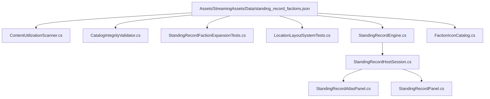

# Standing Record Faction Wiring & Architecture Tracer

## 1. System Dependency Graph

---

## 2. Downstream Presentation & Host Routing

1. **Host Session:**
   `StandingRecordHostSession.cs` coordinates data directory resolution and instantiates `StandingRecordEngine`.
2. **UI Atlas Panels:**
   `StandingRecordAtlasPanel.cs` and `StandingRecordPanel.cs` render ground layout boundaries, room exploration stencils, and territorial markers.
3. **Emblem Resolution:**
   `FactionIconCatalog.Resolve(factionId)` queries the internal dictionary or returns `FallbackIconPath` ("assets/ui/Icons/faction_icon_unknown.png") when no explicit PNG asset is specified.
4. **Data Verification Pipeline:**
   - Pre-commit & CI: `CatalogIntegrityValidator.Validate` cross-references all IDs against `IdPrefixes`.
   - Godot CLI: `--data-integrity-selftest` validates all 216 catalogs without errors.
   - Core CLI: `dotnet test Ashfall.Core.Tests` runs the test suite.
