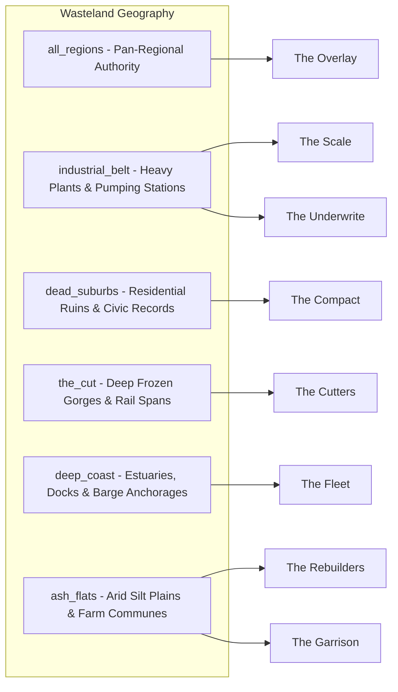

# Standing Record Region Matrix

## 1. Regional Authority Alignment

All `home_region` references in `standing_record_factions.json` resolve against canonical macro-regions defined in [`WASTELAND_REGION_ATLAS.md`](../world/WASTELAND_REGION_ATLAS.md) and [`wasteland_map_v1.json`](../../Assets/StreamingAssets/Data/wasteland_map_v1.json). Zero fictional or unverified regions were introduced.

---

## 2. Regional Assignment Table

| Faction ID | Display Name | Home Region Anchor | Geographic Context & Key Landmarks | Sentinel / Concrete |
|---|---|---|---|---|
| `faction_the_overlay` | **The Overlay** | `all_regions` | Pan-wasteland cadastral survey bureau; operates mobile triangulation stations across all quadrants | Sentinel (`all_regions`) |
| `faction_the_scale` | **The Scale** | `industrial_belt` | Controls main pipeline trunks, refinery cooling conduits, and sluice manifolds | Concrete |
| `faction_the_compact` | **The Compact** | `dead_suburbs` | Based in ruined municipal clerks' vaults and pre-war land registries | Concrete |
| `faction_the_underwrite` | **The Underwrite** | `industrial_belt` | Operates fortified fuel storage depots and armed caravan staging grounds | Concrete |
| `faction_the_cutters` | **The Cutters** | `the_cut` | Maintains high-elevation trestles, cutting roadbeds, and ice chokepoints | Concrete |
| `faction_the_fleet` | **The Fleet** | `deep_coast` | Centered on tidal estuaries, repair slips, barge berths, and saline waterways | Concrete |
| `faction_the_rebuilders` | **The Rebuilders** | `ash_flats` | Manages alluvial silt farming communes, community seed silos, and brick kilns | Concrete |
| `faction_the_garrison` | **The Garrison** | `ash_flats` | Garrisoned at Fort Karkov guarding border transit routes across the southern flats | Concrete |

---

## 3. Sentinel & Multi-Region Behavior

- **`all_regions` Sentinel:** The Overlay uses `all_regions` because it represents a roaming administrative survey office. Systems querying region-specific factions treat `all_regions` as universally valid across all wasteland zones.
- **Single-Anchor Rule:** All other 7 factions anchor to a single concrete macro-region, ensuring crisp regional identity without fuzzy territorial overlap.
