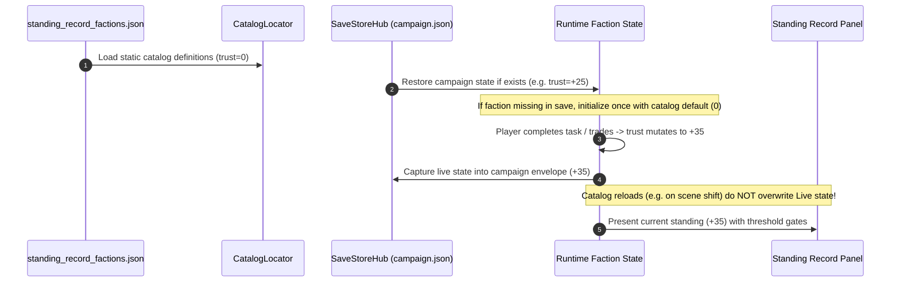

# Standing Record Trust & Alignment Contract

## 1. Trust Lifecycle Architecture

This contract establishes the operational lifecycle of the `trust` field across loading, campaign execution, and persistence, guarding against the risk of catalog defaults clobbering live reputation.

---

## 2. Invariants & Rules

1. **Initial Trust Baseline:** Authored `trust: 0` in `standing_record_factions.json` represents starting diplomatic credit for a new game.
2. **Persistence Ownership:** Campaign save stores (`SaveStoreHub` / `campaign.json`) own the live mutable integer for each faction ID.
3. **Old-Save Migration:** When an old save lacking an entry for a newly introduced faction is loaded, the game initializes that faction's reputation to the catalog baseline (`0`) exactly once.
4. **No Overwrite on Boot:** Re-parsing `standing_record_factions.json` during gameplay or scene changes NEVER resets live campaign standing.

---

## 3. Alignment Posture Taxonomy

| Alignment String | Operational Semantics | Player Relationship Trajectory |
|---|---|---|
| `conditional` | Transactional; cooperation requires meeting explicit jurisdictional access rules or material quotas. | Can rise to alliance or sink to hostility based on player behavior. |
| `neutral` | Non-aligned civil/administrative body; open to interaction without immediate ideological demands. | Maintains steady baseline access unless actively violated. |
| `hostile` | Reserved for active combatant factions; not used as starting posture for Standing Record bureaus. | Banned from starting Standing Record entries to ensure trade reachability. |
| `allied` | Reserved for earned high-reputation states; not granted for free at campaign start. | Earned through consistent service and contract fulfillment. |

---

## 4. Trust Threshold & Access Gates

| Trust Band | Access Tier | Interface & Service Clearance |
|---|---|---|
| **< -20** | *Suspended* | Services locked; checkpoint passage denied; armed sentries turn the player back. |
| **-20 to -1** | *Restricted* | Trade permitted with severe price penalties; advanced offers and route telemetry withheld. |
| **0 to +19** | *Standard* | Baseline access; standard exchange rates; primary offers realizable with valid materials. |
| **+20 to +39** | *Trusted* | Preferential trade rates; priority transit chits; access to special waystations and depots. |
| **+40 to +50** | *Vouched* | Full diplomatic recognition; unrestricted passage; highest-tier logistics and archival assets unlocked. |
