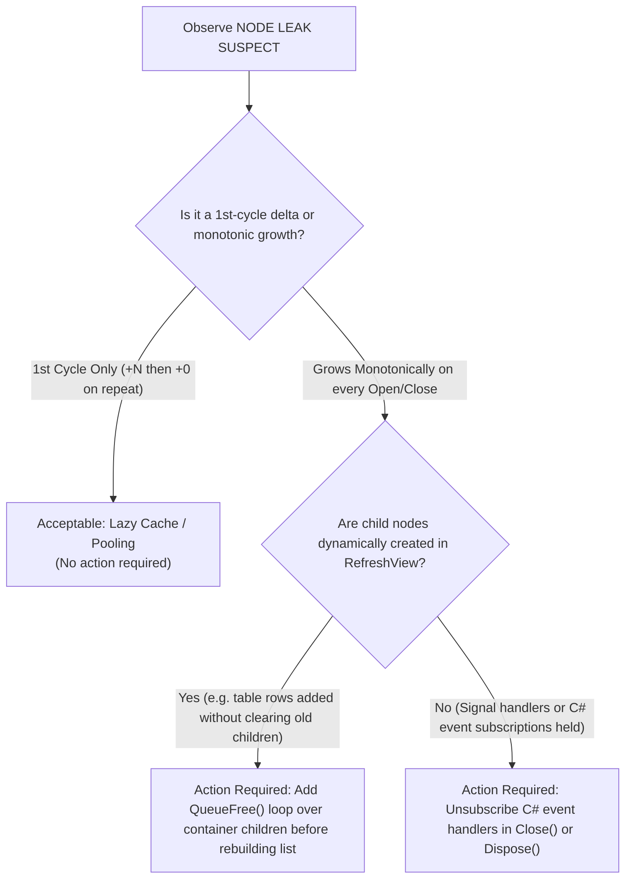

# Contributor Guide — UI Node Diagnostics, Lifecycle & Leak Triage

**Date:** 2026-08-27
**Scope:** Explains why UI self-tests (e.g. `--player-panels-uitest`, `--dashboard-uitest`) may emit `NODE LEAK SUSPECT` diagnostic notices even when all assertions pass cleanly, and how contributors should interpret and triage UI cleanup debt.

---

## 1. Executive Summary

When running UI self-tests with opt-in diagnostics enabled (`ASHFALL_UI_NODE_DIAGNOSTICS=1`), contributors may observe output such as:

```
[UiNodeDiag] before survivors          nodes=42 controls=18 objects=1054
[UiNodeDiag] after  survivors          nodes=45 controls=20 objects=1059 (vs before: +3 nodes, +2 controls, +5 objects)
[UiNodeDiag] NODE LEAK SUSPECT: 'survivors' left 3 node(s) in the tree after its test block closed
[HOST_SELFTEST] player_panels_uitest PASS
```

> [!IMPORTANT]
> **Passing assertions prove behavioral and functional correctness; leak diagnostics report deferred cleanup debt.**
> A test passing with exit code `0` means all gameplay, layout, binding, and state-machine contracts are satisfied. The `NODE LEAK SUSPECT` line is an informational diagnostic designed to guide performance and memory hygiene, not a blocking functional failure.

---

## 2. Why Diagnostics Emit While Assertions Pass

There are three primary architectural reasons why a passing test emits node delta diagnostics:

### 1. Godot Deferred Deletion & Single-Frame Headless Execution
In Godot Engine, calling `node.QueueFree()` or closing an overlay does not instantly remove the node from memory. Instead, the engine marks the node for deletion at the end of the current frame's idle processing:
- In headless test harnesses, entire panel test blocks often run within a single synchronous frame without yielding to the Godot frame pump (`await ToSignal(GetTree(), "process_frame")`).
- Consequently, nodes queued for deletion are still present in the scene tree when `UiNodeDiagnostics.Report()` captures the "after" snapshot immediately following panel closure.

### 2. First-Open Caching & Sub-Component Pooling
Many complex panels (such as [`MapAtlasPanel`](../../src/UI/MapAtlasPanel.cs), [`ResearchAtlasPanel`](../../src/UI/ResearchAtlasPanel.cs), and [`EventsLogPanel`](../../src/UI/EventsLogPanel.cs)) lazily instantiate sub-views (reusable item rows, tooltip containers, background texture 9-slices) on their first `Open()` and keep them hidden (`Visible = false`) for rapid reopening rather than re-allocating them on every interaction:
- This creates an intentional, one-time positive node delta on the first open/close cycle.
- On subsequent open/close cycles, the delta drops to `+0`.

### 3. Non-Blocking Diagnostic Isolation (`Tier 3`)
Under the [Gating vs Diagnostic Policy](../ci/GATING_VS_DIAGNOSTIC_CHECKS.md), `UiNodeDiagnostics` is classified as **Tier 3 (Diagnostic Only)**:
- It tracks `TreeNodes`, `UiControls`, and Godot's live `ObjectCount` performance monitor to assist developers during profiling.
- It is intentionally decoupled from the test's return code so informational telemetry never masks or conflates real logic defects.

---

## 3. How Contributors Should Triage Leak Notices

When investigating a `NODE LEAK SUSPECT` notice, use the following triage decision tree:



### Healthy vs. Unhealthy Diagnostic Patterns

#### A. Healthy First-Open Allocation (Benign)
```
[UiNodeDiag] before map_atlas         nodes=50 controls=20 objects=1100
[UiNodeDiag] after  map_atlas (run 1) nodes=56 controls=24 objects=1110 (+6 nodes) -> Initial cache
[UiNodeDiag] after  map_atlas (run 2) nodes=56 controls=24 objects=1110 (+0 nodes) -> Stable baseline
```

#### B. Genuine Leak Pattern (Requires Action)
```
[UiNodeDiag] after  combat_log (run 1) nodes=60 (+10 nodes)
[UiNodeDiag] after  combat_log (run 2) nodes=70 (+10 nodes)
[UiNodeDiag] after  combat_log (run 3) nodes=80 (+10 nodes) -> Unbounded accumulation!
```
*Fix:* Ensure dynamic list rebuilds call `child.QueueFree()` or clear old list children prior to re-populating rows in `RefreshView()`.

---

## 4. Shutdown Resource/RID Warnings — Classified Signatures

The diagnostic guide also governs **process-shutdown** `Resource`/`RID`/`ObjectDB`
warnings. Two signatures are currently known.

### 5.1 Known-benign — accessibility smoke-specimen harness

Signature (exact, emitted at exit):

```
WARNING: 2 RIDs of type "CanvasItem" were leaked.
ERROR: 1 RID allocations of type '...FontAdvanced...' were leaked at exit.
WARNING: 8 ObjectDB instances were leaked at exit
ERROR: 1 resources still in use at exit
```

Verbose object set: 2 parentless `Label`, 2 base `Object`, `StyleBoxFlat`,
`StyleBoxEmpty`, `FontFile`, `Image`.

**Class:** diagnostic-harness specimen lifetime (NOT a production panel leak).
`UiAccessibilitySelfTest` instantiates a fixed list of representative panels
plus a briefing modal **without attaching them to the SceneTree**, calls
`_Ready()` for inspection, then `Free()`s them. The default-theme style/font
resources created for those standalone specimens are retained by two parentless
labels and are released only at process teardown.

**Evidence (flat, not monotonic):** three consecutive
`--ui-accessibility-selftest` runs each emit exactly the same 8 ObjectDB / 2
CanvasItem RIDs / 1 Font RID / 1 resource.

**Distinguisher from a real leak:** the production lifecycle path
`--panel-bind-lifecycle-selftest` emits **zero** shutdown warnings across its
bind/unbind/close cycles, and the count does not grow across repeated a11y runs.
A warning whose ObjectDB count **grows** across cycles, or that appears on a
lifecycle path (not a specimen harness), is a real leak and is not covered by
this classification.

**Disposition:** acceptable Tier 3 shutdown noise for the a11y harness; no
global forced-free cleanup is permitted. Any new/renamed leaked type in this
signature is a finding, not blanket-ignored.

## 5. Best Practices for Panel Implementation

1. **Clear Dynamic Children in `RefreshView`:**
   ```csharp
   foreach (Node child in _listContainer.GetChildren())
   {
       child.QueueFree();
   }
   ```
2. **Unwire Events on Close/Dispose:**
   Always disconnect session and signal subscriptions when closing panels or unbinding hosts:
   ```csharp
   public void Unbind()
   {
       if (_session != null)
       {
           _session.OnStateChanged -= RefreshView;
           _session = null;
       }
   }
   ```
3. **Distinguish Unit Test Verification from Profiling:**
   - Run standard gates: `godot --headless -- --player-panels-uitest` (verifies functionality).
   - Run leak audit when profiling: `ASHFALL_UI_NODE_DIAGNOSTICS=1 godot --headless -- --player-panels-uitest`.
