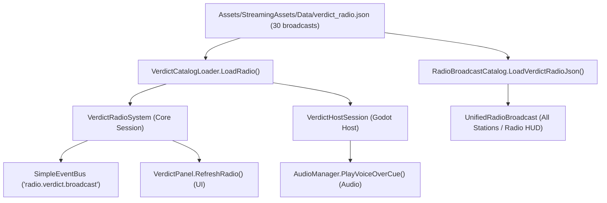

# Verdict Radio Content Utilization & Ingestion Audit

> **System Consumers:**
> 1. `VerdictRadioSystem` (`Assets/Ashfall.Core/Verdict/VerdictRadioSystem.cs`)
> 2. `VerdictHostSession` (`src/Host/VerdictHostSession.cs`)
> 3. `RadioBroadcastCatalog` (`Assets/Ashfall.Core/Radio/RadioBroadcastCatalog.cs`)
> 4. `VerdictPanel` (`src/VerdictPanel.cs`)

---

## 1. Multi-Pipeline Ingestion Trace

All 30 broadcasts in `verdict_radio.json` are ingested and utilized across multiple decoupled engine paths:

## 2. Ingestion Verification Points
1. **Host Boot:** `CatalogBootValidator` registers `verdict_radio.json` with status `Optional` (clean boot, zero warnings).
2. **Host Session:** `VerdictHostSession.Create()` loads entries via `VerdictCatalogLoader.LoadRadio()`, initializes `VerdictRadioSystem`, and evaluates `TickRadio(day)` daily.
3. **Unified Radio:** `RadioBroadcastCatalog.Initialize()` invokes `LoadVerdictRadioJson()`, registering all 30 entries as `UnifiedRadioBroadcast` records under `BroadcastGenre.VerdictCensus`.
4. **UI Presentation:** `VerdictPanel.RefreshRadio()` iterates `Radio.Corpus`, formatting each broadcast's status, frequency, trigger day, and kind icon.
