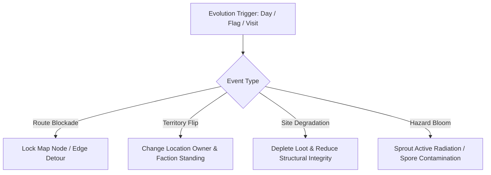

# Location Evolution & Living Geography Runtime Contract — Plan 11

> **Document Class:** World Evolution & Geography Contract
> **Authority:** `Assets/Ashfall.Core/LocationEvolutionSystem.cs`, `Assets/Ashfall.Core/LocationEvolutionSystem.Live.cs`, `Assets/Ashfall.Core/LandmarkDegradationSystem.cs`, `Assets/Ashfall.Core/World/WastelandMapSystem.cs`
> **Host Wiring:** `src/Host/WastelandMapSaveStore.cs`, `src/World/WastelandMapView.cs`
> **Save Key:** `location_evolution`, `landmark_degradation`, `wasteland_map`

---

## 1. Executive Summary

ASHFALL's world geography evolves dynamically across campaigns. A location is never static: ownership flips with faction wars, structural integrity decays from weathering, contamination spreads during fallout storms, and routes become blocked by checkpoints or collapsed bridges.

---

## 2. Event Types & State Mutation Mechanics

Plan 11 implements four distinct evolution event archetypes across 10 authored world events:

### 2.1 Route Blockades
- **Mechanism:** Calls `WastelandMapSystem.Lock(nodeId)` or invalidates specific path edges.
- **Route Planner Response:** `WastelandMapSystem.PlanRoute` recalculates BFS routes avoiding locked nodes. If no detour exists, departure is rejected with an explicit warning.

### 2.2 Territory Flips
- **Mechanism:** Calls `LocationEvolutionSystem.SetLocationOwner(locationId, newOwner)`.
- **World Impact:** Updates map marker faction icons and modifies expedition threat tables.

### 2.3 Site Degradations
- **Mechanism:** Calls `LocationEvolutionSystem.MarkDepleted(locationId, amount)` and `LandmarkDegradationSystem.DamageLandmark(landmarkId, damage, day)`.
- **World Impact:** Loot pools degrade from pristine to scavenged, descriptions update via `LocationMemorySystem`.

### 2.4 Hazard Blooms
- **Mechanism:** Calls `LocationEvolutionSystem.AddThreat(locationId, threatId)` and elevates `contaminationLevel`.
- **World Impact:** Raises rads/hour and introduces mold/spore disease checks on expedition entry.

---

## 3. Ten Authored Evolution Events

| Event ID | Type | Trigger Condition | Target Location / Node | Consequence |
|---|---|---|---|---|
| `event_evolution_checkpoint_kilo` | Blockade | Day $\ge 20$ + Faction Escalation | `loc_cut_abandoned_depot` | Faction checkpoint established; route locked |
| `event_evolution_bridge_debris` | Blockade | Day $\ge 35$ + Weather Storm | `loc_eastern_road` | Concrete bridge collapse; detour forced |
| `event_evolution_cut_road_closure` | Blockade | Day $\ge 50$ + Faction Conflict | `loc_cut_arsenal_ruin` | Road closed by barricade and sniper line |
| `event_evolution_warlord_expansion` | Territory | Warlord Annexation Flag | `loc_neutral_ground` | Warlords claim node; raises danger level |
| `event_evolution_faction_retreat` | Territory | Faction Defeat Flag | `loc_black_flotilla_outpost` | Garrison retreats; abandoned cache opens |
| `event_evolution_warehouse_stripped` | Degradation | Day $\ge 15$ + Prior Visit | `loc_excavation_utility_tunnels` | Scavengers pick outer chambers clean |
| `event_evolution_settlement_abandoned`| Degradation | Day $\ge 40$ | `suburban_house` | Settlement burned and abandoned |
| `event_evolution_water_tower_collapse`| Degradation | Integrity $\le 0$ / Day $\ge 60$| `loc_water_station` | Landmark tower collapses, flooding area |
| `event_evolution_rad_hotspot_bloom` | Hazard | Fallout Storm Weather | `loc_cut_radiation_zone_alpha` | Rads/hr double; high dosimeter warning |
| `event_evolution_subway_mold_bloom` | Hazard | Day $\ge 25$ + Dampness | `loc_excavation_metro_interchange`| Spore mold bloom covers lower platforms |

---

## 4. Determinism & Save Invariants
- Evolution triggers evaluate idempotently on each `TickDay(day)`.
- Triggered event IDs persist in `LocationEvolutionSaveState.mutations` and `LandmarkSaveState.landmarks`.
- Reloading a save reconstructs exact map states, route locks, and location owners.
